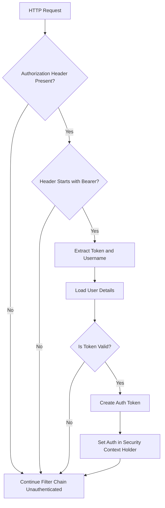

# Github-Repository-Management/src/main/java/com/Barsat/Github/Repository/Management/Config/Jwt/JwtFilter.java

> **Source File:** [Github-Repository-Management/src/main/java/com/Barsat/Github/Repository/Management/Config/Jwt/JwtFilter.java](https://github.com/test-company-prowiz/Easy-Repo/blob/master/Github-Repository-Management/src/main/java/com/Barsat/Github/Repository/Management/Config/Jwt/JwtFilter.java)  
> **Repository:** `Easy-Repo`  
> **Branch:** `master`

# Github-Repository-Management/src/main/java/com/Barsat/Github/Repository/Management/Config/Jwt/JwtFilter.java

### Overview
This file implements a custom Spring Security filter, `JwtFilter`, responsible for processing JSON Web Tokens (JWTs) received in HTTP requests. Its primary purpose is to validate JWTs, extract user information, and establish the authenticated principal in Spring Security's `SecurityContextHolder` for subsequent authorization checks.

### Architecture & Role
The `JwtFilter` is a Spring `@Component` that extends `OncePerRequestFilter`, positioning it within the application's security filter chain. Architecturally, it resides at the authentication layer, acting as an entry point for JWT-based authentication. It intercepts incoming requests before they reach controllers, validates the provided token, and, if valid, sets up the security context, effectively authenticating the user for the duration of that request.

### Key Components
- `JwtFilter`: The main class, extending `OncePerRequestFilter`, which processes JWTs.
- `jwtUtils`: An autowired instance of `JwtUtils` (not defined in this file) responsible for token-related operations such as extracting the username and validating the token's integrity and expiry.
- `myUserDetailsService`: An autowired instance of `MyUserDetailsService` (not defined in this file) used to load `UserDetails` from the application's user store based on the username extracted from the JWT.
- `doFilterInternal(HttpServletRequest request, HttpServletResponse response, FilterChain filterChain)`: The overridden method where the core JWT processing logic resides.

### Execution Flow / Behavior
1.  **Request Interception**: Upon receiving an HTTP request, `doFilterInternal` is invoked.
2.  **Header Extraction**: It attempts to retrieve the `Authorization` header from the request.
3.  **Token Parsing**: If the header exists and starts with "Bearer ", the JWT is extracted by removing the "Bearer " prefix.
4.  **Username Extraction**: The `jwtUtils` is used to extract the username from the parsed JWT.
5.  **Authentication Check**: If a username is successfully extracted and no authentication currently exists in the `SecurityContextHolder`, the process continues.
6.  **User Details Loading**: `myUserDetailsService` is used to load the `UserDetails` corresponding to the extracted username.
7.  **Token Validation**: The `jwtUtils` validates the extracted token against the loaded `UserDetails`.
8.  **Security Context Population**: If the token is valid, a `UsernamePasswordAuthenticationToken` is created using the `UserDetails` and the request's authentication details. This token is then set in the `SecurityContextHolder`, establishing the user's authentication for the current request.
9.  **Filter Chain Continuation**: The `filterChain.doFilter()` method is called to pass the request to the next filter in the chain, allowing the request to proceed with an authenticated context if successful. If any validation fails, the request proceeds unauthenticated.

### Dependencies
-   `com.Barsat.Github.Repository.Management.Service.MyUserDetailsService`: Provides user-specific data required for authentication (e.g., username, roles).
-   `com.Barsat.Github.Repository.Management.Config.Jwt.JwtUtils`: Utility class for JWT token manipulation (extraction, validation).
-   `jakarta.servlet.FilterChain`, `jakarta.servlet.ServletException`, `jakarta.servlet.http.HttpServletRequest`, `jakarta.servlet.http.HttpServletResponse`: Standard Java Servlet API components for filter operations.
-   `org.springframework.security.authentication.UsernamePasswordAuthenticationToken`: Spring Security object representing an authentication request or authenticated user.
-   `org.springframework.security.core.context.SecurityContextHolder`: Spring Security's central storage for the current security context.
-   `org.springframework.security.core.userdetails.UserDetails`: Interface defining core user information.
-   `org.springframework.security.web.authentication.WebAuthenticationDetailsSource`: Builds authentication details from an HTTP request.
-   `org.springframework.stereotype.Component`: Marks this class as a Spring-managed component, enabling autowiring and component scanning.
-   `org.springframework.web.filter.OncePerRequestFilter`: Base class ensuring the filter executes exactly once per HTTP request.

### Design Notes
-   This filter provides a stateless authentication mechanism by relying entirely on the JWT present in each request.
-   The design effectively integrates JWT-based authentication into the Spring Security framework without requiring session management for user authentication.
-   Error handling for invalid or expired tokens is implicit; if `jwtUtils` methods fail, authentication will not be set, leading to subsequent unauthorized access attempts being handled by other Spring Security components (e.g., `AccessDeniedHandler`, `AuthenticationEntryPoint`).

### Diagram (Optional)
