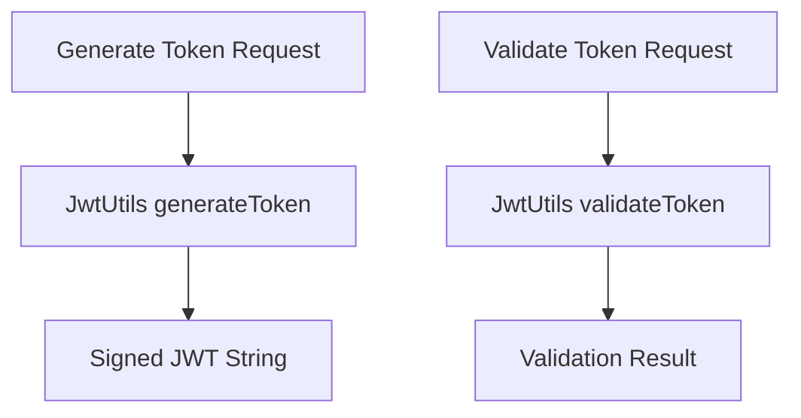

# Github-Repository-Management/src/main/java/com/Barsat/Github/Repository/Management/Config/Jwt/JwtUtils.java

> **Source File:** [Github-Repository-Management/src/main/java/com/Barsat/Github/Repository/Management/Config/Jwt/JwtUtils.java](https://github.com/test-company-prowiz/Easy-Repo/blob/master/Github-Repository-Management/src/main/java/com/Barsat/Github/Repository/Management/Config/Jwt/JwtUtils.java)  
> **Repository:** `Easy-Repo`  
> **Branch:** `master`

# Github-Repository-Management/src/main/java/com/Barsat/Github/Repository/Management/Config/Jwt/JwtUtils.java

### Overview
This file defines a utility service for JSON Web Token (JWT) operations. Its primary responsibilities include generating new JWTs, extracting information (like username and expiration) from existing tokens, and validating tokens.

### Architecture & Role
This component resides within the security configuration layer of the application, specifically handling JWT-related aspects of authentication. It is marked as a Spring `@Service`, indicating its role as a singleton component managed by the Spring IoC container, available for dependency injection into other parts of the application that require JWT services.

### Key Components
*   `JwtUtils` class: The main service class providing JWT functionalities.
*   Constructor: Initializes the service by generating a new `HmacSHA256` secret key upon instantiation, encoding it to Base64, and storing it internally. If key generation fails, it throws a `RuntimeException`.
*   `generateToken(String username)`: Creates a new JWT for a given `username`, setting the subject, issuance time, and an expiration time of 30 hours from issuance.
*   `getMykey()`: A private helper method that decodes the internally stored Base64 secret key string into a `SecretKey` object, used for signing and verifying tokens.
*   `extractUsername(String token)`: Retrieves the subject claim (expected to be the username) from the provided JWT.
*   `validateToken(String token, UserDetails userDetails)`: Validates a JWT by verifying its signature, checking if it's expired, and comparing the extracted username with the username from a `UserDetails` object.
*   `extractClaim(String token, Function<Claims, T> claimResolver)`: A generic private method to extract a specific claim from a token using a provided function.
*   `extractAllClaims(String token)`: Parses and verifies the JWT's signature and returns all claims (payload) within the token.
*   `isTokenExpired(String token)`: A private helper method that determines if a token's expiration date has passed.

### Execution Flow / Behavior
1.  Upon application startup, the Spring container instantiates `JwtUtils` as a `@Service`. The constructor executes, generating a new `HmacSHA256` secret key and storing its Base64 encoded representation.
2.  When an authentication process requires issuing a new token, `generateToken(String username)` is invoked. This method constructs a JWT with the specified username, current timestamp, and a hardcoded 30-hour expiration, then signs it using the internally generated secret key.
3.  For incoming requests that present a JWT, methods like `extractUsername(String token)` or `validateToken(String token, UserDetails userDetails)` are called.
4.  These methods internally use `extractAllClaims(String token)` to parse the token, verify its signature using the generated secret key, and then extract the necessary claims (e.g., subject, expiration).
5.  `validateToken` performs additional checks by comparing the extracted username with the `UserDetails` and ensuring the token has not expired.

### Dependencies
*   `io.jsonwebtoken.*`: External library (JJWT) for all core JWT creation, parsing, signing, and verification functionalities.
*   `org.springframework.security.core.userdetails.UserDetails`: Spring Security interface used to represent user details for validation against an extracted username.
*   `org.springframework.stereotype.Service`: Spring Framework annotation to designate this class as a service component, enabling automatic detection and registration for dependency injection.
*   `javax.crypto.KeyGenerator`, `javax.crypto.SecretKey`, `java.security.NoSuchAlgorithmException`: Standard Java cryptographic APIs used for generating the symmetric secret key.
*   `java.util.Base64`, `java.util.Date`, `java.util.HashMap`, `java.util.Map`, `java.util.function.Function`: Standard Java utility classes for encoding, date handling, data structures, and functional interfaces.

### Design Notes
*   **Volatile Secret Key:** The secret key is generated programmatically in the constructor at runtime. This means the key will change every time the application restarts. In production environments, it is generally preferred to use a stable, externally configured secret key (e.g., via environment variables or application properties) to ensure tokens remain valid across service restarts and multiple running instances.
*   **Hardcoded Expiration:** The token expiration time is hardcoded to 30 hours. This value may need to be configurable to adjust token lifetime based on security policies or user experience requirements.
*   **Error Handling:** The constructor's `NoSuchAlgorithmException` is caught and re-thrown as a `RuntimeException`. While functional, more specific exception handling or a graceful shutdown might be considered for production systems if key generation is critical.

### Diagram (Optional)
