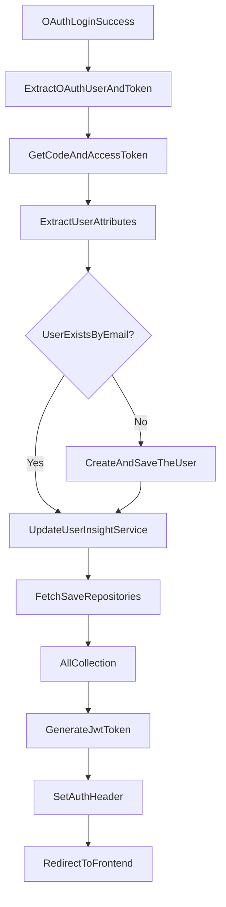

# Github-Repository-Management/src/main/java/com/Barsat/Github/Repository/Management/Config/OAuth/OAuthSuccessionHandler.java

> **Source File:** [Github-Repository-Management/src/main/java/com/Barsat/Github/Repository/Management/Config/OAuth/OAuthSuccessionHandler.java](https://github.com/test-company-prowiz/Easy-Repo/blob/master/Github-Repository-Management/src/main/java/com/Barsat/Github/Repository/Management/Config/OAuth/OAuthSuccessionHandler.java)
> **Repository:** `Easy-Repo`
> **Branch:** `master`

# Github-Repository-Management/src/main/java/com/Barsat/Github/Repository/Management/Config/OAuth/OAuthSuccessionHandler.java

### Overview
This file defines a Spring Security `AuthenticationSuccessHandler` for handling successful OAuth2 authentication, specifically with GitHub. Its primary purpose is to process authenticated user data, persist user information if new, trigger the fetching and saving of GitHub repositories, generate a JWT, and redirect the client to the frontend application.

### Architecture & Role
Architecturally, this file acts as a critical component in the authentication layer of the application. It is a Spring `@Component` that implements `AuthenticationSuccessHandler`, placing it within the Spring Security filter chain immediately following a successful OAuth2 authentication event. It bridges the external OAuth provider (GitHub) with the application's internal user management and data ingestion services.

### Key Components
*   **`OAuthSuccessionHandler`**: The main class, implementing `AuthenticationSuccessHandler`. It is responsible for orchestrating post-OAuth login actions.
*   **Constructor Injection**: The class uses constructor injection to receive dependencies for various services and repositories:
    *   `UserRepo`: For user persistence.
    *   `OAuthService`: To manage OAuth-related data like access tokens.
    *   `RepoCollectionsService`: For organizing user repositories.
    *   `GithubFetchSaveService`: To retrieve and store GitHub repository data.
    *   `JwtUtils`: To generate authentication tokens.
    *   `CommitGraphService`: Although injected, its direct usage is not present in `onAuthenticationSuccess`.
    *   `UserInsightService`: To store user insights, like disk usage.
*   **`onAuthenticationSuccess` method**: The core method that executes the post-authentication logic, receiving `HttpServletRequest`, `HttpServletResponse`, and `Authentication` objects.
*   **`@Value` Annotations**: Used to inject configuration properties like `clientId` (from GitHub OAuth) and `frontEndUrl` (for redirection).

### Execution Flow / Behavior
Upon successful OAuth2 authentication, the `onAuthenticationSuccess` method is invoked:
1.  It casts the `Authentication` object to `DefaultOAuth2User` and `OAuth2AuthenticationToken` to access user details and OAuth token information.
2.  The OAuth `code` and `accessToken` are extracted from the request and token respectively, and set within the `OAuthService`.
3.  User attributes such as email, name, avatar URL, bio, ID, and disk usage are extracted from the `DefaultOAuth2User` principal.
4.  A `TheUser` object is constructed using the extracted GitHub user data, including a default BCrypt-encoded password and marking the provider as `GITHUB`.
5.  If a user with the extracted email does not already exist in the `UserRepo`, the new `TheUser` is saved.
6.  The `UserInsightService` is updated with the user's disk usage.
7.  `githubFetchSaveService.fetchSaveRepositories` is called to initiate fetching and saving of the authenticated user's GitHub repositories.
8.  `repoCollectionsService.allCollection` is invoked to create collections for the fetched repositories.
9.  A JSON Web Token (JWT) is generated using `JwtUtils` for the authenticated user.
10. The generated JWT is set as an `Authorization` header in the `HttpServletResponse`.
11. The client is redirected to the configured `frontend.url`.

### Dependencies
*   **Internal**:
    *   `com.Barsat.Github.Repository.Management.Config.Jwt.JwtUtils`: For JWT token generation.
    *   `com.Barsat.Github.Repository.Management.Models.Provider`: Enum for OAuth provider type.
    *   `com.Barsat.Github.Repository.Management.Models.TheUser`: Custom user model.
    *   `com.Barsat.Github.Repository.Management.Repository.UserRepo`: Data access for user persistence.
    *   `com.Barsat.Github.Repository.Management.Service.*`: Various services (`CommitGraphService`, `GithubFetchSaveService`, `UserInsightService`, `OAuthService`, `RepoCollectionsService`) for business logic execution.
*   **External**:
    *   `jakarta.servlet.http.HttpServletRequest`, `jakarta.servlet.http.HttpServletResponse`: Servlet API for request/response handling.
    *   `org.springframework.beans.factory.annotation.Value`: Spring annotation for injecting property values.
    *   `org.springframework.security.core.Authentication`: Spring Security core authentication interface.
    *   `org.springframework.security.crypto.bcrypt.BCryptPasswordEncoder`: For password hashing.
    *   `org.springframework.security.oauth2.client.authentication.OAuth2AuthenticationToken`: Specific OAuth2 authentication token.
    *   `org.springframework.security.oauth2.core.user.DefaultOAuth2User`: Default representation of an OAuth2 user principal.
    *   `org.springframework.security.web.DefaultRedirectStrategy`, `org.springframework.security.web.authentication.AuthenticationSuccessHandler`: Spring Security components for redirection and success handling.
    *   `org.springframework.stereotype.Component`: Spring annotation for component scanning.
    *   `java.io.IOException`, `java.util.Map`: Standard Java utility classes.

### Design Notes
*   The use of constructor injection for dependencies adheres to recommended Spring practices, promoting testability and immutability.
*   A default, hardcoded "Password" is used for `BCryptPasswordEncoder` when a `TheUser` object is created for an OAuth login. While encrypted, this is a placeholder and should be reviewed if users are expected to ever sign in directly with this password.
*   The system immediately fetches and saves repository data and creates collections upon the first successful OAuth login, aiming to provide an immediate user experience with their GitHub data.
*   The generated JWT is explicitly placed in the `Authorization` header, indicating a stateless authentication mechanism commonly used by SPAs.

### Diagram
