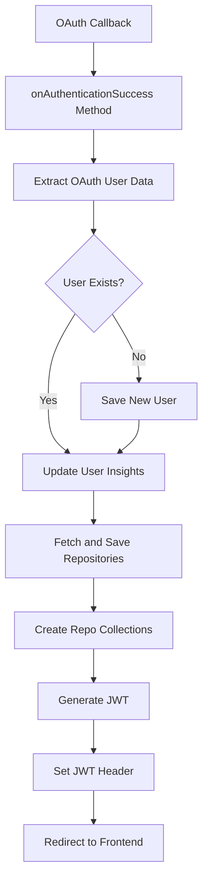

# Github-Repository-Management/src/main/java/com/Barsat/Github/Repository/Management/Config/OAuth/OAuthSuccessionHandler.java

> **Source File:** [Github-Repository-Management/src/main/java/com/Barsat/Github/Repository/Management/Config/OAuth/OAuthSuccessionHandler.java](https://github.com/test-company-prowiz/Easy-Repo/blob/master/Github-Repository-Management/src/main/java/com/Barsat/Github/Repository/Management/Config/OAuth/OAuthSuccessionHandler.java)  
> **Repository:** `Easy-Repo`  
> **Branch:** `master`

# Github-Repository-Management/src/main/java/com/Barsat/Github/Repository/Management/Config/OAuth/OAuthSuccessionHandler.java

### Overview
This file defines an `AuthenticationSuccessHandler` for Spring Security's OAuth2 flow. Its primary purpose is to process successfully authenticated GitHub users, persist their data, fetch their repositories, generate a JSON Web Token (JWT), and redirect them to the frontend application.

### Architecture & Role
This component operates within the security layer of the application, specifically handling the post-authentication phase of an OAuth2 login initiated through GitHub. As a Spring `@Component` implementing `AuthenticationSuccessHandler`, it is invoked by Spring Security once an external identity provider (GitHub, in this case) successfully authenticates a user and redirects back to the application. It acts as a bridge between the OAuth2 callback and the application's internal user management and data ingestion processes.

### Key Components
*   **`OAuthSuccessionHandler`**: The main class, annotated with `@Component`, indicating it's a Spring-managed bean. It implements `AuthenticationSuccessHandler`.
*   **`onAuthenticationSuccess` method**: This is the core method invoked by Spring Security upon successful OAuth2 authentication. It orchestrates the retrieval of user details, persistence, data fetching, token generation, and redirection.
*   **Injected Services**:
    *   `UserRepo`: For database operations related to `TheUser` entities.
    *   `OAuthService`: Handles OAuth-specific operations like setting and retrieving access tokens.
    *   `RepoCollectionsService`: Manages the creation of repository collections for the user.
    *   `GithubFetchSaveService`: Responsible for fetching user repositories from GitHub and saving them to the application's database.
    *   `JwtUtils`: Utility for generating JWTs.
    *   `CommitGraphService`: For processing commit graph data.
    *   `UserInsightService`: For setting user-specific insight data, such as disk usage.
*   **`@Value` properties**: `clientId` (from GitHub registration) and `frontEndUrl` (target for redirection).

### Execution Flow / Behavior
1.  **OAuth Callback**: After a user successfully authenticates with GitHub, GitHub redirects the user agent back to the application's configured OAuth2 callback URL.
2.  **`onAuthenticationSuccess` Invocation**: Spring Security intercepts this callback and invokes the `onAuthenticationSuccess` method of this handler.
3.  **Token and User Data Retrieval**: The method extracts the OAuth `code` from the request and the `DefaultOAuth2User` object from the `Authentication` principal to get user attributes (email, name, avatar URL, bio, provider ID, disk usage). It also generates and sets the GitHub access token using `OAuthService`.
4.  **User Registration/Update**:
    *   A `TheUser` object is constructed using data from the OAuth2 user.
    *   A default, hashed password is set. The user is marked as `GITHUB` provider and `enabled`.
    *   If a user with the extracted email does not exist in the database, the new `TheUser` object is saved via `userRepo`.
5.  **Data Ingestion**:
    *   `userInsightService` is updated with the user's disk usage.
    *   `githubFetchSaveService` is called to fetch the user's repositories from GitHub using the obtained access token and store them in the application's database. This step is performed after ensuring the user is saved.
    *   `repoCollectionsService` is invoked to create initial repository collections for the newly authenticated user.
6.  **JWT Generation**: A JWT is generated using `jwtUtils`.
7.  **Response Handling**: The generated JWT is added to the `Authorization` header of the HTTP response. The user is then redirected to the configured `frontEndUrl` using `DefaultRedirectStrategy`.

### Dependencies
*   **Internal Framework**: `com.Barsat.Github.Repository.Management.Config.Jwt.JwtUtils`, `com.Barsat.Github.Repository.Management.Models.Provider`, `com.Barsat.Github.Repository.Management.Models.TheUser`, `com.Barsat.Github.Repository.Management.Repository.UserRepo`, `com.Barsat.Github.Repository.Management.Service.CommitGraph.CommitGraphService`, `com.Barsat.Github.Repository.Management.Service.GithubFetchService.GithubFetchSaveService`, `com.Barsat.Github.Repository.Management.Service.Insights.UserInsightService`, `com.Barsat.Github.Repository.Management.Service.OAuthService.OAuthService`, `com.Barsat.Github.Repository.Management.Service.RepoCollectionsService.RepoCollectionsService`. These represent core application components, models, and services critical for user management, data fetching, and security.
*   **External Libraries/Frameworks**:
    *   `jakarta.servlet.*`: Provides core servlet API for handling HTTP requests and responses.
    *   `org.springframework.beans.factory.annotation.Value`: For injecting configuration properties.
    *   `org.springframework.security.*`: Essential Spring Security classes for OAuth2, authentication handling, and password encoding (`BCryptPasswordEncoder`).
    *   `org.springframework.stereotype.Component`: Marks the class as a Spring component for auto-detection and dependency injection.
    *   `java.io.IOException`, `java.util.Map`: Standard Java utilities.

### Design Notes
*   **Constructor Injection**: The class explicitly uses constructor injection for its dependencies, which is a recommended practice over field injection for improved testability and immutability.
*   **Hardcoded Password**: OAuth users are assigned a hardcoded password ("Password") after hashing using `BCryptPasswordEncoder`. This password is not used for direct login through the application's form-based authentication but might be a placeholder or used in specific internal scenarios.
*   **Redirect Strategy**: A `DefaultRedirectStrategy` is used for redirection to the frontend URL, which is configured via `@Value`.
*   **Unused `userName` and `clientId`**: The `userName` field is declared but not initialized or used for JWT generation (`jwtUtils.generateToken(userName)` will use a `null` value unless `userName` is set elsewhere which is not visible in the provided code). Similarly, `clientId` is injected but not utilized within the `onAuthenticationSuccess` method. These might indicate areas for refactoring or potential bugs.
*   **Order of Operations**: The code explicitly notes that `githubFetchSaveService.fetchSaveRepositories` should be called *after* saving the user to ensure proper mapping and prevent null references on first login.
*   **Synchronous Operations**: The current implementation performs all repository fetching and collection creation synchronously within the success handler. For large datasets or slow external APIs, this could potentially block the authentication thread and impact user experience. Consider offloading these long-running tasks to an asynchronous process or a message queue for better scalability and responsiveness.

### Diagram (Optional)

