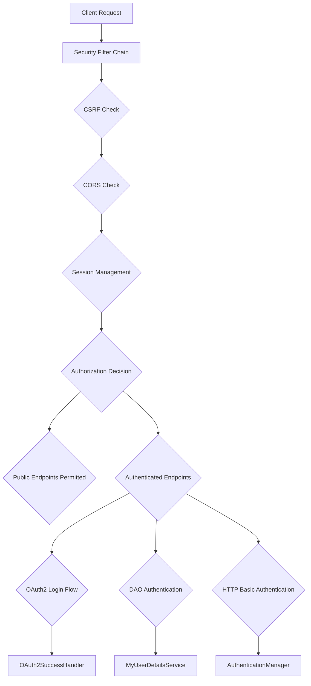

# Github-Repository-Management/src/main/java/com/Barsat/Github/Repository/Management/Config/SecurityConfig.java

> **Source File:** [Github-Repository-Management/src/main/java/com/Barsat/Github/Repository/Management/Config/SecurityConfig.java](https://github.com/test-company-prowiz/Easy-Repo/blob/master/Github-Repository-Management/src/main/java/com/Barsat/Github/Repository/Management/Config/SecurityConfig.java)  
> **Repository:** `Easy-Repo`  
> **Branch:** `master`

# Github-Repository-Management/src/main/java/com/Barsat/Github/Repository/Management/Config/SecurityConfig.java

### Overview
This file configures Spring Security for the application, establishing the foundation for authentication, authorization, and web security. It integrates multiple authentication mechanisms, defines access rules for endpoints, and manages Cross-Origin Resource Sharing (CORS).

### Architecture & Role
This file resides in the `Config` layer of the application, serving as a core component for defining the security posture of the entire backend. It dictates how HTTP requests are secured by configuring the Spring Security filter chain, authentication providers, and specific security behaviors such as session management and CORS. It acts as the central orchestrator for security-related beans and settings.

### Key Components
- `SecurityConfig` class: The main configuration class, annotated with `@Configuration` and `@EnableWebSecurity`, enabling Spring Security.
- `securityFilterChain` bean: Defines the sequence of security filters applied to incoming HTTP requests, including CSRF handling, session management policy, URL authorization, OAuth2 login, and CORS.
- `authenticationProvider` bean: Configures a `DaoAuthenticationProvider` to handle username/password authentication using `MyUserDetailsService` and `BCryptPasswordEncoder`.
- `authenticationManager` bean: Exposes the `AuthenticationManager`, which is the primary interface for authenticating users.
- `corsConfigurationSource` bean: Specifies the application's CORS policy, including allowed origins, HTTP methods, headers, and credentials.
- `passwordEncoder` bean: Provides an instance of `BCryptPasswordEncoder` for secure password hashing.
- `MyUserDetailsService`: A custom service responsible for loading user-specific data during authentication.
- `OAuthSuccessionHandler`: A custom handler invoked upon successful OAuth2 authentication.

### Execution Flow / Behavior
1.  **Initialization:** Upon application startup, Spring Boot loads `SecurityConfig` and registers the defined beans.
2.  **Request Interception:** Every incoming HTTP request is intercepted by the Spring Security filter chain.
3.  **Filter Chain Processing:**
    *   **CSRF Protection:** CSRF protection is enabled but ignored for specific public endpoints (`/api/auth/public/**`, `/register`, `/login`).
    *   **Session Management:** The application is configured to always create or use an HTTP session (`SessionCreationPolicy.ALWAYS`).
    *   **CORS Configuration:** The `corsConfigurationSource` is applied to manage cross-origin requests based on defined rules.
    *   **Authorization:** Requests matching `/api/auth/public/**`, `/register`, `/login`, or `/oauth2/**` are permitted without authentication. All other requests require an authenticated user.
    *   **Authentication:**
        *   **OAuth2 Login:** If an OAuth2 flow is initiated, successful authentication is handled by the `oAuthSuccessionHandler`.
        *   **HTTP Basic:** HTTP Basic authentication is enabled as an option.
        *   **DAO Authentication:** For username/password authentication, the `DaoAuthenticationProvider` uses `MyUserDetailsService` to load user details and `BCryptPasswordEncoder` to verify credentials.
4.  **JWT Filter (Inactive):** While a `JwtFilter` is injected, its inclusion in the main `securityFilterChain` is commented out, indicating that JWT-based authentication is not actively enforced in this primary filter chain.

### Dependencies
- `com.Barsat.Github.Repository.Management.Config.Jwt.JwtFilter`: A custom filter designed for JWT processing, though currently not integrated into the main `SecurityFilterChain`.
- `com.Barsat.Github.Repository.Management.Config.OAuth.OAuthSuccessionHandler`: A custom handler for post-OAuth2 authentication success logic.
- `com.Barsat.Github.Repository.Management.Service.MyUserDetailsService`: A custom implementation of `UserDetailsService` crucial for loading user details during DAO-based authentication.
- Spring Security: Core framework components like `HttpSecurity`, `AuthenticationManager`, `PasswordEncoder`, and `CorsConfigurationSource`.
- Jakarta Servlet API: Used for `HttpServletRequest` in CORS configuration.

### Design Notes
- The security setup currently supports a hybrid approach, allowing for both session-based authentication (implied by `SessionCreationPolicy.ALWAYS`) and OAuth2 integration.
- The `JwtFilter` is present but commented out from the main `SecurityFilterChain`. This suggests a potential future integration of stateless JWT authentication or that JWT handling occurs in a separate, unconfigured part of the application logic. The active session management policy is typically incongruent with a pure JWT stateless design.
- A broad CORS policy is defined, allowing multiple localhost origins and specific Vercel deployment URLs, which is common for development and deployment of single-page applications. The allowance of credentials means cookies or authentication headers can be sent cross-origin.
- CSRF protection is selectively disabled for public endpoints, acknowledging typical API interaction patterns that might not involve browser-based CSRF tokens.
- The use of `BCryptPasswordEncoder` for password hashing is a robust and recommended security practice.

### Diagram (Optional)
