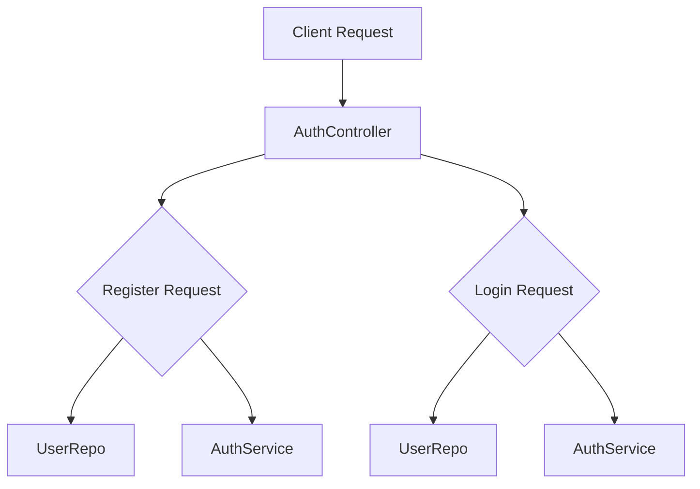

# Github-Repository-Management/src/main/java/com/Barsat/Github/Repository/Management/Controller/AuthController.java

> **Source File:** [Github-Repository-Management/src/main/java/com/Barsat/Github/Repository/Management/Controller/AuthController.java](https://github.com/test-company-prowiz/Easy-Repo/blob/master/Github-Repository-Management/src/main/java/com/Barsat/Github/Repository/Management/Controller/AuthController.java)  
> **Repository:** `Easy-Repo`  
> **Branch:** `master`

# Github-Repository-Management/src/main/java/com/Barsat/Github/Repository/Management/Controller/AuthController.java

### Overview
This file defines a Spring `@RestController` responsible for handling user authentication requests. It provides endpoints for user registration and login within the `easyrepo` application context.

### Architecture & Role
This file resides in the Controller layer of the application's architecture. Its primary role is to expose RESTful API endpoints, receive HTTP requests, validate request data, and orchestrate calls to the `AuthService` for business logic processing and `UserRepo` for data existence checks. It serves as the initial entry point for client-side authentication interactions.

### Key Components
-   `AuthController` class: The main controller class annotated with `@RestController` and mapped to `/easyrepo/auth`.
-   `AuthService authService`: An injected service component that encapsulates the business logic for user registration and login verification.
-   `UserRepo userRepo`: An injected repository component used to query user data, specifically to check for the existence of users by email or username.
-   `register(SignUpRequest signUpRequest)`: A POST endpoint at `/easyrepo/auth/register` that handles new user registrations. It first checks for duplicate emails and usernames before delegating to `AuthService` for user creation.
-   `login(LoginRequest loginRequest)`: A POST endpoint at `/easyrepo/auth/login` that handles user login requests. It verifies credentials and returns an `AuthResposne` containing a JWT token upon successful authentication.
-   `hello()`: A basic GET endpoint at `/easyrepo/auth/hello` for testing connectivity.

### Execution Flow / Behavior
1.  **Client Request:** An HTTP request targets an authentication endpoint (e.g., `/easyrepo/auth/register` or `/easyrepo/auth/login`).
2.  **Controller Mapping:** Spring routes the request to the corresponding method in `AuthController`.
3.  **Registration (`/register`):**
    *   The `SignUpRequest` body is validated using `@Valid`.
    *   `userRepo.existsByEmail()` is invoked to check if the email already exists. If true, a `400 Bad Request` response is returned.
    *   `userRepo.existsByUsername()` is invoked to check if the username already exists. If true, a `400 Bad Request` response is returned.
    *   If both checks pass, `authService.register()` is called to process the registration.
    *   A `200 OK` response with a success message is returned.
4.  **Login (`/login`):**
    *   The `LoginRequest` body is received.
    *   The controller checks if the username exists using `userRepo.existsByUsername()`.
    *   It then calls `authService.loginVerify()` to authenticate the user.
    *   If `userRepo.existsByUsername()` is true AND `authService.loginVerify()` returns the specific string "Invalid username or password", a `400 Bad Request` response is sent.
    *   In all other cases (e.g., username does not exist, or `authService.loginVerify()` returns a token), a `200 OK` response is generated. For a successful login, `authService.loginVerify()` is called again to retrieve the JWT token, which is then included in the `AuthResposne`.

### Dependencies
-   **Internal:**
    *   `com.Barsat.Github.Repository.Management.Models.RequestModels.LoginRequest`: Defines the structure for incoming login data.
    *   `com.Barsat.Github.Repository.Management.Models.RequestModels.SignUpRequest`: Defines the structure for incoming registration data.
    *   `com.Barsat.Github.Repository.Management.Models.ResponseModels.AuthResposne`: Defines the structure for outgoing authentication responses, including JWT tokens.
    *   `com.Barsat.Github.Repository.Management.Repository.UserRepo`: Interface for database operations related to user entities, specifically for checking user existence.
    *   `com.Barsat.Github.Repository.Management.Service.AuthService`: Service layer component responsible for core authentication business logic.
-   **External:**
    *   `jakarta.validation.Valid`: Used for declarative validation of request payload objects.
    *   `org.springframework.http.ResponseEntity`: Utility class for creating HTTP responses with custom status codes and bodies.
    *   `org.springframework.web.bind.annotation.*`: Spring Web annotations (`@RestController`, `@RequestMapping`, `@GetMapping`, `@PostMapping`, `@RequestBody`) for defining web endpoints and handling HTTP requests.

### Design Notes
-   The `login` method's `if` condition uses the bitwise `&` operator instead of the short-circuiting logical `&&` operator. This means both sides of the condition (`userRepo.existsByUsername()` and `authService.loginVerify()`) will always be evaluated, potentially leading to `authService.loginVerify()` being called even if the username does not exist.
-   The `login` method's `else` block handles both successful logins and cases where `userRepo.existsByUsername()` returns `false`. This logic appears to call `authService.loginVerify()` a second time in the `else` block to retrieve the JWT token, which could be inefficient or lead to unexpected behavior if `authService.loginVerify` returns a non-token string in scenarios like a non-existent user. This might warrant a review for logical clarity and efficiency.
-   Constructor injection is used for `AuthService` and `UserRepo`, promoting immutability and easier testing.

### Diagram (Optional)
