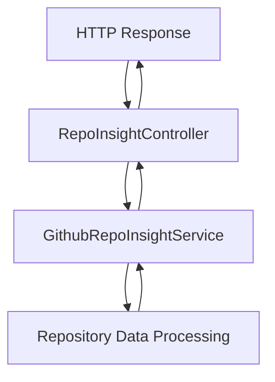

# Github-Repository-Management/src/main/java/com/Barsat/Github/Repository/Management/Controller/InsightController/RepoInsightController.java

> **Source File:** [Github-Repository-Management/src/main/java/com/Barsat/Github/Repository/Management/Controller/InsightController/RepoInsightController.java](https://github.com/test-company-prowiz/Easy-Repo/blob/master/Github-Repository-Management/src/main/java/com/Barsat/Github/Repository/Management/Controller/InsightController/RepoInsightController.java)  
> **Repository:** `Easy-Repo`  
> **Branch:** `master`

# Github-Repository-Management/src/main/java/com/Barsat/Github/Repository/Management/Controller/InsightController/RepoInsightController.java

### Overview
This file defines a Spring REST controller responsible for exposing API endpoints related to GitHub repository insights. It handles incoming web requests for repository data and delegates the processing to a dedicated service layer.

### Architecture & Role
This file acts as a controller layer component within a Spring Boot web application. It is the entry point for HTTP requests targeting repository insight functionalities, sitting at the edge of the application's core logic. Its primary role is to map URL paths to specific methods and prepare data for the response.

### Key Components
*   **`RepoInsightController`**: A Spring `@RestController` class that handles HTTP requests for repository insights.
*   **`githubRepoInsightService`**: An injected instance of `GithubRepoInsightService`, responsible for business logic related to fetching repository insights.
*   **`repoInsight(String repoName)`**: A `@GetMapping` method mapped to `/easyrepo/insights/repo/{repoName}`. It retrieves total lines of code data for a specified repository.
*   **`repoReadMe(String repoName)`**: A `@GetMapping` method mapped to `/easyrepo/insights/repo/getReadMe/{repoName}`. It fetches the README content for a given repository.

### Execution Flow / Behavior
When an HTTP GET request arrives at `/easyrepo/insights/repo/{repoName}`, the `repoInsight` method is invoked. It extracts the `repoName` from the path, calls `githubRepoInsightService.getTotalLinesOfCode(repoName)`, prints the result to standard output, and then returns the result.

For an HTTP GET request to `/easyrepo/insights/repo/getReadMe/{repoName}`, the `repoReadMe` method is called. It extracts `repoName`, invokes `githubRepoInsightService.getReadMe(repoName)`, and returns the String content of the README.

### Dependencies
*   **`com.Barsat.Github.Repository.Management.Service.Insights.GithubRepoInsightService`**: An internal service dependency that encapsulates the business logic for retrieving GitHub repository insights such as lines of code and README content.
*   **`org.springframework.web.bind.annotation.*`**: Spring framework annotations (`@RestController`, `@RequestMapping`, `@GetMapping`, `@PathVariable`) are used for defining REST endpoints and handling HTTP requests.

### Design Notes
*   The controller adheres to the Spring MVC pattern, separating concerns by delegating business logic to a service layer.
*   The use of `System.out.println` within the `repoInsight` method indicates debug or development-phase code; in a production environment, this should typically be replaced with a proper logging framework.
*   The return type `Map<String, List>` for `repoInsight` is generic; a more specific DTO or a more descriptive `Map` key could improve type safety and clarity.

### Diagram (Optional)
