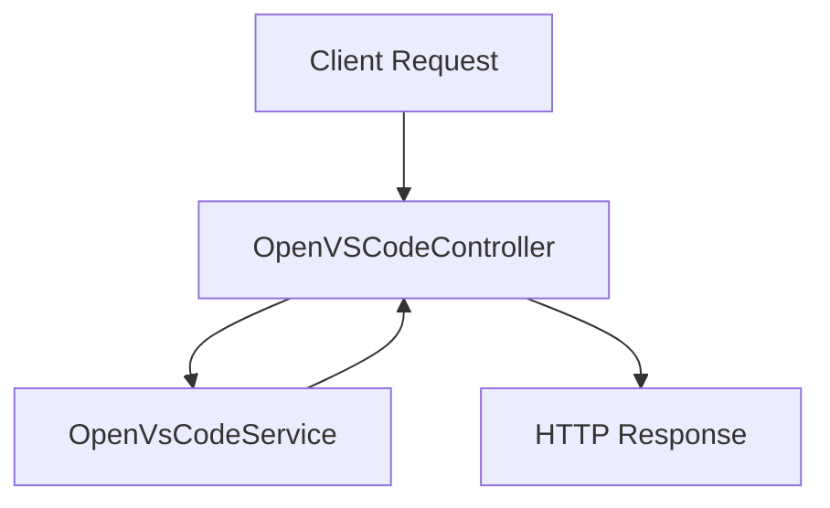

# Github-Repository-Management/src/main/java/com/Barsat/Github/Repository/Management/Controller/OpenVSCode/OpenVSCodeController.java

> **Source File:** [Github-Repository-Management/src/main/java/com/Barsat/Github/Repository/Management/Controller/OpenVSCode/OpenVSCodeController.java](https://github.com/test-company-prowiz/Easy-Repo/blob/master/Github-Repository-Management/src/main/java/com/Barsat/Github/Repository/Management/Controller/OpenVSCode/OpenVSCodeController.java)  
> **Repository:** `Easy-Repo`  
> **Branch:** `master`

# Github-Repository-Management/src/main/java/com/Barsat/Github/Repository/Management/Controller/OpenVSCode/OpenVSCodeController.java

### Overview
This file defines a Spring REST controller responsible for handling HTTP requests related to opening VS Code for a specified repository. It serves as an API endpoint to trigger the generation of a VS Code URL.

### Architecture & Role
This component resides in the controller layer of the application's architecture. It functions as a public-facing API endpoint, processing incoming web requests and delegating the underlying business logic to a service layer component. It is a standard Spring `@RestController`, exposing RESTful resources.

### Key Components
*   **`OpenVSCodeController` class**: The main class annotated with `@RestController` and `@RequestMapping("easyrepo/openVSCode")`, indicating it handles requests for the `/easyrepo/openVSCode` path.
*   **Constructor `OpenVSCodeController(OpenVsCodeService openVsCodeService)`**: Uses constructor injection to receive an instance of `OpenVsCodeService`, ensuring the controller has access to its required service dependency.
*   **`openVSCode(@PathVariable String repoName)` method**: Annotated with `@GetMapping("/{repoName}")`, this method handles HTTP GET requests to `/easyrepo/openVSCode/{repoName}`. It extracts the `repoName` from the URL path and uses the injected `openVsCodeService` to generate the VS Code URL.

### Execution Flow / Behavior
1.  An HTTP GET request is received by the application, matching the `/easyrepo/openVSCode/{repoName}` URI pattern.
2.  The Spring Framework dispatches this request to the `openVSCode` method within `OpenVSCodeController`.
3.  The `{repoName}` part of the URI is extracted and bound to the `repoName` method parameter.
4.  The `openVsCodeService.openVsCodeUrl(repoName)` method is called, delegating the logic for generating the VS Code URL.
5.  The `String` returned by the `openVsCodeService` is then returned by the controller method, serving as the HTTP response body.

### Dependencies
*   **`com.Barsat.Github.Repository.Management.Service.OpenVsCode.OpenVsCodeService`**: An internal service interface/class responsible for the core logic of constructing the VS Code URL based on the repository name. The controller relies on this service for its primary functionality.
*   **`org.springframework.web.bind.annotation.GetMapping`**: Spring annotation to map HTTP GET requests to specific handler methods.
*   **`org.springframework.web.bind.annotation.PathVariable`**: Spring annotation to extract values from URI templates.
*   **`org.springframework.web.bind.annotation.RequestMapping`**: Spring annotation to map web requests onto specific handler classes or methods.
*   **`org.springframework.web.bind.annotation.RestController`**: Spring annotation that marks a class as a controller where every method returns a domain object instead of a view, implicitly adding `@ResponseBody` to all handler methods.

### Design Notes
*   **Separation of Concerns**: The controller adheres to the principle of separation of concerns by delegating the actual URL generation logic to `OpenVsCodeService`. This keeps the controller lean, focusing solely on request handling and response formatting.
*   **RESTful API Design**: The use of `@RestController`, `@RequestMapping`, and `@GetMapping` establishes a clear RESTful endpoint for an action, making the API intuitive for consumers.
*   **Dependency Injection**: Constructor injection is used for `OpenVsCodeService`, which is a best practice for managing dependencies, improving testability, and making the component's requirements explicit.

### Diagram (Optional)
