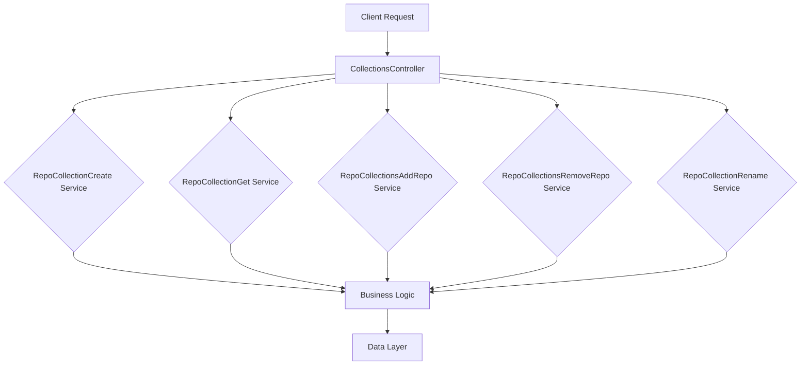

# Github-Repository-Management/src/main/java/com/Barsat/Github/Repository/Management/Controller/RepoCollections/CollectionsController.java

> **Source File:** [Github-Repository-Management/src/main/java/com/Barsat/Github/Repository/Management/Controller/RepoCollections/CollectionsController.java](https://github.com/test-company-prowiz/Easy-Repo/blob/master/Github-Repository-Management/src/main/java/com/Barsat/Github/Repository/Management/Controller/RepoCollections/CollectionsController.java)  
> **Repository:** `Easy-Repo`  
> **Branch:** `master`

# Github-Repository-Management/src/main/java/com/Barsat/Github/Repository/Management/Controller/RepoCollections/CollectionsController.java

### Overview
This file defines a Spring REST controller responsible for handling HTTP requests related to managing repository collections. It acts as the entry point for API calls that create, retrieve, update, and delete repository collections.

### Architecture & Role
The `CollectionsController` sits at the API layer within a multi-tiered architecture, specifically as a controller component in a Spring Web MVC application. Its primary role is to expose RESTful endpoints for client interactions, receiving incoming HTTP requests, extracting necessary data, and delegating business logic to specific service components. It does not contain business logic itself but orchestrates the calls to appropriate services.

### Key Components
*   `CollectionsController`: The main class annotated with `@RestController` and `@RequestMapping("/easyrepo/collections")`, indicating it handles requests under this base path.
*   `RepoCollectionCreate`: Service dependency for creating new repository collections.
*   `RepoCollectionGet`: Service dependency for retrieving repository collections.
*   `RepoCollectionsAddRepo`: Service dependency for adding repositories to collections.
*   `RepoCollectionsRemoveRepo`: Service dependency for removing collections.
*   `RepoCollectionRename`: Service dependency for renaming collections.
*   `RepoCollectionDTO`: Data Transfer Object used for request bodies when creating or adding to collections.
*   `RepoCollectionsEntity`: Model representing a repository collection, used as a return type for retrieval operations.

### Execution Flow / Behavior
The controller maps incoming HTTP requests to specific methods based on their path and HTTP verb.
*   A `GET` request to `/easyrepo/collections/all` retrieves all repository collections via `repoCollectionGet.allRepoCollections()`.
*   A `GET` request to `/easyrepo/collections/{collectionName}` retrieves a specific collection by name via `repoCollectionGet.getSpecificCollection()`.
*   A `GET` request to `/easyrepo/collections/allExistingCollections` retrieves a list of all existing collections via `repoCollectionGet.allExistingCollections()`.
*   A `POST` request to `/easyrepo/collections/createCollection` creates a new collection using the provided `RepoCollectionDTO` via `repoCollectionsCreate.createCollection()`.
*   A `POST` request to `/easyrepo/collections/addRepoToCollection/{collectionId}` adds a repository to a specified collection using `repoCollectionsAddRepo.addRepo()`.
*   A `DELETE` request to `/easyrepo/collections/removeRepoFromCollection/{collectionName}` removes an entire collection by name via `repoCollectionsRemoveRepo.removeRepoFromCollection()`.
*   A `GET` request to `/easyrepo/collections/{oldName}/{newName}` renames a collection via `repoCollectionRename.renameRepoCollection()`.

### Dependencies
*   **Internal Dependencies**:
    *   `com.Barsat.Github.Repository.Management.DTO.RepoCollectionDTO`: Used for transferring data in create and add operations.
    *   `com.Barsat.Github.Repository.Management.Models.RepoModels.RepoCollectionsEntity`: Used as the return type for collection retrieval.
    *   `com.Barsat.Github.Repository.Management.Service.RepoCollectionsService.*`: A set of service interfaces (`RepoCollectionCreate`, `RepoCollectionGet`, `RepoCollectionsAddRepo`, `RepoCollectionsRemoveRepo`, `RepoCollectionRename`) that encapsulate business logic, which are injected via constructor.
*   **External Dependencies**:
    *   `org.springframework.web.bind.annotation.*`: Spring Framework annotations (`@RestController`, `@RequestMapping`, `@GetMapping`, `@PostMapping`, `@DeleteMapping`, `@PathVariable`, `@RequestBody`) are used for defining the controller, request mappings, and parameter binding.

### Design Notes
The controller adheres to the Single Responsibility Principle by delegating all business logic to dedicated service classes, injected via constructor. This promotes modularity and testability. The use of separate service interfaces for different CRUD operations (e.g., `RepoCollectionCreate`, `RepoCollectionGet`) follows a fine-grained service design pattern.
A potential area for clarification is the `removeRepoFromCollection` endpoint. While its name suggests removing a *repository from* a collection, the parameter (`collectionName`) and the delegated service method (`removeRepoFromCollection(collectionName)`) imply removing the *entire collection* itself.

### Diagram (Optional)
