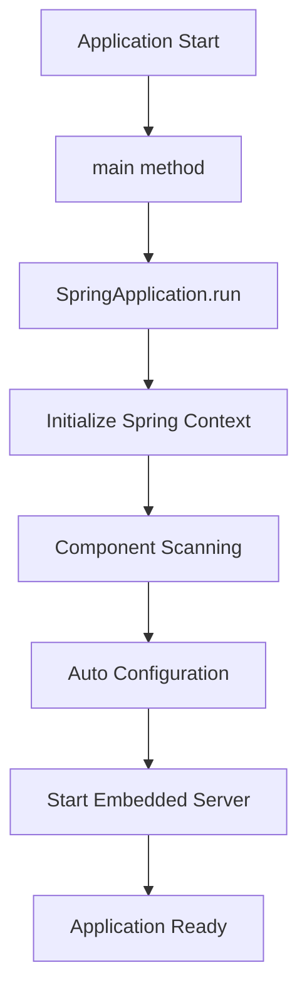

# Github-Repository-Management/src/main/java/com/Barsat/Github/Repository/Management/GithubRepositoryManagementApplication.java

> **Source File:** [Github-Repository-Management/src/main/java/com/Barsat/Github/Repository/Management/GithubRepositoryManagementApplication.java](https://github.com/test-company-prowiz/Easy-Repo/blob/master/Github-Repository-Management/src/main/java/com/Barsat/Github/Repository/Management/GithubRepositoryManagementApplication.java)  
> **Repository:** `Easy-Repo`  
> **Branch:** `master`

# Github-Repository-Management/src/main/java/com/Barsat/Github/Repository/Management/GithubRepositoryManagementApplication.java

### Overview
This file serves as the main entry point and bootstrap class for the `GithubRepositoryManagement` Spring Boot application. It initializes the Spring application context and enables core Spring Boot functionalities like auto-configuration and component scanning.

### Architecture & Role
This file resides at the root of the application's source code and acts as the primary application class. Architecturally, it is part of the application layer, responsible for launching the entire service. It instantiates the Spring application context, which then manages the lifecycle of other components like controllers, services, and repositories.

### Key Components
*   `GithubRepositoryManagementApplication`: The main class that Spring Boot uses to run the application.
*   `@SpringBootApplication`: A convenience annotation that combines `@Configuration`, `@EnableAutoConfiguration`, and `@ComponentScan`. It configures the application for Spring's component model, automatically configures beans based on classpath settings, and scans for other Spring components.
*   `main` method: The standard Java entry point that uses `SpringApplication.run()` to start the embedded web server and initialize the Spring application context.
*   Commented-out `CommandLineRunner` implementation: Indicates a previous or planned functionality to execute specific logic immediately after the application context has loaded, possibly for initial data setup or testing.

### Execution Flow / Behavior
1.  When the application starts, the JVM invokes the `main` method.
2.  `SpringApplication.run(GithubRepositoryManagementApplication.class, args)` is called.
3.  This method performs the following:
    *   Initializes the Spring application context.
    *   Performs component scanning to discover and register beans (e.g., controllers, services, repositories) within the `com.Barsat.Github.Repository.Management` package and its sub-packages.
    *   Applies auto-configurations based on classpath dependencies.
    *   Starts the embedded web server (e.g., Tomcat, by default).
4.  The application then becomes ready to serve requests.
5.  The commented-out `run` method, if active, would execute logic such as checking for and deleting a `UserRepo` entry with a specific ID, demonstrating potential data manipulation or testing upon startup.

### Dependencies
*   `org.springframework.boot.SpringApplication`: Essential for bootstrapping and running a Spring Boot application.
*   `org.springframework.boot.autoconfigure.SpringBootApplication`: The core annotation for enabling Spring Boot features.
*   `org.springframework.boot.CommandLineRunner` (commented out): An interface that would allow executing code once the application context is loaded and before the application starts accepting external requests.
*   `com.Barsat.Github.Repository.Management.Repository.UserRepo` (commented out): Suggests a dependency on a data repository for `User` entities.
*   `com.Barsat.Github.Repository.Management.Service.RepoCollectionsService.RepoCollectionsService` (commented out): Suggests a dependency on a service layer component.
*   `org.springframework.beans.factory.annotation.Autowired` (commented out): Standard Spring annotation for dependency injection.

### Design Notes
*   The class is designed to be minimal, focusing solely on application bootstrapping, which is a standard Spring Boot practice.
*   The commented-out code involving `UserRepo` and `RepoCollectionsService`, along with the `CommandLineRunner` interface, indicates that this class was either used for initial development/testing of data persistence (e.g., cascade operations) or has future potential to include initialization logic.
*   Keeping initialization/testing logic commented out or removing it for production builds is a good practice to ensure clean startup behavior.

### Diagram (Optional)
