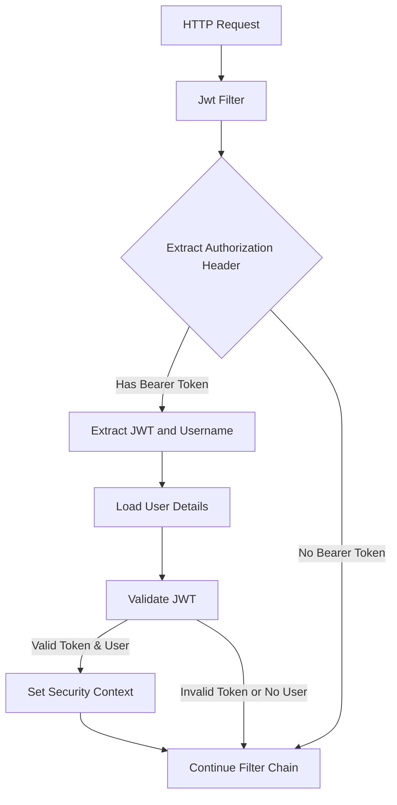

# Github-Repository-Management/src/main/java/com/Barsat/Github/Repository/Management/Config/Jwt/JwtFilter.java

### Overview
This file defines a Spring Security filter (`JwtFilter`) responsible for intercepting incoming HTTP requests, extracting a JSON Web Token (JWT) from the Authorization header, validating it, and authenticating the user within the Spring Security context.

### Architecture & Role
Architecturally, this file acts as a security filter within the application's Spring Security filter chain. It operates at the authentication layer, specifically handling token-based authentication. Its role is to bridge JWT-based stateless authentication with Spring Security's established authentication mechanisms, allowing subsequent security filters to recognize an authenticated user based on a valid JWT.

### Key Components
*   `JwtFilter` class: A Spring `@Component` that extends `OncePerRequestFilter`, ensuring its `doFilterInternal` method is executed only once per HTTP request. It contains the primary logic for JWT processing.
*   `doFilterInternal` method: This overridden method implements the core logic for extracting, validating, and processing the JWT to set up authentication.
*   `jwtUtils`: An injected utility class responsible for JWT-specific operations such as extracting the username and validating the token's integrity and expiration.
*   `myUserDetailsService`: An injected service that loads user-specific data, including authorities, based on a username extracted from the JWT.

### Execution Flow / Behavior
1.  An HTTP request enters the Spring Security filter chain.
2.  The `JwtFilter`'s `doFilterInternal` method is invoked.
3.  It attempts to retrieve the "Authorization" header from the `HttpServletRequest`.
4.  If the header exists and starts with "Bearer ", the JWT token is extracted.
5.  The username is then extracted from this token using `jwtUtils.extractUsername()`.
6.  If a username is successfully extracted and no authentication object is currently present in the `SecurityContextHolder`:
    *   User details are loaded using `myUserDetailsService.loadUserByUsername()`.
    *   The JWT token is validated against the loaded `UserDetails` using `jwtUtils.validateToken()`.
    *   If the token is valid, a `UsernamePasswordAuthenticationToken` is created, populated with `UserDetails` and request specifics, and then set in `SecurityContextHolder.getContext().setAuthentication()`.
7.  Regardless of whether authentication occurred, `filterChain.doFilter(request, response)` is called to pass the request to the next filter in the chain.

### Dependencies
*   **Internal:**
    *   `com.Barsat.Github.Repository.Management.Service.MyUserDetailsService`: Provides user details for authentication based on a username.
    *   `com.Barsat.Github.Repository.Management.Config.Jwt.JwtUtils`: Handles JWT token creation, parsing, and validation.
*   **External:**
    *   `org.springframework.security.web.filter.OncePerRequestFilter`: Base class for filters that execute once per request.
    *   `org.springframework.security.core.context.SecurityContextHolder`: Manages the security context, storing the currently authenticated user.
    *   `org.springframework.security.authentication.UsernamePasswordAuthenticationToken`: Represents an authentication request or an authenticated principal.
    *   `org.springframework.stereotype.Component`: Marks the class as a Spring-managed component.
    *   `jakarta.servlet.*`: Standard Servlet API classes for request, response, and filter chain operations.

### Design Notes
The `JwtFilter` leverages Spring Security's `OncePerRequestFilter` to ensure that JWT validation and user authentication occur only once per incoming request. By injecting `JwtUtils` and `MyUserDetailsService`, it adheres to the Single Responsibility Principle, delegating specific concerns like token operations and user detail fetching to dedicated services. This design allows for a clear separation of concerns, making the authentication flow maintainable and extensible. It integrates seamlessly with Spring Security by updating the `SecurityContextHolder`, allowing the rest of the application to operate as if standard session-based authentication had occurred.

### Diagram (Optional)
