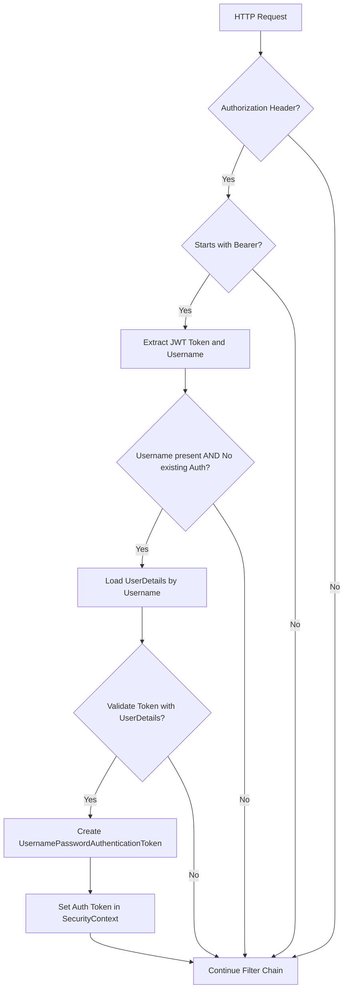

# Github-Repository-Management/src/main/java/com/Barsat/Github/Repository/Management/Config/Jwt/JwtFilter.java

### Overview
This file defines a Spring `OncePerRequestFilter` named `JwtFilter`. Its purpose is to intercept incoming HTTP requests, extract and validate JSON Web Tokens (JWTs) from the Authorization header, and establish the authenticated user context within Spring Security.

### Architecture & Role
The `JwtFilter` resides in the security configuration layer of the application. It functions as an authentication filter within the Spring Security filter chain. Its role is to process JWTs for stateless authentication, allowing subsequent security components to operate on an already authenticated `SecurityContext` without requiring traditional session-based logins.

### Key Components
- **`JwtFilter` class**: Extends `OncePerRequestFilter`, ensuring that it is executed only once per HTTP request. It is annotated with `@Component`, making it a Spring-managed bean.
- **`jwtUtils`**: An injected instance of `JwtUtils` (assumed) responsible for JWT-specific operations such as extracting the username from a token and validating the token's integrity and expiration.
- **`myUserDetailsService`**: An injected instance of `MyUserDetailsService` (assumed, implementing `UserDetailsService`) which loads user-specific data (`UserDetails`) from a data store based on a username.
- **`doFilterInternal` method**: The core method overriding `OncePerRequestFilter`'s abstract method. It contains the logic for token extraction, validation, and setting the Spring Security `SecurityContext`.

### Execution Flow / Behavior
1. An HTTP request enters the filter chain, and the `doFilterInternal` method of `JwtFilter` is invoked.
2. The method attempts to read the "Authorization" header from the request.
3. If the header is present and starts with "Bearer ", the JWT token is extracted.
4. The username is then extracted from this token using `jwtUtils`.
5. If a username is successfully extracted and there is no existing authentication in the `SecurityContextHolder`, the process continues:
    a. `UserDetails` for the extracted username are loaded via `myUserDetailsService`.
    b. The JWT token is validated against these `UserDetails` using `jwtUtils`.
    c. If the token is valid, a `UsernamePasswordAuthenticationToken` is constructed using the `UserDetails`.
    d. This authentication token is then augmented with request-specific details.
    e. Finally, this token is set in the `SecurityContextHolder`, thereby authenticating the user for the duration of the current request.
6. Regardless of whether authentication occurred, the filter ensures that the request proceeds to the next filter in the chain by calling `filterChain.doFilter()`.

### Dependencies
- **Internal**:
    - `com.Barsat.Github.Repository.Management.Service.MyUserDetailsService`: Crucial for loading user details based on the username extracted from the JWT.
    - `com.Barsat.Github.Repository.Management.Config.Jwt.JwtUtils`: Provides the necessary utility functions for handling JWTs, including parsing and validation.
- **External**:
    - `jakarta.servlet.*`: Standard Servlet API for HTTP request/response handling and filter chain management.
    - `org.springframework.security.*`: Spring Security framework components, including authentication tokens, user details management, and the `SecurityContextHolder` for managing the authenticated principal.
    - `org.springframework.stereotype.Component`: Spring annotation for component scanning.
    - `org.springframework.web.filter.OncePerRequestFilter`: Spring base class for web filters.

### Design Notes
- The use of `OncePerRequestFilter` ensures that the JWT validation logic is executed exactly once per incoming request, preventing redundant processing.
- The design cleanly separates concerns by delegating JWT-specific operations to `JwtUtils` and user details retrieval to `MyUserDetailsService`, making `JwtFilter` focused on orchestrating the authentication flow.
- The filter integrates directly with Spring Security's `SecurityContextHolder`, providing a standard and idiomatic way to manage user authentication state.
- The current implementation assumes `jwtUtils.validateToken` handles token expiration and integrity checks, returning `false` on failure. Explicit error responses for invalid tokens (e.g., 401 Unauthorized) are not directly handled within this filter's `doFilterInternal` method but would typically be configured at a higher level in Spring Security's exception handling.

### Diagram (Optional)
