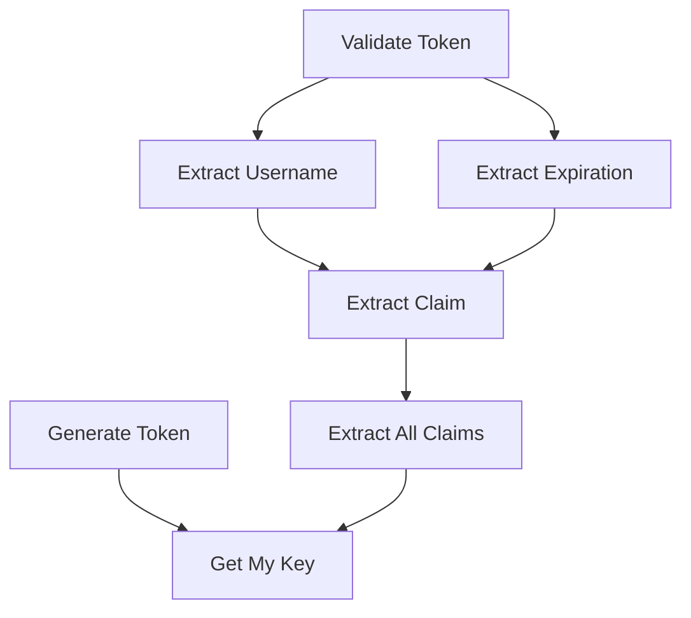

# Github-Repository-Management/src/main/java/com/Barsat/Github/Repository/Management/Config/Jwt/JwtUtils.java

### Overview
This file provides utility functions for JSON Web Token (JWT) operations, including generation, parsing, and validation. It is designed to be used within a Spring Boot application for authentication and authorization contexts.

### Architecture & Role
This file is annotated as a Spring `@Service`, positioning it within the service layer of the application. It belongs to the security or authentication configuration component, specifically handling JWT lifecycle management. It integrates with Spring Security by accepting `UserDetails` objects for token validation.

### Key Components
*   **`JwtUtils` class**: The main service class that encapsulates all JWT-related functionalities.
*   **`secretKey` field**: Stores the Base64-encoded secret key used for signing and verifying JWTs. This key is generated dynamically during the object's instantiation.
*   **`JwtUtils()` constructor**: Initializes the `secretKey` by generating a new `HmacSHA256` key and encoding it.
*   **`generateToken(String username)`**: Creates a new JWT, setting the subject (username), issuance date, and expiration date (30 hours from issuance).
*   **`getMykey()`**: Decodes the stored Base64 `secretKey` and returns it as a `SecretKey` object suitable for HMAC operations.
*   **`extractUsername(String token)`**: Extracts the subject claim (username) from a given JWT.
*   **`extractAllClaims(String token)`**: Parses and verifies the JWT's signature using the secret key, then returns all contained claims.
*   **`validateToken(String token, UserDetails userDetails)`**: Validates a token by checking if its embedded username matches the provided `UserDetails` username and if the token has not expired.

### Execution Flow / Behavior
1.  **Initialization**: When the `JwtUtils` service is instantiated by the Spring container, its constructor executes, generating a unique `HmacSHA256` secret key. This key is immediately Base64 encoded and stored.
2.  **Token Generation**: Upon a call to `generateToken(String username)`, a new JWT is constructed. It is signed using the internally generated `secretKey` and configured with a 30-hour expiration period.
3.  **Token Extraction/Parsing**: When methods like `extractUsername`, `extractExpiration`, or `extractClaim` are invoked, they delegate to `extractAllClaims(String token)`. This method first uses the `secretKey` to verify the token's signature, ensuring its integrity, before parsing and returning the claims payload.
4.  **Token Validation**: The `validateToken` method performs two primary checks: it extracts the username from the token and compares it against the username provided by `UserDetails`, and it verifies that the token's expiration time has not passed.

### Dependencies
*   **External Libraries**:
    *   `io.jsonwebtoken.*`: JJWT library for all core JWT operations (building, parsing, signing, verifying).
    *   `javax.crypto.*`, `java.security.*`: Standard Java Cryptography Architecture (JCA) for key generation.
*   **Spring Framework**:
    *   `org.springframework.stereotype.Service`: Marks this class as a Spring-managed service component.
    *   `org.springframework.security.core.userdetails.UserDetails`: An interface from Spring Security, used for validating tokens against application user details.

### Design Notes
*   **Dynamic Secret Key**: The secret key for JWT signing and verification is generated programmatically upon application startup. This simplifies initial setup but means the key changes every time the application restarts. For production environments, a static, securely managed key (e.g., configured via environment variables or a key management system) is typically preferred to ensure token validity across restarts or multiple service instances.
*   **Fixed Expiration Time**: Tokens are configured with a fixed expiration of 30 hours. This duration should be reviewed based on security policies and user experience requirements.
*   **Error Handling**: The constructor catches `NoSuchAlgorithmException` during key generation and re-throws it as a `RuntimeException`, indicating a critical setup failure if the `HmacSHA256` algorithm is unavailable on the JVM.

### Diagram (Optional)
