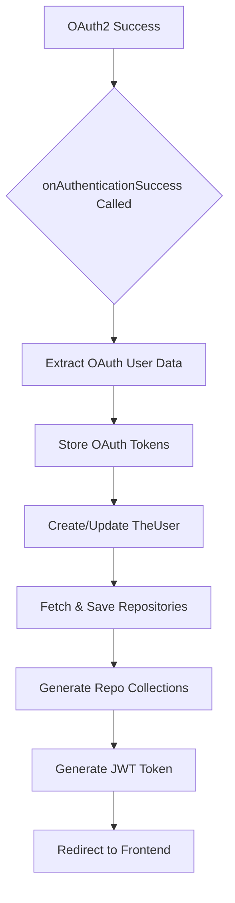

# Github-Repository-Management/src/main/java/com/Barsat/Github/Repository/Management/Config/OAuth/OAuthSuccessionHandler.java

### Overview
This file defines an `AuthenticationSuccessHandler` for Spring Security's OAuth2 flow, specifically handling successful authentication events for GitHub users. Its primary purpose is to process user information received from GitHub, integrate it into the application's user model, trigger data fetching and processing services, and issue a JWT token before redirecting the user to the frontend application.

### Architecture & Role
This component operates at the security layer of the application, specifically within the authentication processing chain of Spring Security. As an `AuthenticationSuccessHandler`, it is invoked immediately after a user successfully authenticates via an OAuth2 provider (GitHub, in this case). It acts as a post-authentication processor, bridging the initial OAuth authentication with the application's internal user management, data synchronization, and session management (via JWT).

### Key Components
*   **`OAuthSuccessionHandler`**: Implements `AuthenticationSuccessHandler` to define custom logic for successful OAuth2 authentication.
*   **Constructor-injected services**:
    *   `UserRepo`: Manages persistence operations for `TheUser` entities.
    *   `OAuthService`: Custom service for handling OAuth-specific operations, such as storing access tokens.
    *   `RepoCollectionsService`: Service responsible for organizing and managing repository collections.
    *   `GithubFetchSaveService`: Service to fetch and persist user repositories from GitHub.
    *   `JwtUtils`: Utility class for generating JSON Web Tokens.
    *   `CommitGraphService`: Service for processing commit graph data (though not explicitly called in `onAuthenticationSuccess`).
    *   `UserInsightService`: Service for collecting and setting user insights, such as disk usage.
*   **`onAuthenticationSuccess` method**: The core method that executes the business logic upon successful authentication.
*   **`@Value` properties**: `clientId` (GitHub client ID) and `frontEndUrl` (target URL for redirection after success).

### Execution Flow / Behavior
When a user successfully authenticates via GitHub OAuth2:
1.  The `onAuthenticationSuccess` method is invoked by Spring Security.
2.  It extracts the `DefaultOAuth2User` and `OAuth2AuthenticationToken` from the `Authentication` object.
3.  The OAuth `code` from the request parameters and the `accessToken` (obtained via `oAuthService.generateAccessToken`) are stored within the `oAuthService`.
4.  User attributes such as `email`, `name`, `avatar_url`, `bio`, `id`, and `disk_usage` are extracted from the `DefaultOAuth2User`'s attributes.
5.  A `TheUser` object is constructed using these attributes, setting `Provider` to `GITHUB` and assigning a placeholder BCrypt-encoded password. The `disk_usage` is set in `userInsightService`.
6.  If a user with the extracted email does not exist, the new `TheUser` object is saved to the `userRepo`.
7.  The `githubFetchSaveService` is called to fetch and save repositories for the authenticated user, using their GitHub username and access token.
8.  The `repoCollectionsService` is invoked to create collections for the user.
9.  A JWT token is generated by `jwtUtils` and added to the `Authorization` header of the HTTP response.
10. The user is redirected to the `frontEndUrl` using `DefaultRedirectStrategy`.

### Dependencies
*   **Internal**:
    *   `com.Barsat.Github.Repository.Management.Config.Jwt.JwtUtils`: For JWT token generation.
    *   `com.Barsat.Github.Repository.Management.Models.Provider`, `com.Barsat.Github.Repository.Management.Models.TheUser`: Data models for users and providers.
    *   `com.Barsat.Github.Repository.Management.Repository.UserRepo`: Data access for user persistence.
    *   `com.Barsat.Github.Repository.Management.Service.*`: Various application services (`CommitGraphService`, `GithubFetchSaveService`, `UserInsightService`, `OAuthService`, `RepoCollectionsService`) that perform business logic related to user data, repository fetching, and insights.
*   **External (Spring Framework & Jakarta EE)**:
    *   `jakarta.servlet.ServletException`, `jakarta.servlet.http.HttpServletRequest`, `jakarta.servlet.http.HttpServletResponse`: Standard servlet API for request/response handling.
    *   `org.springframework.beans.factory.annotation.Value`: For injecting configuration properties.
    *   `org.springframework.security.core.Authentication`: Spring Security's representation of the currently authenticated principal.
    *   `org.springframework.security.crypto.bcrypt.BCryptPasswordEncoder`: For password hashing.
    *   `org.springframework.security.oauth2.client.authentication.OAuth2AuthenticationToken`, `org.springframework.security.oauth2.core.user.DefaultOAuth2User`: Spring Security's OAuth2 specific authentication and user objects.
    *   `org.springframework.security.web.DefaultRedirectStrategy`, `org.springframework.security.web.authentication.AuthenticationSuccessHandler`: Core Spring Security components for handling redirects and successful authentication.
    *   `org.springframework.stereotype.Component`: Marks the class as a Spring component for auto-detection and dependency injection.
    *   `java.io.IOException`: Standard Java I/O exception.
    *   `java.util.Map`: Used for attribute handling.

### Design Notes
*   **Constructor Injection**: The class uses constructor injection for all its service dependencies, which is a recommended practice in Spring for better testability and immutability.
*   **OAuth User Registration**: The handler automatically registers new GitHub users into the application's `TheUser` model upon their first login.
*   **Password Handling**: A placeholder password (`"Password"`) is BCrypt-encoded and set for OAuth users. This implies that OAuth users are not expected to log in via traditional username/password methods, but the `TheUser` model supports a password field.
*   **Immediate Data Sync**: Upon successful authentication, the system immediately triggers services to fetch and save user repositories (`githubFetchSaveService`) and generate initial data collections (`repoCollectionsService`).
*   **JWT Token Generation**: The system generates a JWT token for the authenticated user, which is returned in the response header. This token is expected to be used by the frontend for subsequent authenticated API requests.
*   **Potential `userName` Issue**: The `userName` field used for JWT generation is declared but not initialized or assigned any value from the authenticated user's attributes (e.g., `name`). This will likely result in `jwtUtils.generateToken(null)` being called.
*   **Redirection**: The handler directly redirects the user to a configured frontend URL after all backend processing is complete.

### Diagram (Optional)
