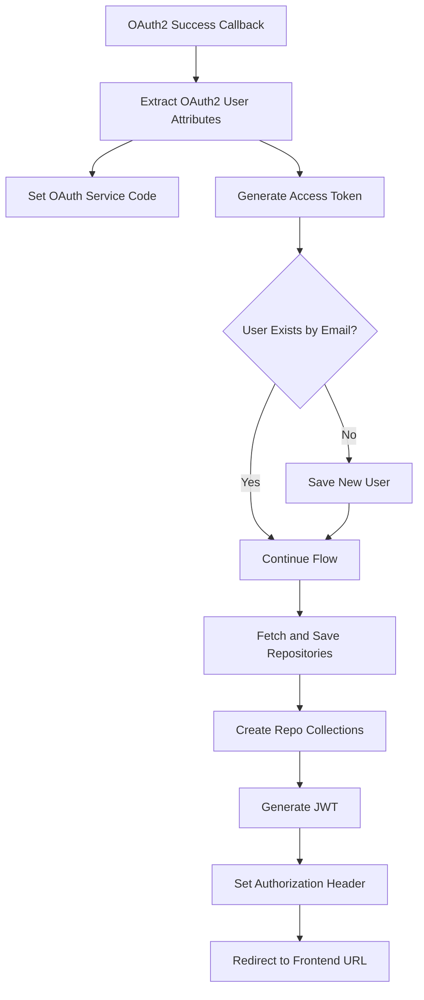

# Github-Repository-Management/src/main/java/com/Barsat/Github/Repository/Management/Config/OAuth/OAuthSuccessionHandler.java

### Overview
This file defines `OAuthSuccessionHandler`, a Spring component that handles successful OAuth2 authentication events. Its primary function is to process user information obtained from a successful GitHub OAuth2 login, persist the user data if new, fetch their repositories, generate a JWT, and redirect the user to a frontend application.

### Architecture & Role
This component operates within the security and authentication layer of the application. It acts as a callback handler for Spring Security's OAuth2 authentication flow. After a user successfully authenticates with an external OAuth2 provider (specifically GitHub), this handler intercepts the success event to perform necessary post-authentication logic, integrating with various services for user management, repository synchronization, and token generation.

### Key Components
*   **`OAuthSuccessionHandler`**: The main class, marked as a `@Component`, which implements Spring Security's `AuthenticationSuccessHandler`.
    *   It uses constructor injection to receive dependencies such as `UserRepo`, `OAuthService`, `RepoCollectionsService`, `GithubFetchSaveService`, `JwtUtils`, `CommitGraphService`, and `UserInsightService`.
    *   It injects configuration values like `clientId` and `frontEndUrl` using `@Value`.
*   **`onAuthenticationSuccess` Method**: The core method that executes upon a successful OAuth2 authentication.
    *   It extracts user details and attributes from the `DefaultOAuth2User` and `OAuth2AuthenticationToken`.
    *   Manages the OAuth access token by interacting with `OAuthService`.
    *   Registers or updates user data in the database via `UserRepo`.
    *   Initiates background processes for fetching user repositories and creating collections.
    *   Generates a JSON Web Token (JWT) using `JwtUtils`.
    *   Redirects the client browser to a configured frontend URL.

### Execution Flow / Behavior
1.  Upon successful OAuth2 authentication (e.g., via GitHub), Spring Security invokes the `onAuthenticationSuccess` method of this handler.
2.  The method extracts the `code` parameter from the request and the `accessToken` by utilizing the `OAuthService`.
3.  User attributes such as email, name, avatar URL, bio, provider ID, and disk usage are extracted from the `DefaultOAuth2User` principal.
4.  A `TheUser` object is constructed and populated with these attributes. A placeholder password is set using `BCryptPasswordEncoder`, and the provider is set to `GITHUB`.
5.  The user's `disk_usage` is passed to `UserInsightService`.
6.  The `userRepo` is checked for an existing user with the extracted email. If no user exists, the newly constructed `TheUser` object is saved to the database.
7.  `githubFetchSaveService.fetchSaveRepositories` is called with the user's name and access token to retrieve and persist their GitHub repositories.
8.  `repoCollectionsService.allCollection()` is then invoked to create repository collections for the authenticated user.
9.  A JWT is generated using `jwtUtils.generateToken` for the user's username.
10. The generated JWT is set in the `Authorization` header of the `HttpServletResponse`.
11. Finally, the client is redirected to the `frontEndUrl` using `DefaultRedirectStrategy`.

### Dependencies
*   **Internal Dependencies**:
    *   `com.Barsat.Github.Repository.Management.Config.Jwt.JwtUtils`: Utility for JWT generation.
    *   `com.Barsat.Github.Repository.Management.Models.Provider`, `TheUser`: Data models for user provider and user entity.
    *   `com.Barsat.Github.Repository.Management.Repository.UserRepo`: Data access interface for user persistence.
    *   `com.Barsat.Github.Repository.Management.Service.*`: Various service components (`CommitGraphService`, `GithubFetchSaveService`, `UserInsightService`, `OAuthService`, `RepoCollectionsService`) for handling specific business logic related to GitHub data, insights, and OAuth flow.
*   **External Dependencies**:
    *   `jakarta.servlet.http.HttpServletRequest`, `HttpServletResponse`: Standard Servlet API for HTTP request and response handling.
    *   `org.springframework.beans.factory.annotation.Value`: Spring annotation for injecting configuration properties.
    *   `org.springframework.security.*`: Spring Security framework components, including `Authentication`, `BCryptPasswordEncoder`, `OAuth2AuthenticationToken`, `DefaultOAuth2User`, `AuthenticationSuccessHandler`, and `DefaultRedirectStrategy`.
    *   `org.springframework.stereotype.Component`: Spring annotation for component scanning.

### Design Notes
*   **Constructor Injection**: The class primarily uses constructor injection for its dependencies, which is a recommended practice for better testability and explicit dependency management.
*   **Dynamic Frontend Redirection**: The `frontEndUrl` is configurable via `@Value`, allowing for flexible deployment and environment-specific frontend integration.
*   **Password Handling for OAuth Users**: A `BCryptPasswordEncoder` is used to encode a generic "Password" for `TheUser` objects created via OAuth. This suggests that OAuth users might not directly use password-based login, or it serves as a placeholder for accounts managed primarily through the OAuth provider.
*   **Sequential Logic**: The order of operations, specifically saving the user before fetching repositories, is noted in a comment as critical to avoid `null` mapping issues on the first login, highlighting an important data dependency.

### Diagram (Optional)
