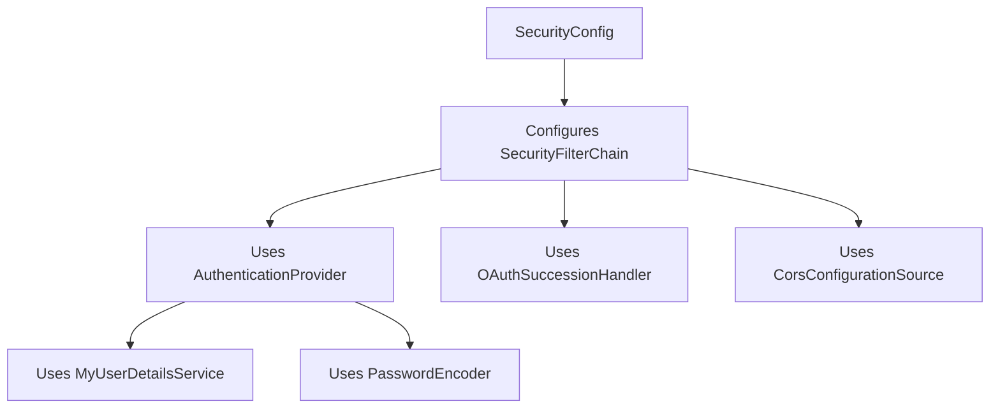

# Github-Repository-Management/src/main/java/com/Barsat/Github/Repository/Management/Config/SecurityConfig.java

### Overview
This file defines the core security configuration for the application using Spring Security. It establishes rules for request authorization, authentication providers, Cross-Origin Resource Sharing (CORS), and integrates OAuth2 login.

### Architecture & Role
Architecturally, this file resides in the `Config` layer and serves as the central point for configuring the application's security aspects. It defines the `SecurityFilterChain` bean, which is a fundamental component of Spring Security, dictating how incoming HTTP requests are processed in terms of authentication, authorization, and other security measures.

### Key Components
*   **`SecurityConfig` class**: The main configuration class, annotated with `@Configuration` and `@EnableWebSecurity`.
*   **`securityFilterChain(HttpSecurity http, CorsConfigurationSource corsConfigurationSource)` method**: A `@Bean` that configures the Spring Security filter chain, specifying authorization rules, CSRF handling, session management, OAuth2 integration, and CORS.
*   **`authenticationProvider()` method**: A `@Bean` that creates a `DaoAuthenticationProvider`, responsible for authenticating users against a `UserDetailsService` using a `PasswordEncoder`.
*   **`authenticationManager(AuthenticationConfiguration config)` method**: A `@Bean` that provides the `AuthenticationManager` for the application, used to process authentication requests.
*   **`corsConfigurationSource()` method**: A `@Bean` that defines the global CORS policy for the application, including allowed origins, methods, headers, and credentials.
*   **`passwordEncoder()` method**: A `@Bean` that provides a `BCryptPasswordEncoder` for hashing and verifying user passwords.
*   **`MyUserDetailsService`**: Injected dependency responsible for loading user-specific data during authentication.
*   **`JwtFilter`**: Injected dependency, intended for JWT authentication, though currently commented out from the filter chain.
*   **`OAuthSuccessionHandler`**: Injected dependency, a custom handler for successful OAuth2 authentication.

### Execution Flow / Behavior
Upon application startup, Spring initializes the `SecurityConfig` class and registers its `@Bean` methods.
1.  **`securityFilterChain`**: This bean constructs the HTTP security configuration.
    *   CSRF protection is configured to ignore specific public endpoints (`/api/auth/public/**`, `/register`, `/login`).
    *   Session management is set to `SessionCreationPolicy.ALWAYS`, meaning an HTTP session will always be created if one does not exist.
    *   Requests to `/api/auth/public/**`, `/register`, `/login`, and `/oauth2/**` are permitted without authentication. All other requests require authentication.
    *   OAuth2 login is enabled and configured to use the `oAuthSuccessionHandler` upon successful authentication.
    *   Basic HTTP authentication is enabled.
    *   CORS is configured using the `corsConfigurationSource` bean.
    *   The `JwtFilter` is *not* actively added to the security filter chain as its integration line is commented out.
2.  **`authenticationProvider`**: This bean defines how users are authenticated by associating a `BCryptPasswordEncoder` with `MyUserDetailsService`, allowing it to load user details and verify credentials.
3.  **`authenticationManager`**: Provides the central interface for the application to handle authentication requests using the configured providers.
4.  **`corsConfigurationSource`**: Defines the allowed origins (various `localhost` instances and specific Vercel deployments), HTTP methods (GET, POST, PUT, DELETE, PATCH), allows credentials, and permits all headers for CORS requests.
5.  **`passwordEncoder`**: Provides the `BCryptPasswordEncoder` instance for password hashing operations throughout the application.

### Dependencies
*   **Internal Dependencies**:
    *   `com.Barsat.Github.Repository.Management.Config.Jwt.JwtFilter`: Injected, intended for JWT processing, but not actively used in the filter chain.
    *   `com.Barsat.Github.Repository.Management.Config.OAuth.OAuthSuccessionHandler`: Injected, custom handler for OAuth2 success.
    *   `com.Barsat.Github.Repository.Management.Service.MyUserDetailsService`: Injected, provides user details for authentication.
*   **External Dependencies**:
    *   **Spring Framework Security**: Numerous classes from `org.springframework.security.*` for core security functionality, web security configuration, authentication providers, password encoding, and OAuth2.
    *   **Spring Framework Context**: `@Bean`, `@Configuration`.
    *   **Spring Framework Beans**: `@Autowired`.
    *   **Jakarta Servlet API**: `jakarta.servlet.http.HttpServletRequest` for CORS configuration.

### Design Notes
*   **Flexible Authentication**: The configuration supports multiple authentication mechanisms including basic HTTP authentication and OAuth2 login. The presence of the `JwtFilter` in the constructor indicates a potential for JWT-based authentication, though it is currently disabled in the security filter chain.
*   **CORS Policy**: The CORS configuration is permissive for a defined set of development and deployment origins, allowing common HTTP methods and all headers. This is typical for single-page applications interacting with a backend API.
*   **Session Management**: The use of `SessionCreationPolicy.ALWAYS` ensures a session is always created, which is suitable for traditional session-based applications.
*   **CSRF Protection**: CSRF protection is selectively disabled for public endpoints, balancing security with the needs of unauthenticated access points.
*   **Password Hashing**: `BCryptPasswordEncoder` is used, which is an industry-standard cryptographic hash function for storing passwords securely.

### Diagram (Optional)
