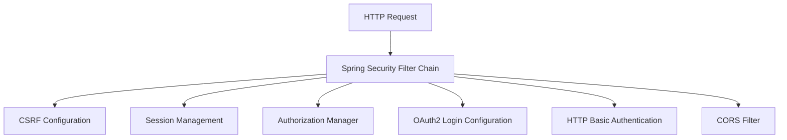

# Github-Repository-Management/src/main/java/com/Barsat/Github/Repository/Management/Config/SecurityConfig.java

### Overview
This file configures Spring Security for the application, defining web security rules, authentication providers, session management policies, and Cross-Origin Resource Sharing (CORS) settings. It acts as the central point for securing HTTP requests within the application.

### Architecture & Role
This file resides in the configuration layer of the application, specifically handling security infrastructure. It implements Spring Security's web security configurations, dictating how requests are authorized and authenticated. It integrates various security components into a `SecurityFilterChain`, which processes incoming HTTP requests.

### Key Components
*   `SecurityConfig` class: The main class annotated with `@Configuration` and `@EnableWebSecurity` responsible for defining security beans and the security filter chain.
*   `securityFilterChain` method: Configures the HTTP security aspects, including CSRF protection, session management, request authorization rules, OAuth2 login setup, HTTP Basic authentication, and CORS integration.
*   `authenticationProvider` method: Provides a `DaoAuthenticationProvider` bean, which uses `MyUserDetailsService` to retrieve user details and `BCryptPasswordEncoder` for password validation.
*   `authenticationManager` method: Exposes the `AuthenticationManager` bean, essential for processing authentication requests.
*   `corsConfigurationSource` method: Defines the application's CORS policy, specifying allowed origins, HTTP methods, headers, and credentials.
*   `passwordEncoder` method: Provides a `BCryptPasswordEncoder` bean for secure password hashing.
*   `MyUserDetailsService`: An injected dependency responsible for loading user-specific data.
*   `OAuthSuccessionHandler`: An injected dependency that handles successful OAuth2 authentication events.
*   `JwtFilter`: An injected dependency for JWT-based authentication, though its inclusion in the `securityFilterChain` is currently commented out.

### Execution Flow / Behavior
1.  **Application Startup**: When the application starts, Spring detects `SecurityConfig` due to its `@Configuration` annotation.
2.  **Bean Initialization**: Spring initializes various security-related beans:
    *   A `BCryptPasswordEncoder` for password hashing.
    *   A `DaoAuthenticationProvider` configured with the `MyUserDetailsService` and `BCryptPasswordEncoder`.
    *   The `AuthenticationManager` is retrieved from the `AuthenticationConfiguration`.
    *   A `CorsConfigurationSource` is established with specified allowed origins, methods, and headers.
3.  **Security Filter Chain Setup**: The `securityFilterChain` method defines the sequence of security filters:
    *   **CSRF Protection**: Configured to ignore specific public endpoints (`/api/auth/public/**`, `/register`, `/login`) from CSRF checks.
    *   **Session Management**: Sets the session creation policy to `SessionCreationPolicy.ALWAYS`, ensuring a session is always created if one doesn't exist.
    *   **Authorization**: Configures authorization rules:
        *   Requests to `/api/auth/public/**`, `/register`, `/login`, and `/oauth2/**` are granted `permitAll()` access.
        *   All other requests (`anyRequest()`) require authentication (`authenticated()`).
    *   **OAuth2 Login**: Enables OAuth2 login and registers the `oAuthSuccessionHandler` for post-login processing.
    *   **HTTP Basic Authentication**: Activates HTTP Basic authentication.
    *   **CORS**: Applies the defined `corsConfigurationSource` to handle cross-origin requests.
    *   *Note on JWT*: Although the `JwtFilter` is injected, its integration into the `securityFilterChain` via `addFilterBefore` is currently commented out, meaning JWT authentication is not active in this configuration.

### Dependencies
*   **Internal**:
    *   `com.Barsat.Github.Repository.Management.Config.Jwt.JwtFilter`: Provides a custom filter for JSON Web Token processing.
    *   `com.Barsat.Github.Repository.Management.Config.OAuth.OAuthSuccessionHandler`: Handles custom logic upon successful OAuth2 authentication.
    *   `com.Barsat.Github.Repository.Management.Service.MyUserDetailsService`: A custom service for retrieving user details during authentication.
*   **External (Spring Framework)**:
    *   `org.springframework.security.*`: Core Spring Security components for configuring web security, authentication, and authorization.
    *   `org.springframework.web.cors.CorsConfigurationSource`: Interface for configuring Cross-Origin Resource Sharing.
    *   `jakarta.servlet.http.HttpServletRequest`: Standard servlet API used in CORS configuration.

### Design Notes
*   **Hybrid Authentication Approach**: The configuration supports multiple authentication mechanisms: traditional username/password via `DaoAuthenticationProvider` and OAuth2 login.
*   **Session Management Policy**: `SessionCreationPolicy.ALWAYS` indicates a stateful approach where a session is always maintained. This contrasts with stateless patterns often used with JWTs, though the `JwtFilter` is present but inactive.
*   **Selective CSRF Protection**: CSRF protection is explicitly disabled for public authentication and registration endpoints. While this can simplify client interactions, careful consideration of potential vulnerabilities for these specific endpoints is warranted.
*   **Explicit CORS Configuration**: The CORS configuration precisely lists allowed origins, methods, and headers, which is a good security practice to mitigate cross-site scripting attacks. The use of `*` for `allowedHeaders` and `exposedHeaders` is broad and could be tightened if specific header restrictions are desired.
*   **Inactive JWT Filter**: The `JwtFilter` is available as a bean but not currently added to the `SecurityFilterChain`. This suggests JWT-based authentication might be a planned feature, an alternative path, or a remnant of previous design iterations.

### Diagram (Optional)
