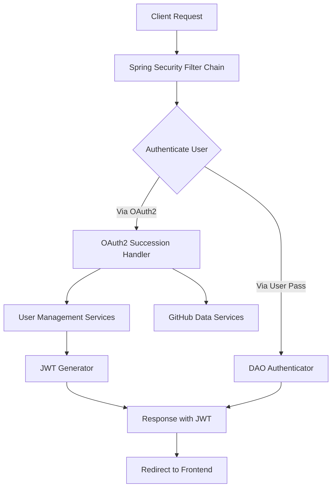

# Easy-Repo — Repository Overview

### High-Level Purpose
This repository implements a Spring Boot application designed to manage and integrate with GitHub repositories. Its primary objective is to provide authentication mechanisms (including OAuth2 with GitHub and traditional username/password), persist user data, fetch and synchronize user-specific GitHub repository information, and provide a foundation for further repository-related insights and management.

### Architectural Structure
The application follows a standard Spring Boot layered architecture, organized within the `com.Barsat.Github.Repository.Management` package.

*   **Configuration Layer (`Config`)**: Contains critical application configurations, primarily focusing on security. This includes sub-packages for `Jwt` (JSON Web Token handling) and `OAuth` (OAuth2 authentication setup), as well as the main `SecurityConfig` for defining the Spring Security filter chain and rules.
*   **Service Layer (`Service`)**: Encapsulates business logic, such as user detail loading (`MyUserDetailsService`), OAuth-specific operations (`OAuthService`), and GitHub data fetching and saving (`GithubFetchSaveService`, `RepoCollectionsService`, `CommitGraphService`, `UserInsightService`).
*   **Repository Layer (`Repository`)**: Provides data access objects (DAOs) for persisting and retrieving entities, e.g., `UserRepo` for user data.
*   **Model Layer (`Models`)**: Defines the data entities used throughout the application, such as `TheUser` and `Provider`.

This structure promotes separation of concerns, with security configurations handled distinctly from core business logic and data persistence.

### Core Components
*   **Spring Security Infrastructure**: The foundation for authentication and authorization.
*   **`SecurityConfig`**: The central configuration class that defines the HTTP security rules, authentication providers, session management, CORS policies, and integrates various security filters, including OAuth2 login.
*   **`OAuthSuccessionHandler`**: A Spring Security success handler responsible for processing post-OAuth2 authentication events. It handles user creation/update, triggers GitHub repository fetching, generates JWTs, and redirects to the frontend.
*   **`JwtFilter`**: A custom Spring Security filter (currently inactive in the `SecurityConfig`) designed to intercept requests, validate JWTs from the Authorization header, and set up the Spring Security context.
*   **`JwtUtils`**: A utility service for generating, parsing, and validating JSON Web Tokens.
*   **`MyUserDetailsService`**: A custom implementation of Spring Security's `UserDetailsService` for loading application-specific user details, crucial for traditional username/password authentication.
*   **GitHub Integration Services**: A suite of services (e.g., `GithubFetchSaveService`, `RepoCollectionsService`) that interact with the GitHub API to fetch user repositories and organize them into collections.
*   **`UserRepo`**: The data access component for managing `TheUser` entities in the persistence layer.

### Interaction & Data Flow
1.  **Incoming HTTP Request**: A client initiates an HTTP request to the application.
2.  **Spring Security Filter Chain**: The request first passes through the `SecurityConfig`-defined Spring Security filter chain.
3.  **Authentication Path A - OAuth2**:
    *   If the request is for OAuth2 login (`/oauth2/**`), Spring Security delegates to an OAuth2 provider (e.g., GitHub).
    *   Upon successful external authentication, control returns to the application via `OAuthSuccessionHandler`.
    *   The `OAuthSuccessionHandler` extracts user details, persists/updates the user via `UserRepo`, initiates asynchronous tasks to fetch and save GitHub repositories, generates a JWT using `JwtUtils`, sets this JWT in the response header, and redirects the client to a configured frontend URL.
4.  **Authentication Path B - Username/Password**:
    *   If the request involves traditional username/password login (`/login`), the `DaoAuthenticationProvider` uses `MyUserDetailsService` to retrieve user details and `BCryptPasswordEncoder` to validate the password.
5.  **Authentication Path C - JWT (Inactive)**:
    *   The `JwtFilter` is present but currently commented out in `SecurityConfig`. If active, it would intercept requests containing a "Bearer" JWT in the Authorization header, validate it via `JwtUtils`, and authenticate the user by updating the `SecurityContextHolder`.
6.  **Authorization**: After a user is authenticated (by any active method), the `SecurityConfig` enforces authorization rules, typically requiring authentication for most API endpoints while permitting access to public authentication and registration endpoints.
7.  **Data Processing**: Once authenticated, the user's requests can access various services (e.g., `GithubFetchSaveService`, `RepoCollectionsService`) to interact with and manage GitHub repository data.

### Technology Stack
*   **Backend Framework**: Spring Boot
*   **Security Framework**: Spring Security (with support for OAuth2 and JWT)
*   **JWT Library**: JJWT (`io.jsonwebtoken.*`)
*   **Password Hashing**: BCrypt (`BCryptPasswordEncoder`)
*   **Persistence**: Spring Data (inferred from `Repository` components like `UserRepo`)
*   **Web Server**: Embedded Servlet Container (provided by Spring Boot)
*   **Core Java APIs**: Java Cryptography Architecture (JCA) for key generation.
*   **Servlet API**: Jakarta Servlet API (`jakarta.servlet.*`) for HTTP request/response handling.

### Design Observations
*   **Hybrid Authentication Model**: The application supports both OAuth2-based authentication (specifically with GitHub) and traditional username/password authentication, providing flexibility for user registration and login.
*   **Stateful Session Management**: The `SecurityConfig` defines `SessionCreationPolicy.ALWAYS`, indicating a stateful approach where HTTP sessions are consistently maintained. This contrasts with the typically stateless nature of JWT-based authentication, though the `JwtFilter` for JWT handling is currently inactive.
*   **Dynamic JWT Secret Key**: The `JwtUtils` generates a new `HmacSHA256` secret key every time the application starts. While this simplifies initial setup, it means that any previously issued JWTs become invalid upon application restart. For production environments, a static, securely managed key configured externally is generally preferred for consistency and scalability.
*   **Clear Separation of Concerns**: Different aspects of the security and application logic are handled by dedicated components (e.g., `JwtFilter` for token processing, `OAuthSuccessionHandler` for OAuth2 post-login, `MyUserDetailsService` for user details), enhancing maintainability.
*   **External Service Integration**: The architecture is designed to integrate significantly with GitHub, handling user authentication and data retrieval from the GitHub API.

### System Diagram (Optional)
