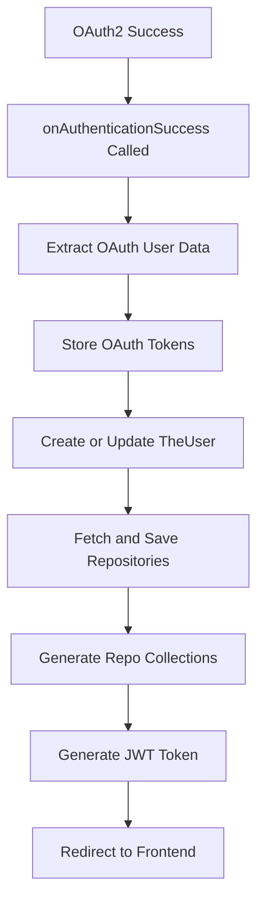

# Easy-Repo — Repository Overview

### High-Level Purpose
This repository contains a Spring Boot application designed to manage and provide insights into a user's GitHub repositories. Its primary objective is to integrate with GitHub for user authentication via OAuth2, fetch repository data, and process it, offering a secure backend with provisions for various authentication mechanisms including JWT.

### Architectural Structure
The application employs a standard layered architecture within a Spring Boot framework.
*   **`Config` Layer**: Centralizes application-wide configurations, particularly for Spring Security, JWT processing, and OAuth2 integration.
*   **`Service` Layer**: Contains the core business logic, including user management, OAuth operations, GitHub repository fetching and saving, data processing for repository collections, and user insights.
*   **`Repository` Layer**: Provides the data access objects (DAOs) for persisting user entities.
*   **`Models` Layer**: Defines the data transfer objects (DTOs) and entity structures used across the application.
Developer tooling configuration for Visual Studio Code, such as `.vscode/settings.json`, exists independently at the development environment layer, not affecting the runtime architecture.

### Core Components
*   **`SecurityConfig`**: The central configuration component for Spring Security, defining authorization rules, authentication providers, CORS policy, session management, and integrating OAuth2 login.
*   **`JwtFilter`**: (Currently inactive in the security filter chain) Intended to intercept incoming HTTP requests to validate and process JSON Web Tokens (JWTs) for authentication.
*   **`JwtUtils`**: A utility service responsible for the lifecycle management of JWTs, including generating, validating, and extracting claims from tokens.
*   **`OAuthSuccessionHandler`**: A custom Spring Security handler that executes upon successful OAuth2 authentication (specifically GitHub). It provisions users, initiates data synchronization (fetching repositories), generates initial repository collections, and issues a JWT token.
*   **`MyUserDetailsService`**: An implementation of Spring Security's `UserDetailsService` to load user-specific data required during authentication.
*   **`UserRepo`**: A data repository component responsible for persistence operations related to `TheUser` entities.
*   **`GithubFetchSaveService`**: A service dedicated to fetching and persisting a user's repositories from the GitHub API into the application's data store.
*   **`RepoCollectionsService`**: Manages the creation and organization of user-defined collections of repositories.
*   **`UserInsightService`**: Gathers and processes user-specific insights, such as disk usage, derived from repository data.

### Interaction & Data Flow
The primary high-level runtime interaction described is the OAuth2 login flow:
1.  An unauthenticated user initiates an OAuth2 login, typically through GitHub.
2.  Upon successful authentication with GitHub, Spring Security invokes the application's `OAuthSuccessionHandler`.
3.  The `OAuthSuccessionHandler` extracts user details provided by GitHub and either creates a new `TheUser` entity or updates an existing one, persisting it via `UserRepo`.
4.  It then orchestrates calls to `GithubFetchSaveService` to retrieve and save the user's repositories and to `RepoCollectionsService` to set up initial repository collections.
5.  A JWT is generated by `JwtUtils` and added to the HTTP response header.
6.  Finally, the user is redirected to a configured frontend application URL.

For subsequent requests, the system currently uses `SessionCreationPolicy.ALWAYS` and supports basic HTTP authentication. While a `JwtFilter` component exists for stateless JWT authentication, it is not actively integrated into the main Spring Security filter chain as configured, indicating a primary reliance on session-based or OAuth-driven authentication.

### Technology Stack
*   **Backend Framework**: Spring Boot, Spring Security.
*   **Authentication/Authorization**: OAuth2 (with specific GitHub integration), JSON Web Tokens (using the JJWT library), BCrypt for secure password hashing.
*   **Web**: Spring Web (built on Jakarta Servlet API).
*   **Development Tooling**: Visual Studio Code (configured via `.vscode/settings.json` for Java development).
*   **External Integrations**: GitHub API (implicitly through `GithubFetchSaveService`).
*   **Cryptography**: Standard Java Cryptography Architecture (JCA) for key generation.

### Design Observations
*   **Modular Security Design**: The application exhibits a clear separation of concerns within its security components, with dedicated classes for JWT utilities, OAuth success handling, and overall Spring Security configuration.
*   **Dynamic JWT Secret Key Generation**: The JWT secret key is generated programmatically at application startup. While convenient for development, this approach causes all previously issued tokens to become invalid upon application restart, making it unsuitable for multi-instance deployments or scenarios requiring persistent sessions across restarts. A static or externally managed key strategy would improve robustness.
*   **Immediate Post-Authentication Data Provisioning**: Upon successful OAuth2 login, the system proactively fetches GitHub repositories and initializes repository collections, aiming to provide a fully prepared user environment instantly.
*   **Mixed Authentication Mechanisms**: The `SecurityConfig` supports both OAuth2 login and basic HTTP authentication. The `SessionCreationPolicy.ALWAYS` setting suggests a preference for session-based interactions for the active authentication methods. The `JwtFilter` component is present but explicitly commented out from the security filter chain, indicating that JWT-based authentication is either under development or an optional/alternative mechanism not currently enabled.
*   **Potential Null JWT Subject**: In `OAuthSuccessionHandler`, the `userName` field, intended for JWT subject, is declared but not explicitly initialized from the authenticated user's attributes before being used by `jwtUtils.generateToken`. This could result in JWTs being generated with a `null` subject, which requires review.

### System Diagram (Optional)

