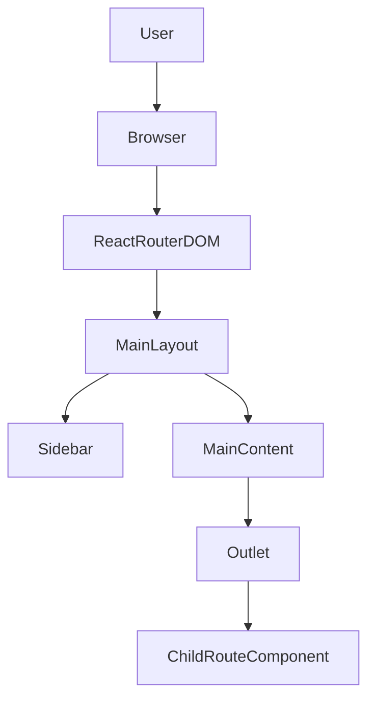

# REPOSITORY_OVERVIEW.md

> **Source File:** [REPOSITORY_OVERVIEW.md](https://github.com/test-company-prowiz/Easy-Repo/blob/master/REPOSITORY_OVERVIEW.md)
> **Repository:** `Easy-Repo`
> **Branch:** `master`

# Easy-Repo — Repository Overview

### High-Level Purpose
This repository hosts the frontend application for an "AI Documentation Engine". Its primary objective is to provide a responsive and consistent user interface for navigating and displaying documentation content.

### Architectural Structure
The repository implements a client-side web application using a component-based architecture. It primarily consists of a React UI layer responsible for presentation and user interaction. Routing is handled client-side by `react-router-dom`, with a top-level `MainLayout` component acting as a shell for all route-specific content.

### Core Components
*   **`MainLayout`**: A foundational React component that defines the global application structure, including persistent navigation (sidebar) and a dynamic content area for child routes.
*   **Client-side Router**: Implemented using `react-router-dom` to manage navigation, render components based on URL paths, and provide programmatic navigation capabilities.

### Interaction & Data Flow
User interaction begins in the browser, triggering client-side routing managed by `react-router-dom`. The router renders the `MainLayout` component, which provides a consistent shell. Navigation within the application (e.g., clicking sidebar links) uses `useNavigate` to update the URL. The `Outlet` component within `MainLayout` then dynamically renders the appropriate child component corresponding to the current route. Sidebar visibility is managed by internal component state for responsiveness.

### Technology Stack
*   **Frontend Framework**: React
*   **Routing**: `react-router-dom`
*   **Styling**: Tailwind CSS

### Design Observations
*   The application prioritizes a responsive design, adapting its layout and navigation behavior for various screen sizes.
*   A centralized `MainLayout` component ensures UI consistency across the application and simplifies the addition of new routes by abstracting common structural elements.
*   Navigation items are programmatically defined, allowing for flexible and easily extensible routing.

### System Diagram

```mermaid
graph TD
User[User] --> Browser[Browser]
Browser --> ReactRouterDOM[ReactRouterDOM]
ReactRouterDOM --> MainLayout[MainLayout]
MainLayout --> Sidebar[Sidebar]
MainLayout --> MainContent[MainContent]
MainContent --> Outlet[Outlet]
Outlet --> ChildComponent[ChildRouteComponent]
```