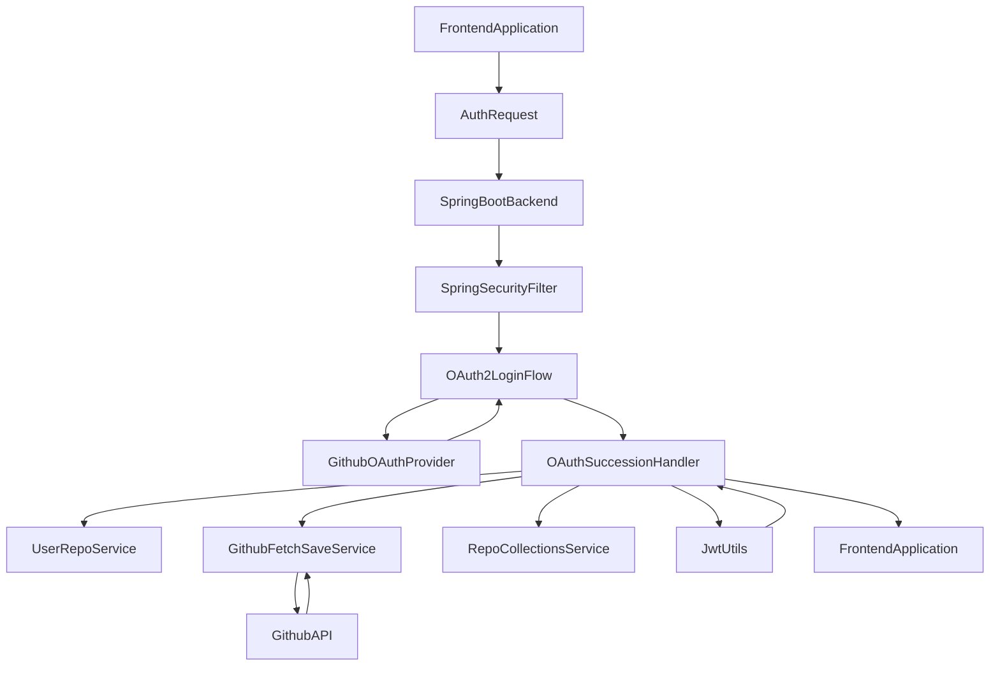

# Easy-Repo — Repository Overview

### High-Level Purpose
This repository implements a Spring Boot application designed to manage and provide insights into GitHub repositories for authenticated users. It facilitates secure user authentication (via OAuth2 and traditional credentials), synchronizes repository data from GitHub, enables users to organize repositories into custom collections, and offers an API for various repository-related operations. It acts as a backend service for a client-side frontend application.

### Architectural Structure
The system follows a multi-layered architecture, primarily for the Spring Boot backend, complemented by a separate React frontend.
**Backend Layers:**
*   **`Config`**: Contains global application configurations, including Spring Security settings, JWT management, and OAuth2 integration.
*   **`Controller`**: Exposes RESTful API endpoints, handles incoming HTTP requests, and delegates business logic to the service layer.
*   **`Service`**: Encapsulates core business logic, such as user management, GitHub API interactions (fetching/saving repositories), repository collection management, and user insights.
*   **`Repository`**: Defines data access interfaces for persistence operations for various entities.
*   **`Models`**: Holds JPA entities for database mapping and Data Transfer Objects (DTOs) for structured data exchange.
**Frontend:**
*   A separate React application (`grms-frontend`) consumes these backend APIs, organizing its code into components and global styles.
**Development Environment:**
*   `.vscode` directory contains workspace-specific settings for the Visual Studio Code IDE, particularly for Java development.

### Core Components
*   **`SecurityConfig`**: The central configuration for Spring Security, defining the security filter chain, authentication providers (DAO and OAuth2), CORS policy, and session management.
*   **`JwtUtils`**: A service component responsible for generating, parsing, and validating JSON Web Tokens (JWTs).
*   **`JwtFilter`**: A Spring Security filter designed for processing JWTs, though its inclusion in the main `SecurityFilterChain` is currently commented out.
*   **`OAuthSuccessionHandler`**: A custom Spring Security handler that processes successful OAuth2 logins, integrates user data, triggers repository data synchronization from GitHub, generates initial repository collections, and issues a JWT.
*   **`AuthService` and `AuthController`**: Handle user registration and traditional username/password login, issuing JWTs upon successful authentication.
*   **`MyUserDetailsService`**: An implementation of Spring Security's `UserDetailsService` for loading user details during authentication.
*   **`GithubFetchSaveService`**: Manages fetching GitHub repositories via the GitHub API and persisting them in the application's database.
*   **`RepoCollectionsService`**: Orchestrates the creation, retrieval, and modification of user-defined repository collections.
*   **`RepoInsightController`**: Provides API endpoints for querying GitHub repository insights (e.g., lines of code, README content).

### Interaction & Data Flow
The primary data flow for OAuth2 authentication and subsequent interactions is:
1.  A client-side frontend initiates an OAuth2 login request (e.g., with GitHub) by redirecting the user to a Spring Boot backend endpoint.
2.  The Spring Security filter chain intercepts this request and initiates the OAuth2 flow, redirecting the user to the OAuth2 provider (GitHub).
3.  Upon successful authentication, the OAuth2 provider redirects the user back to the Spring Boot application.
4.  The `OAuthSuccessionHandler` processes this successful authentication event. It extracts user details and access tokens, then either creates a new `TheUser` entity or updates an existing one in the database.
5.  It then triggers internal services (`GithubFetchSaveService`, `RepoCollectionsService`, `UserInsightService`) to synchronize the user's GitHub repositories, create initial collections, and record user insights.
6.  A JWT is generated by `JwtUtils` and subsequently added to the `Authorization` header of the HTTP response.
7.  Finally, the client is redirected to a pre-configured frontend URL.
For subsequent API requests, the application is configured to support HTTP Basic authentication and a session-based approach, while the generated JWT is expected to be used by the frontend for stateless authentication.

### Technology Stack
*   **Backend**: Java, Spring Boot, Spring Security (with OAuth2, JWT, BCryptPasswordEncoder), Spring Data JPA, JJWT (`io.jsonwebtoken`), Jackson (`com.fasterxml.jackson.annotation`), Project Lombok, Jakarta Servlet API, `javax.crypto`.
*   **Frontend**: TypeScript, React, NextUI, Tailwind CSS, PostCSS.
*   **Development Tools**: Visual Studio Code, Git.

### Design Observations
*   **Hybrid Authentication Strategy**: The backend supports multiple authentication models including OAuth2, traditional username/password login, and HTTP Basic. The `JwtFilter` is present but deactivated in the primary `SecurityFilterChain`, and `SessionCreationPolicy.ALWAYS` is active, suggesting an evolving or mixed approach to authentication state management.
*   **Volatile JWT Secret Key**: The `JwtUtils` component dynamically generates a new HmacSHA256 secret key on each application restart. This design choice invalidates all previously issued JWTs upon restart, making it unsuitable for production environments that require persistent sessions or multi-instance deployments. A stable, externally managed key is recommended.
*   **Proactive Data Synchronization**: The system immediately fetches and processes GitHub repository data upon successful OAuth2 authentication. This design aims to provide an immediate, rich user experience but could be resource-intensive for users with a large number of repositories.
*   **Indirect Repository Management**: Operations such as repository deletion and renaming are not performed directly through the application's API. Instead, users are redirected to GitHub's settings page, which avoids requiring sensitive "delete" OAuth scopes upfront and potentially enhances user trust.
*   **Potential `null` JWT Subject**: In `OAuthSuccessionHandler`, the `userName` variable used for JWT generation appears uninitialized, potentially leading to JWTs being issued with a `null` subject. This is a critical logical flaw requiring remediation to ensure valid token generation.
*   **Lombok for Conciseness**: The extensive use of Project Lombok effectively reduces boilerplate code in DTOs and entities, contributing to cleaner and more readable codebases.

### System Diagram

```mermaid
graph TD
A[FrontendApplication] --> B[AuthRequest]
B --> C[SpringBootBackend]
C --> D[SpringSecurityFilter]
D --> E[OAuth2LoginFlow]
E --> F[GithubOAuthProvider]
F --> E
E --> G[OAuthSuccessionHandler]
G --> H[UserRepoService]
G --> I[GithubFetchSaveService]
I --> J[GithubAPI]
J --> I
G --> K[RepoCollectionsService]
G --> L[JwtUtils]
L --> G
G --> M[FrontendApplication]
```