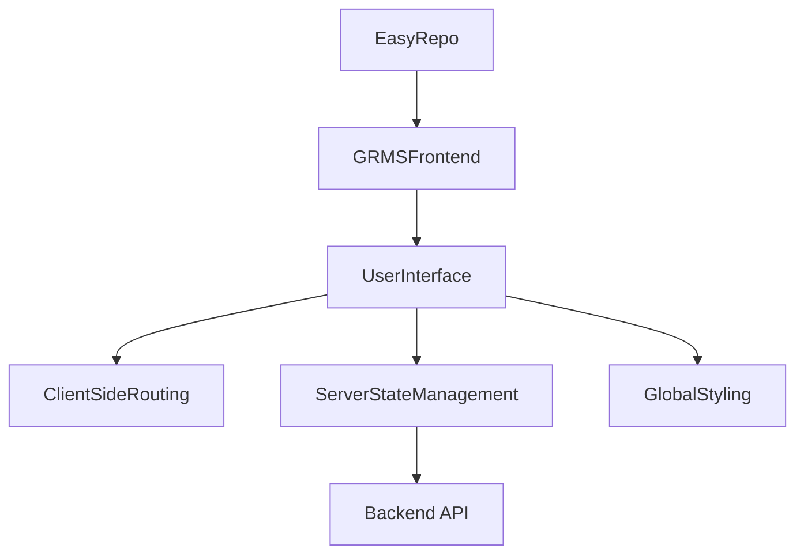

# REPOSITORY_OVERVIEW.md

> **Source File:** [REPOSITORY_OVERVIEW.md](https://github.com/test-company-prowiz/Easy-Repo/blob/master/REPOSITORY_OVERVIEW.md)
> **Repository:** `Easy-Repo`
> **Branch:** `master`

# Easy-Repo — Repository Overview

### High-Level Purpose
The `Easy-Repo` repository hosts the frontend application for a system, likely related to "GRMS" (inferred from `grms-frontend`). Its primary objective is to provide a user interface with client-side routing, user authentication, and a dashboard, while managing server-side data interactions.

### Architectural Structure
The repository contains at least one primary module, `grms-frontend`, which is a single-page application (SPA). This module is structured with a `src` directory containing the main application logic (`App.tsx`) and global styling (`index.css`). The overall structure suggests a client-side application layer.

### Core Components
*   **Application Root (`App.tsx`)**: Orchestrates client-side routing, global state management for data fetching, and integrates authentication logic.
*   **Client-Side Router (`react-router-dom`)**: Manages navigation and view rendering based on URL paths.
*   **Server State Manager (`@tanstack/react-query`)**: Handles data fetching, caching, and synchronization with a backend.
*   **Authentication Components (`Login`, `ProtectedRoutes`)**: Provide user login functionality and enforce access control for protected routes.
*   **Global Stylesheet (`index.css`)**: Defines base styles, integrates Tailwind CSS, and includes custom utility classes for consistent UI presentation.

### Interaction & Data Flow
The frontend application, upon loading in a browser, initializes its routing and data fetching mechanisms. User interactions trigger route changes, leading to the rendering of different UI components (e.g., Home, Login, Dashboard). Protected routes enforce authentication checks before displaying content. Data required by components is fetched and managed through `@tanstack/react-query`, implying interactions with a backend API for data retrieval and submission. Styling is applied globally via Tailwind CSS.

### Technology Stack
*   **React**: The primary JavaScript library for building user interfaces (inferred from `.tsx` files and component structure).
*   **TypeScript**: Used for application development, providing type safety (inferred from `.tsx` file extension).
*   **`react-router-dom`**: For declarative client-side routing.
*   **`@tanstack/react-query`**: For server state management, including data fetching, caching, and synchronization.
*   **Tailwind CSS**: A utility-first CSS framework for styling.
*   **PostCSS**: Likely used in the build process to expand Tailwind directives (inferred from `index.css`).

### Design Observations
*   **Centralized Frontend Concerns**: Routing and global data fetching are configured at the application root, providing a clear and consistent approach to these cross-cutting concerns.
*   **Modular Authentication**: The `ProtectedRoutes` component abstracts authentication logic, promoting reusability and separation of concerns for access control.
*   **Utility-First Styling**: The adoption of Tailwind CSS enables rapid UI development and ensures design consistency through a comprehensive set of utility classes.
*   **Accessibility Focus**: Explicit styling for focus rings (`*:focus:not(ol)`) demonstrates consideration for keyboard navigation and overall accessibility.

### System Diagram

```mermaid
graph TD
EasyRepo --> GRMSFrontend
GRMSFrontend --> UserInterface
UserInterface --> ClientSideRouting
UserInterface --> ServerStateManagement
UserInterface --> GlobalStyling
ServerStateManagement --> BackendAPI[Backend API]
```