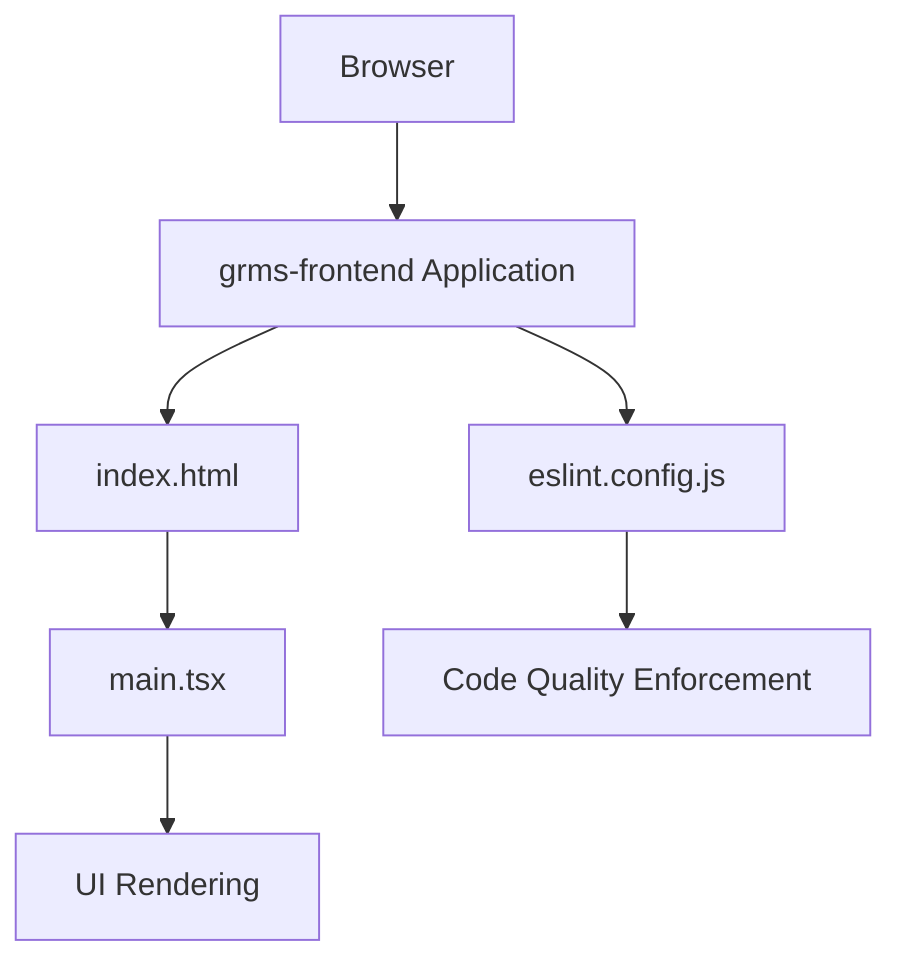

# REPOSITORY_OVERVIEW.md

> **Source File:** [REPOSITORY_OVERVIEW.md](https://github.com/test-company-prowiz/Easy-Repo/blob/master/REPOSITORY_OVERVIEW.md)
> **Repository:** `Easy-Repo`
> **Branch:** `master`

# Easy-Repo — Repository Overview

### High-Level Purpose
The repository appears to host a frontend web application, specifically `grms-frontend`. Its primary objective is to deliver an interactive client-side user interface.

### Architectural Structure
The repository contains at least one distinct frontend application, `grms-frontend`. This application follows a single-page application (SPA) architecture, with an `index.html` acting as the entry point for the browser and `/src/main.tsx` bootstrapping the core application logic.

### Core Components
*   **`grms-frontend` Application**: The main client-side web application.
    *   **HTML Entry Point (`index.html`)**: Serves as the initial document loaded by the browser, defining the application's shell and mounting point.
    *   **Client-Side Application Logic (`main.tsx`)**: The primary JavaScript/TypeScript bundle responsible for rendering the UI and handling client-side interactions.
*   **Development Tooling**:
    *   **ESLint Configuration (`eslint.config.js`)**: Enforces code quality and consistency for TypeScript and React components.

### Interaction & Data Flow
A client browser initiates interaction by requesting the `index.html` file. This HTML document then directs the browser to load external resources, including fonts and the main JavaScript/TypeScript application bundle (`/src/main.tsx`). The JavaScript application subsequently initializes and renders its user interface within a designated HTML element (`
`). During development, ESLint tooling analyzes the frontend codebase to ensure adherence to defined code standards.

### Technology Stack
*   **Frontend Framework**: React (inferred from `react-hooks` and `main.tsx`).
*   **Language**: TypeScript (explicitly mentioned for `.ts`, `.tsx`, and `typescript-eslint`).
*   **Bundler/Build Tool**: Vite (inferred from `vite.svg` and `type="module"` script).
*   **Linting**: ESLint, `typescript-eslint`, `eslint-plugin-react-hooks`, `eslint-plugin-react-refresh`.
*   **Styling/Assets**: Google Fonts, SVG assets.

### Design Observations
The `grms-frontend` application is designed as a modern Single-Page Application, leveraging a JavaScript framework (likely React) and TypeScript for type safety. The strong emphasis on linting (ESLint with React-specific and TypeScript rules) indicates a focus on code quality, maintainability, and developer experience, particularly in supporting features like React Fast Refresh. The use of a module-based script and `vite.svg` suggests a contemporary build setup.

### System Diagram

```mermaid
graph TD
Browser --> FrontendApplication[grms-frontend Application]
FrontendApplication --> IndexHTML[index.html]
IndexHTML --> MainTSX[main.tsx]
MainTSX --> UIRendering[UI Rendering]
FrontendApplication --> ESLintConfig[eslint.config.js]
ESLintConfig --> CodeQualityEnforcement[Code Quality Enforcement]
```