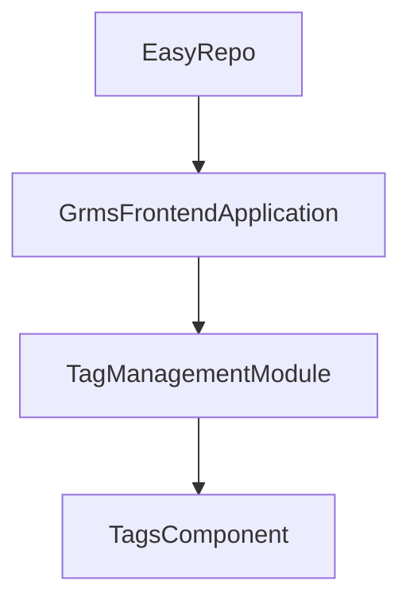

# REPOSITORY_OVERVIEW.md

> **Source File:** [REPOSITORY_OVERVIEW.md](https://github.com/test-company-prowiz/Easy-Repo/blob/master/REPOSITORY_OVERVIEW.md)
> **Repository:** `Easy-Repo`
> **Branch:** `master`

# Easy-Repo — Repository Overview

### High-Level Purpose
The `Easy-Repo` repository appears to host a frontend application, specifically a General Resource Management System (GRMS) frontend. Its primary objective, as inferred from the provided component, is to provide user interface functionality for managing system tags, encompassing both viewing existing tags and creating new ones.

### Architectural Structure
The repository contains a `grms-frontend` directory, indicating a dedicated frontend application structure. Within this, the `src/components` path suggests a modular component-based architecture, typical for modern single-page applications. Components are organized into logical modules, such as `TagComponents`, grouping related UI elements.

### Core Components
The primary subsystem identifiable is the **Tag Management Module**. This module is responsible for:
*   **`Tags`**: An orchestrating component that aggregates tag display and creation functionalities.
*   **`AllTags`**: A component dedicated to rendering and displaying existing tags.
*   **`CreateTags`**: A component providing the user interface and logic for creating new tags.

### Interaction & Data Flow
At a high level, the `grms-frontend` application renders the `Tags` component. This component, in turn, renders `AllTags` and `CreateTags` concurrently. `AllTags` would typically fetch and display tag data, while `CreateTags` would handle user input for new tags and submit them. The interaction between these two child components is currently independent, with a potential future consideration for shared state if direct communication or data synchronization becomes necessary (e.g., `CreateTags` triggering a refresh in `AllTags`).

### Technology Stack
The frontend application is built using:
*   **React**: Indicated by the use of React functional components.
*   **TypeScript**: Inferred from the `.tsx` file extension, providing type safety for the codebase.

### Design Observations
The `TagComponents` module demonstrates a strong adherence to the composition pattern, where a higher-level `Tags` component composes smaller, focused components (`AllTags`, `CreateTags`) to build a complete feature. This promotes modularity and separation of concerns. A noted area for future design consideration is the introduction of shared state or context for scenarios requiring direct interaction or data synchronization between composed components.

### System Diagram

```mermaid
graph TD
EasyRepo[EasyRepo] --> GrmsFrontend[GrmsFrontendApplication]
GrmsFrontend --> TagManagementModule[TagManagementModule]
TagManagementModule --> TagsComponent[TagsComponent]
```