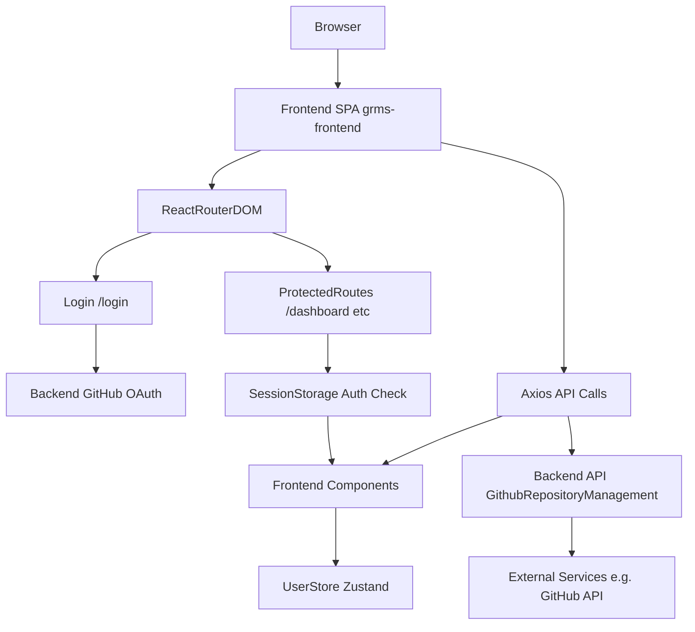

# Easy-Repo — Repository Overview

### High-Level Purpose
The Easy-Repo system provides a web-based platform for managing GitHub repositories. Its primary objective is to offer a user interface for repository interactions, insights, and organization through features like a command-line interface, commit calendars, lines of code statistics, and custom collections.

### Architectural Structure
The repository is structured into a client-server architecture:
*   **`Github-Repository-Management/`**: Contains the backend application, written in Java with Spring Boot.
*   **`grms-frontend/`**: Houses the single-page application (SPA) frontend, built with React and TypeScript.
    *   `src/components/`: Modular UI components organized by feature (e.g., `AuthComponents`, `CLI`, `CollectionsComponents`, `Drawers`, `Calendar`, `Navbar`).
    *   `src/ProtectedRoutes/`: Components responsible for client-side route protection.
    *   `src/store/`: Global state management using Zustand.
    *   `src/utility/`: Custom hooks and utility functions for common tasks like Axios requests.

### Core Components
*   **`GithubRepositoryManagementApplication`**: The Spring Boot backend application context, handling API requests.
*   **`App` (Frontend)**: The root React component, orchestrating global services like client-side routing, data fetching (`@tanstack/react-query`), and the top-level application layout.
*   **`Login`**: Frontend component managing user authentication, primarily through GitHub OAuth.
*   **`ProtectedRoutes`**: A frontend route guard component enforcing authentication checks for protected UI sections.
*   **`CLIMain`**: The central frontend component for command-line interaction with the backend, dynamically rendering drawers or redirecting based on command output.
*   **`CollectionsMain` & `CollectionsPopUp`**: Frontend components for displaying and creating user-defined repository collections.
*   **Drawer Components (e.g., `GetTreeDrawer`, `GetRepoCommitGraphDrawer`, `GetLinesOfCodeDrawer`)**: Reusable UI components for displaying repository-specific data (file trees, commit graphs, LOC statistics) in an overlaid drawer format.
*   **`ContinuousCalendar`**: A frontend component displaying a scrollable, year-long calendar, used for visualizing commit activity.
*   **`UserStore` (Zustand)**: A global state management store used across the frontend for sharing UI state and context (e.g., drawer visibility, selected repository ID).

### Interaction & Data Flow
1.  A client browser requests `index.html`, which bootstraps the React application via `main.tsx`.
2.  The `App` component initializes client-side routing (`react-router-dom`) and global data fetching context (`@tanstack/react-query`).
3.  For authentication, the `Login` component redirects the user to the backend's GitHub OAuth authorization endpoint.
4.  Subsequent protected routes are guarded by `ProtectedRoutes`, which checks for an `authenticated` flag in `sessionStorage`.
5.  Frontend components (e.g., `CLIMain`, `CollectionsMain`, `GetTreeDrawer`, `GetLinesOfCodeDrawer`) make asynchronous HTTP requests to the Java Spring Boot backend API using `axios` or custom `useAxios` hooks. These requests often include authentication cookies and CSRF tokens.
6.  The backend processes these requests, potentially interacting with external services (like GitHub API for repository data), and returns responses.
7.  The frontend then processes backend responses, updates global state (`UserStore`), and dynamically renders UI elements such as drawers or performs client-side redirects.

### Technology Stack
*   **Frontend**:
    *   **Core**: React, TypeScript, Vite
    *   **UI Framework**: `@nextui-org/react`, Tailwind CSS
    *   **Routing**: `react-router-dom`
    *   **State Management**: Zustand (`useUserStore`)
    *   **Data Fetching**: `@tanstack/react-query`, Axios
    *   **Icons**: `@iconify/react`, `react-icons/bs`
*   **Backend**:
    *   **Language**: Java
    *   **Framework**: Spring Boot
    *   **Testing**: JUnit 5

### Design Observations
*   The frontend uses a modern, component-based approach with React and a utility-first CSS framework (Tailwind CSS) for consistent styling.
*   Global state is managed effectively using Zustand, allowing components to share and react to changes in application state.
*   Authentication relies on client-side `sessionStorage` for route protection; a more robust approach would involve server-side token validation for critical paths.
*   The `CLIMain` component's tight coupling to string parsing from backend responses for UI logic introduces potential fragility and maintenance overhead if API response formats change.
*   Page reloads for actions like collection creation could be optimized for a smoother user experience by directly updating the frontend state.
*   Custom Axios hooks abstract API calls, promoting reusability and separating concerns.

### System Diagram

```mermaid
graph TD
Browser --> FrontendSPA[Frontend SPA grms-frontend]
FrontendSPA --> Router[ReactRouterDOM]
Router --> LoginRoute[Login /login]
LoginRoute --> BackendOAuth[Backend GitHub OAuth]
Router --> ProtectedRoutes[ProtectedRoutes /dashboard etc]
ProtectedRoutes --> AuthCheck[SessionStorage Auth Check]
FrontendSPA --> APICalls[Axios API Calls]
APICalls --> BackendAPI[Backend API GithubRepositoryManagement]
BackendAPI --> ExternalServices[External Services e.g. GitHub API]
AuthCheck --> FrontendComponents[Frontend Components]
APICalls --> FrontendComponents
FrontendComponents --> UserStore[UserStore Zustand]
```