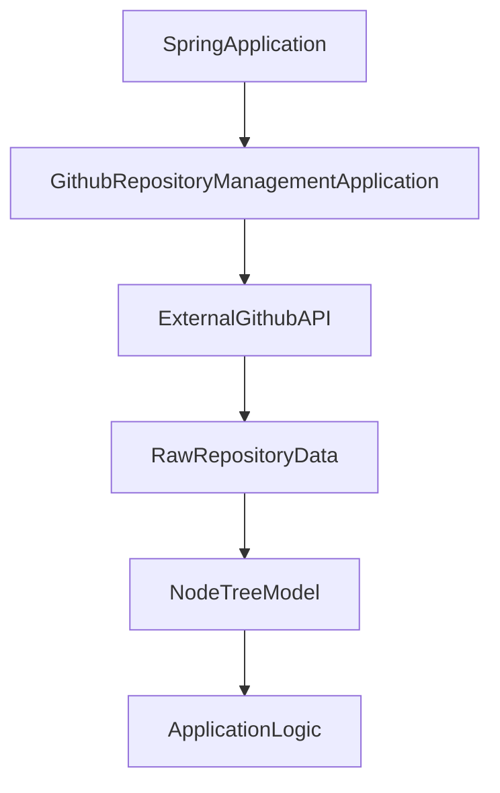

# REPOSITORY_OVERVIEW.md

> **Source File:** [REPOSITORY_OVERVIEW.md](https://github.com/test-company-prowiz/Easy-Repo/blob/master/REPOSITORY_OVERVIEW.md)
> **Repository:** `Easy-Repo`
> **Branch:** `master`

# Easy-Repo — Repository Overview

### High-Level Purpose
This repository hosts the `Github-Repository-Management` application, which is designed to manage and represent the hierarchical structure of GitHub repository contents. Its primary objective is to model files and directories as tree-like data structures for programmatic access and manipulation.

### Architectural Structure
The application follows a standard Spring Boot architecture.
-   **Bootstrap Layer**: The `GithubRepositoryManagementApplication` serves as the entry point, initializing the Spring application context.
-   **Domain Model Layer**: The `Nodes` package contains core data models, such as the `Node` class, which represents individual elements within a repository's file system hierarchy.
-   **Inferred Layers**: Commented-out code and dependencies suggest the presence of `Service` and `Repository` layers (e.g., `RepoCollectionsService`, `UserRepo`) for business logic and data access, respectively, indicating an n-tier design.

### Core Components
-   **`GithubRepositoryManagementApplication`**: The main Spring Boot class responsible for application startup, auto-configuration, and component scanning.
-   **`Node`**: A fundamental data model representing a file or directory. It stores properties like name, type, path, URL, and maintains references to parent and child nodes to form a tree structure. It includes methods for adding children, accessing parents, and traversing the node hierarchy.

### Interaction & Data Flow
1.  The `GithubRepositoryManagementApplication` initiates the Spring context upon startup.
2.  (Inferred) The application likely interacts with external GitHub APIs to retrieve repository metadata and content.
3.  This raw data is then processed and transformed into `Node` objects.
4.  These `Node` objects are interconnected to form an in-memory tree structure, accurately mirroring the repository's file and directory organization.
5.  Application logic can then traverse and query this `Node` tree to perform operations such as searching for specific files or directories.

### Technology Stack
-   **Java**: The primary programming language.
-   **Spring Boot**: Provides the foundational framework for application development, including dependency injection and auto-configuration.
-   **Lombok**: Used to reduce boilerplate code, generating getters and setters.
-   **Jackson**: Utilized for JSON serialization and deserialization, with specific annotations (`@JsonIgnore`) to manage circular references in the `Node` hierarchy.
-   **Jakarta Persistence API (JPA)**: An import for `@Entity` suggests potential future integration with an ORM for database persistence, though not actively used in the provided `Node` class.

### Design Observations
-   **Hierarchical Data Modeling**: The `Node` class is well-suited for representing hierarchical data, which is essential for managing file system structures.
-   **Circular Reference Handling**: The use of `@JsonIgnore` on parent references in the `Node` class demonstrates a robust approach to prevent serialization errors in tree structures.
-   **Extensible Architecture**: The inferred presence of service and repository layers aligns with a modular design, promoting separation of concerns and maintainability.
-   **Evolving Functionality**: Commented-out `CommandLineRunner` logic and unused imports suggest the application is either in active development or has undergone refactoring, with potential future features including initial data setup or direct database interaction.

### System Diagram

```mermaid
graph TD
A[SpringApplication] --> B[GithubRepositoryManagementApplication]
B --> C[ExternalGithubAPI]
C --> D[RawRepositoryData]
D --> E[NodeTreeModel]
E --> F[ApplicationLogic]
```