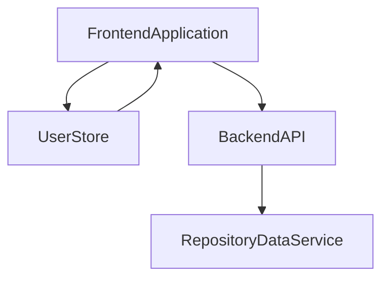

# REPOSITORY_OVERVIEW.md

> **Source File:** [REPOSITORY_OVERVIEW.md](https://github.com/test-company-prowiz/Easy-Repo/blob/master/REPOSITORY_OVERVIEW.md)
> **Repository:** `Easy-Repo`
> **Branch:** `master`

# Easy-Repo — Repository Overview

### High-Level Purpose
The system's primary objective is to provide a user interface for navigating and viewing the hierarchical file and folder structures of specified repositories. It serves as a frontend application that fetches and displays repository content data from a backend service.

### Architectural Structure
The repository demonstrates a client-server architectural pattern.
- **`grms-frontend`**: This directory houses the client-side application, built using React. It is structured into components, state management stores, and utility functions for interacting with the backend.
- **Backend API**: An implicit service layer that exposes endpoints for retrieving repository-specific data, such as file tree structures.

### Core Components
- **Frontend UI Components**: React components (e.g., `GetTreeDrawer`) are responsible for rendering the user interface, utilizing a UI library like `NextUI` for presentation.
- **Global State Management**: A Zustand-based `UserStore` within the frontend manages application-wide state, including UI visibility and the context of the currently viewed repository.
- **API Client Utilities**: Custom hooks (e.g., `useAxios`) abstract HTTP request logic, centralizing communication with the backend API.
- **Backend Repository Tree Service**: An API endpoint (e.g., `/getTree/{repoId}`) is responsible for processing requests and returning the hierarchical structure of a given repository.

### Interaction & Data Flow
1.  A frontend component, potentially triggered by user action, retrieves necessary contextual data (e.g., `treeRepoId`) from the `UserStore`.
2.  The component initiates a GET request to the backend API via a custom Axios hook, passing the repository ID.
3.  The Backend Repository Tree Service processes the request and returns the hierarchical tree data.
4.  The frontend component receives this data and recursively renders it into a navigable tree structure within the UI.
5.  User interactions, such as closing a UI element, update the `UserStore` to reflect changes in the application's state.

### Technology Stack
- **Frontend**:
    - **UI Framework**: React
    - **UI Library**: `NextUI`
    - **State Management**: Zustand
    - **HTTP Client**: Axios (encapsulated in `useAxios` utility)
    - **Language**: TypeScript (inferred from `.tsx` files)
- **Backend**:
    - Implied HTTP/REST API (specific technologies not detailed in the provided summary).

### Design Observations
- **Clear Separation of Concerns**: The frontend effectively segregates UI presentation, global state management, and data fetching logic, enhancing maintainability.
- **Centralized State Management**: The use of Zustand for `UserStore` provides a robust mechanism for managing global application state, reducing the need for prop drilling and simplifying state access across components.
- **Reusable API Logic**: Custom hooks like `useAxios` promote code reusability and consistency in handling API interactions throughout the frontend.
- **Hierarchical Data Presentation**: The system is designed to efficiently fetch and display complex hierarchical data structures, which is critical for repository content views.

### System Diagram

```mermaid
graph TD
A[FrontendApplication] --> B[UserStore]
A --> C[BackendAPI]
C --> D[RepositoryDataService]
B --> A
```