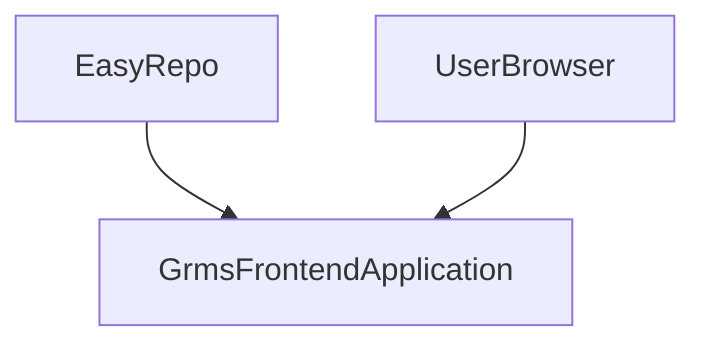

# REPOSITORY_OVERVIEW.md

> **Source File:** [REPOSITORY_OVERVIEW.md](https://github.com/test-company-prowiz/Easy-Repo/blob/master/REPOSITORY_OVERVIEW.md)
> **Repository:** `Easy-Repo`
> **Branch:** `master`

# Easy-Repo — Repository Overview

### High-Level Purpose
The `Easy-Repo` repository primarily hosts the `grms-frontend` application. Its objective is to provide a client-side user interface, likely a Single-Page Application (SPA), for a system.

### Architectural Structure
The repository contains at least one distinct application, `grms-frontend`. This application follows a standard modern frontend architecture, with an `index.html` serving as the entry point and a `src` directory housing the main application logic (`main.tsx`). Development-time configurations like ESLint are co-located within the frontend project directory.

### Core Components
*   **`grms-frontend` Application**: The primary component, a Single-Page Application responsible for rendering the user interface and handling client-side logic. It leverages a JavaScript/TypeScript framework.
*   **ESLint Configuration**: Defines and enforces code quality standards for the `grms-frontend` codebase, covering JavaScript, TypeScript, and React-specific best practices.

### Interaction & Data Flow
Users interact with the system via a web browser, which requests the `index.html` entry point of the `grms-frontend` application. This HTML document then bootstraps the main JavaScript/TypeScript application (`main.tsx`), which takes over rendering and client-side interactions. During development, ESLint performs static analysis on the source code to ensure adherence to defined coding standards.

### Technology Stack
*   **Frontend Framework**: React (inferred from React-specific ESLint plugins and `.tsx` files).
*   **Language**: TypeScript and JavaScript.
*   **Bundler/Dev Server**: Vite (inferred from `/vite.svg` and `type="module"` in `index.html`).
*   **Code Quality**: ESLint, configured with `@eslint/js`, `typescript-eslint`, `eslint-plugin-react-hooks`, and `eslint-plugin-react-refresh`.
*   **Styling**: Google Fonts (Geist, DM Sans, Lato) are utilized for typography.

### Design Observations
The repository demonstrates a modern frontend development approach characterized by:
*   A clear separation of concerns with a dedicated frontend application.
*   Strong emphasis on code quality and consistency through comprehensive ESLint configurations for JavaScript, TypeScript, and React.
*   Leveraging contemporary tooling like Vite for efficient development and bundling.
*   Inclusion of performance optimizations, such as preconnecting to external font sources.
*   Support for developer experience features like React Fast Refresh.

### System Diagram

```mermaid
graph TD
A[EasyRepo] --> B[GrmsFrontendApplication]
C[UserBrowser] --> B
```