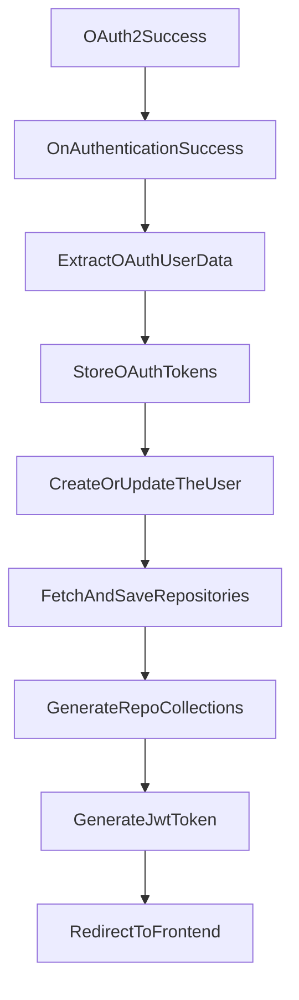

# Easy-Repo — Repository Overview

### High-Level Purpose
This repository implements a Spring Boot application that integrates with GitHub to manage user repositories and provide insights. Its primary objective is to facilitate secure user authentication, synchronize repository data from GitHub, process this data into collections, and offer an API for various repository-related operations. It also includes a client-side React application as its frontend.

### Architectural Structure
The backend application follows a layered architecture, common in Spring Boot projects:
*   **`Config` Layer**: Houses global configurations, including Spring Security settings, JWT token handling, and OAuth2 integration.
*   **`Service` Layer**: Encapsulates the application's core business logic, such as user management, GitHub API interactions (fetching/saving repositories), repository collection management, and user insight generation.
*   **`Controller` Layer**: Exposes RESTful API endpoints, handling incoming HTTP requests and delegating processing to the service layer.
*   **`Repository` Layer**: Provides data access interfaces for interacting with the persistence store for entities like `TheUser`.
*   **`Models` Layer**: Defines JPA entities for database persistence and Data Transfer Objects (DTOs) for structured data exchange between layers and API responses.
*   **Frontend (`grms-frontend`)**: A separate React application that serves as the client-side interface, bootstrapping with `main.tsx`.
*   **Development Configuration (`.vscode`)**: Contains IDE-specific settings, primarily for Visual Studio Code's Java extension.

### Core Components
*   **`SecurityConfig`**: Configures the Spring Security filter chain, defining authorization rules, authentication providers (DAO, OAuth2), CORS policy, and session management.
*   **`JwtUtils`**: A service component responsible for generating, extracting claims from, and validating JSON Web Tokens (JWTs).
*   **`JwtFilter`**: A Spring Security filter designed to process and validate JWTs from incoming requests, though it is currently commented out from the main security filter chain.
*   **`OAuthSuccessionHandler`**: A custom Spring Security handler that processes successful OAuth2 logins, creating/updating user records, triggering repository data synchronization from GitHub, generating initial repository collections, and issuing a JWT.
*   **`MyUserDetailsService`**: An implementation of Spring Security's `UserDetailsService` for loading user details during authentication.
*   **`UserRepo`**: A Spring Data JPA repository for persisting and retrieving `TheUser` entities.
*   **`GithubFetchSaveService`**: Manages the fetching of repositories from GitHub's API and their persistence in the application's database.
*   **`RepoCollectionsService`**: Handles the creation, retrieval, and modification of user-defined repository collections.
*   **`RepoInsightController`**: Provides API endpoints for querying GitHub repository insights, such as lines of code and README content.
*   **`AuthController`**: Manages user registration and traditional username/password login, issuing JWTs upon successful authentication.

### Interaction & Data Flow
The primary interaction flow involves user authentication via OAuth2:
1.  A client initiates an OAuth2 login (e.g., with GitHub).
2.  Upon successful authentication with the OAuth provider, Spring Security invokes `OAuthSuccessionHandler`.
3.  The handler extracts user details and access tokens from the OAuth response.
4.  It then either creates a new `TheUser` entity or updates an existing one via `UserRepo`.
5.  Subsequently, `GithubFetchSaveService` is triggered to pull the user's repositories from GitHub, and `RepoCollectionsService` initializes collections.
6.  `JwtUtils` generates an authentication JWT, which is set in the HTTP response header.
7.  Finally, the client is redirected to a pre-configured frontend URL.
For subsequent authenticated API requests, the system is configured to use session-based authentication (`SessionCreationPolicy.ALWAYS`) and basic HTTP authentication. While a `JwtFilter` exists, its integration into the primary security filter chain is currently disabled, meaning JWTs are issued but not primarily validated by the filter chain for every request.

### Technology Stack
*   **Backend Framework**: Spring Boot, Spring Security (with OAuth2, JWT, BCryptPasswordEncoder).
*   **Persistence**: Spring Data JPA, Hibernate (inferred).
*   **Web**: Spring Web (built on Jakarta Servlet API).
*   **Frontend**: React, NextUI.
*   **Security Libraries**: JJWT (`io.jsonwebtoken`), `javax.crypto` for key generation.
*   **Utility Libraries**: Project Lombok (for boilerplate reduction).
*   **JSON Processing**: Jackson (`com.fasterxml.jackson.annotation`).
*   **Development Tools**: Visual Studio Code.

### Design Observations
*   **Hybrid Authentication Strategy**: The backend supports multiple authentication methods, including OAuth2 and username/password login, alongside `SessionCreationPolicy.ALWAYS`. The `JwtFilter` is present but inactive in the main security chain, suggesting a potential future stateless JWT-first approach or an intentional hybrid design.
*   **Dynamic JWT Secret Key**: The `JwtUtils` component generates a new HmacSHA256 secret key every time the application starts. This provides convenience during development but will invalidate all existing JWTs upon restart, which is problematic for multi-instance deployments or persistent sessions. A stable, externally managed key is recommended for production.
*   **Proactive Data Synchronization**: The system immediately fetches and processes GitHub repository data upon successful OAuth2 authentication, aiming to provide a rich user experience from the first login.
*   **Delegation for Deletion/Renaming**: Repository deletion and renaming are not handled directly via API calls but by redirecting the user to GitHub's settings page. This design choice avoids requesting sensitive "delete" OAuth scopes, potentially improving user trust.
*   **Potential `null` JWT Subject**: The `OAuthSuccessionHandler` might generate JWTs with a `null` subject due to an uninitialized `userName` variable passed to `JwtUtils.generateToken`. This requires review.
*   **Lombok for Conciseness**: Extensive use of Project Lombok significantly reduces boilerplate code in DTOs and entities, enhancing readability and maintainability.

### System Diagram

```mermaid
graph TD
A[OAuth2Success] --> B[OnAuthenticationSuccess]
B --> C[ExtractOAuthUserData]
C --> D[StoreOAuthTokens]
D --> E[CreateOrUpdateTheUser]
E --> F[FetchAndSaveRepositories]
F --> G[GenerateRepoCollections]
G --> H[GenerateJwtToken]
H --> I[RedirectToFrontend]
```