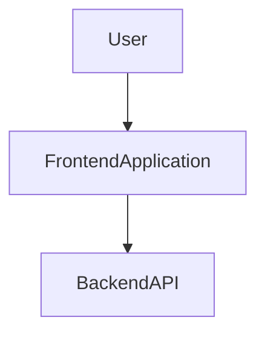

# REPOSITORY_OVERVIEW.md

> **Source File:** [REPOSITORY_OVERVIEW.md](https://github.com/test-company-prowiz/Easy-Repo/blob/master/REPOSITORY_OVERVIEW.md)
> **Repository:** `Easy-Repo`
> **Branch:** `master`

# Easy-Repo — Repository Overview

### High-Level Purpose
This repository appears to host a system for managing and submitting feature requests. Its primary objective is to provide a user interface for users to submit feature descriptions, which are then processed by a backend service.

### Architectural Structure
The repository contains at least a `grms-frontend` directory, indicating a client-side application. Within this frontend, a standard `src/components` structure is used, with further organization into feature-specific modules like `FeatureComponents`. This suggests a modular frontend architecture. A backend service is implied by API interactions.

### Core Components
*   **`grms-frontend`**: The primary frontend application, responsible for rendering the user interface and handling user interactions.
*   **Feature Request UI Component**: A frontend component (e.g., `FeatureMain`) that facilitates the submission of feature descriptions to the backend.
*   **Backend API**: An external service (not directly within the provided file's scope but inferred) that receives and processes feature request submissions from the frontend.

### Interaction & Data Flow
Users interact with the frontend application to input feature descriptions. The frontend component captures this input and dispatches an asynchronous HTTP POST request to a configured backend API endpoint. This request includes the feature description and incorporates security measures such as a CSRF token retrieved from `sessionStorage` and sent via headers.

### Technology Stack
*   **Frontend Framework**: React
*   **UI Library**: NextUI
*   **HTTP Client**: Axios
*   **Environment Variables**: Utilized for backend API URL configuration (e.g., `VITE_BACKEND_URL`).
*   **Client-Side Storage**: `sessionStorage` for security tokens.

### Design Observations
The system exhibits a clear separation between frontend presentation and backend data processing. It incorporates client-side validation and CSRF protection for API interactions. A potential area for architectural evolution is abstracting API call logic from presentational components into dedicated service layers. Hardcoded data in UI components suggests opportunities for dynamic data fetching from the backend.

### System Diagram

```mermaid
graph TD
User --> FrontendApplication
FrontendApplication --> BackendAPI
```