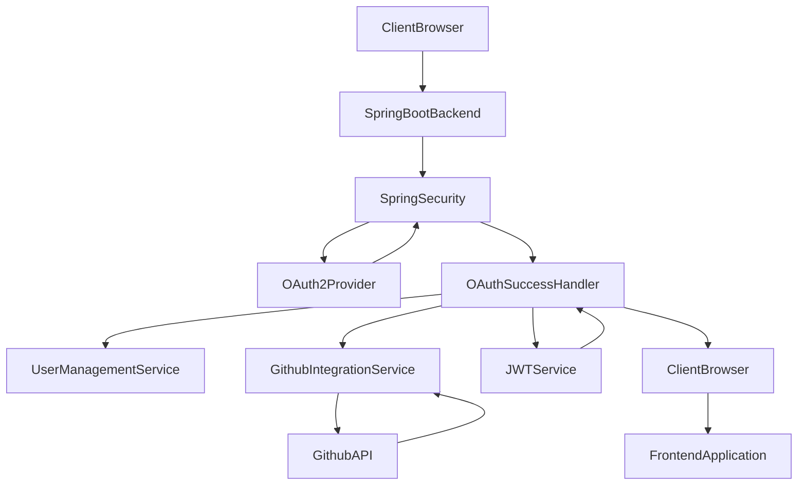

# Easy-Repo — Repository Overview

### High-Level Purpose
This repository implements a Spring Boot application designed to manage and provide insights into GitHub repositories for authenticated users. It facilitates secure user authentication (via OAuth2 and traditional credentials), synchronizes repository data from GitHub, enables users to organize repositories into custom collections, and offers an API for various repository-related operations, including integration with a client-side React frontend.

### Architectural Structure
The backend follows a layered architecture, common in Spring Boot applications:
*   **`Config` Layer**: Contains global configurations, including Spring Security settings, JWT token management, and OAuth2 integration.
*   **`Controller` Layer**: Exposes RESTful API endpoints for client interaction, delegating business logic to the service layer.
*   **`Service` Layer**: Encapsulates core business logic, such as user management, GitHub API interactions (fetching and saving repositories), repository collection management, and user insight generation.
*   **`Repository` Layer**: Defines data access interfaces for persistence operations related to various entities (e.g., users, repositories).
*   **`Models` Layer**: Holds JPA entities for database mapping and Data Transfer Objects (DTOs) for structured data exchange between layers and external API responses.
The frontend is a separate React application (`grms-frontend`) that consumes these backend APIs. Development environment configurations for VS Code are managed in the `.vscode` directory.

### Core Components
*   **`SecurityConfig`**: Central configuration for Spring Security, defining the security filter chain, authentication providers (DAO and OAuth2), CORS policy, and session management.
*   **`JwtUtils`**: A service component responsible for the generation, parsing, and validation of JSON Web Tokens (JWTs).
*   **`JwtFilter`**: A Spring Security filter intended for processing and validating JWTs from incoming requests, though it is currently commented out from the primary security filter chain.
*   **`OAuthSuccessionHandler`**: A custom Spring Security handler that processes successful OAuth2 logins, integrating user data, triggering repository data synchronization from GitHub, generating initial repository collections, and issuing a JWT.
*   **`MyUserDetailsService`**: An implementation of Spring Security's `UserDetailsService` for loading user-specific details during authentication.
*   **`AuthService` and `AuthController`**: Handle user registration and traditional username/password login, issuing JWTs upon successful authentication.
*   **`GithubFetchSaveService`**: Manages fetching GitHub repositories via the GitHub API and persisting them in the application's database.
*   **`RepoCollectionsService`**: Orchestrates the creation, retrieval, and modification of user-defined repository collections.
*   **`RepoInsightController`**: Provides API endpoints for querying GitHub repository insights (e.g., lines of code, README content).

### Interaction & Data Flow
The primary data flow for OAuth2 authentication is:
1.  A client (frontend) initiates an OAuth2 login (e.g., with GitHub).
2.  Spring Security intercepts this, redirects the user to the OAuth2 provider (GitHub).
3.  Upon successful authentication, the OAuth2 provider redirects back to the Spring Boot application.
4.  `OAuthSuccessionHandler` processes the successful authentication event. It extracts user details and access tokens, then either creates a new `TheUser` entity or updates an existing one in the database.
5.  It then triggers services (`GithubFetchSaveService`, `RepoCollectionsService`) to synchronize the user's GitHub repositories and create initial collections.
6.  A JWT is generated by `JwtUtils` and added to the HTTP response header.
7.  Finally, the client is redirected to a pre-configured frontend URL.
For subsequent API requests, the application is configured to primarily use session-based authentication and basic HTTP authentication.

### Technology Stack
*   **Backend Framework**: Java, Spring Boot, Spring Security (with OAuth2, JWT, BCryptPasswordEncoder).
*   **Persistence**: Spring Data JPA (inferred with Hibernate).
*   **Web**: Spring Web (built on Jakarta Servlet API).
*   **Security Libraries**: JJWT (`io.jsonwebtoken`), `javax.crypto` for key generation.
*   **Utility Libraries**: Project Lombok (for boilerplate code reduction).
*   **JSON Processing**: Jackson (`com.fasterxml.jackson.annotation`).
*   **Frontend**: TypeScript, React, NextUI, Tailwind CSS, PostCSS.
*   **Development Tools**: Visual Studio Code, Git.

### Design Observations
*   **Hybrid Authentication Strategy**: The backend employs a hybrid authentication model, supporting OAuth2, username/password login, and HTTP Basic, while also enabling `SessionCreationPolicy.ALWAYS`. The `JwtFilter` is present but commented out from the main security chain, suggesting an evolving or mixed approach to stateless vs. stateful authentication.
*   **Volatile JWT Secret Key**: The `JwtUtils` component dynamically generates a new HmacSHA256 secret key on each application restart. This design choice invalidates all previously issued JWTs upon restart, which is unsuitable for production environments requiring persistent sessions or multi-instance deployments. A stable, externally managed key is recommended.
*   **Proactive Data Synchronization**: The system immediately fetches and processes GitHub repository data upon successful OAuth2 authentication. This aims to provide an immediate, rich user experience but could be resource-intensive for users with a large number of repositories.
*   **Indirect Repository Management**: Operations like repository deletion and renaming are not performed directly through the application's API. Instead, users are redirected to GitHub's settings page, avoiding the need for sensitive "delete" OAuth scopes and potentially enhancing user trust.
*   **Potential `null` JWT Subject**: In `OAuthSuccessionHandler`, the `userName` variable used for JWT generation appears uninitialized, potentially leading to JWTs being issued with a `null` subject. This is a critical logical flaw requiring remediation.
*   **Lombok for Conciseness**: The extensive use of Project Lombok effectively reduces boilerplate code in DTOs and entities, contributing to cleaner and more readable code.

### System Diagram

```mermaid
graph TD
A[ClientBrowser] --> B[SpringBootBackend]
B --> C[SpringSecurity]
C --> D[OAuth2Provider]
D --> C
C --> E[OAuthSuccessHandler]
E --> F[UserManagementService]
E --> G[GithubIntegrationService]
G --> H[GithubAPI]
H --> G
E --> I[JWTService]
I --> E
E --> J[ClientBrowser]
J --> K[FrontendApplication]
```