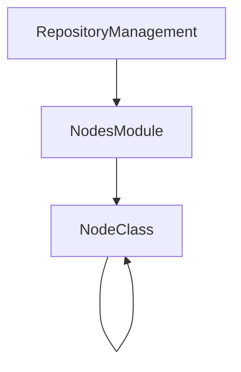

# REPOSITORY_OVERVIEW.md

> **Source File:** [REPOSITORY_OVERVIEW.md](https://github.com/test-company-prowiz/Easy-Repo/blob/master/REPOSITORY_OVERVIEW.md)
> **Repository:** `Easy-Repo`
> **Branch:** `master`

# Easy-Repo — Repository Overview

### High-Level Purpose
The primary objective of this repository is to provide functionality for managing and representing the hierarchical content structure of GitHub repositories. It focuses on modeling files and directories within a repository as a navigable tree structure.

### Architectural Structure
Based on the provided file, the repository appears to be a Java application structured with standard Maven/Gradle conventions (`src/main/java`). The package `com.Barsat.Github.Repository.Management.Nodes` suggests a modular design, where `Nodes` constitutes a core data modeling layer within a broader `Github.Repository.Management` domain. This implies a layered architecture where data structures are distinct from business logic or presentation layers.

### Core Components
The most prominent core component identified is the `Node` class.
-   **`Node`**: Represents an individual file or directory within a repository's content tree. It encapsulates properties like name, path, type (file/directory), and maintains references to its parent and children, forming a hierarchical data structure. This class forms the foundational data model for representing repository content.

### Interaction & Data Flow
The system's core interaction revolves around building and traversing a tree of `Node` objects.
-   `Node` instances are created to model files and directories.
-   These nodes are linked together using `parent` and `children` references to form a hierarchical tree.
-   Methods like `addChildrenToParent` facilitate tree construction.
-   Traversal operations, such as `accessAnyNode`, allow for searching and navigation within the tree.
-   The presence of Jackson annotations (`@JsonIgnore`, `ObjectMapper` import) suggests that `Node` objects are likely serialized to JSON, implying data exchange, possibly via an API or for persistence.

### Technology Stack
-   **Language**: Java
-   **Dependency Injection/Utility**: Lombok (for boilerplate reduction like getters, setters, toString).
-   **Serialization**: Jackson (for JSON processing, indicated by `ObjectMapper` and `@JsonIgnore`).
-   **Collections**: Standard Java collections (e.g., `HashSet` for children).
-   **Potential Persistence**: `jakarta.persistence.Entity` import suggests a potential future or planned integration with JPA for database persistence, though not directly used in the `Node` class itself.

### Design Observations
-   The `Node` class provides a robust model for hierarchical data, crucial for representing file systems or repository content.
-   The use of a bidirectional parent-child relationship allows for flexible tree traversal in both directions.
-   JSON serialization concerns (circular references) are addressed with `@JsonIgnore`, indicating an awareness of API or data transfer requirements.
-   The use of `HashSet` for children implies that the order of children is not significant, and duplicate children (by `equals`/`hashCode`) are prevented.
-   The `toStringHelper` method is a valuable utility for debugging and visualizing the tree structure.
-   The `jakarta.persistence.Entity` import is a notable observation, suggesting that the `Node` model might evolve into a persisted entity, or it's a remnant from a previous design iteration.

### System Diagram

```mermaid
graph TD
A[RepositoryManagement] --> B[NodesModule]
B --> C[NodeClass]
C --> C
```