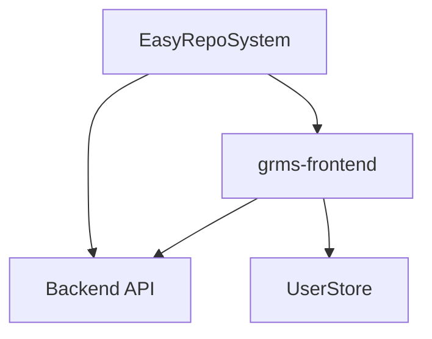

# REPOSITORY_OVERVIEW.md

> **Source File:** [REPOSITORY_OVERVIEW.md](https://github.com/test-company-prowiz/Easy-Repo/blob/master/REPOSITORY_OVERVIEW.md)
> **Repository:** `Easy-Repo`
> **Branch:** `master`

# Easy-Repo — Repository Overview

### High-Level Purpose
The `Easy-Repo` repository appears to host a system designed to provide insights or management capabilities for other repositories, specifically by displaying their README content. Its primary objective is to offer a user interface (`grms-frontend`) that fetches and renders repository documentation from a backend service.

### Architectural Structure
The repository follows a client-server architectural pattern. It contains a `grms-frontend` application, which is a React-based user interface. This frontend interacts with an implied backend API (suggested by the `/easyrepo/insights/repo/getReadMe` endpoint) to retrieve data. The structure indicates a clear separation between the presentation layer and the data service layer.

### Core Components
*   **`grms-frontend`**: A React application responsible for the user interface, state management, and interaction with the backend. It includes components like `ReadMeDrawer` for specific UI functionalities.
*   **Backend API**: An inferred service, likely part of the `easyrepo` domain, which handles data retrieval, specifically fetching README content for specified repositories.
*   **`UserStore` (Zustand)**: A frontend state management solution used within `grms-frontend` to manage global UI states, such as drawer visibility and selected repository context.
*   **`AxiosUtility`**: A frontend utility for abstracting and managing API requests to the backend.

### Interaction & Data Flow
1.  The `grms-frontend` application initializes and manages its UI state using `UserStore`.
2.  Upon a user action or state change (e.g., selecting a repository), `grms-frontend` uses `AxiosUtility` to initiate a GET request to the Backend API (e.g., `/easyrepo/insights/repo/getReadMe/{repoName}`).
3.  The Backend API processes the request, retrieves the specified repository's README content (source not detailed but implied to be external or managed by the backend).
4.  The Backend API responds with the README content, typically as a Markdown string.
5.  `grms-frontend` receives the Markdown content via `AxiosUtility` and renders it using a Markdown rendering library (e.g., `ReactMarkdown`) within its UI components.

### Technology Stack
*   **Frontend**: React, Zustand (state management), `@nextui-org/react` (UI component library), `react-markdown` (Markdown rendering), `axios` (HTTP client).
*   **Backend**: Implied API layer; specific technologies are not detailed from the provided information.

### Design Observations
The system demonstrates a modular design with a clear separation of concerns between frontend UI and backend data services. The use of a global state management solution (`Zustand`) on the frontend simplifies state propagation and component communication. API interaction is encapsulated within a custom `AxiosUtility` hook, promoting reusability and maintainability. The rendering of raw Markdown from the backend directly on the frontend simplifies backend processing by offloading presentation logic.

### System Diagram

```mermaid
graph TD
EasyRepoSystem --> GrmsFrontend[grms-frontend]
EasyRepoSystem --> BackendAPI[Backend API]
GrmsFrontend --> BackendAPI
GrmsFrontend --> UserStore[UserStore]
```