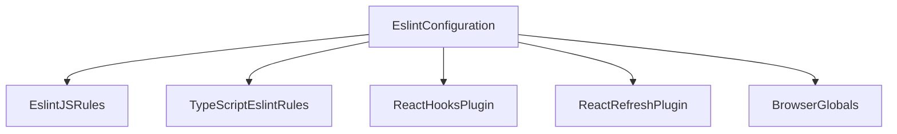

# grms-frontend/eslint.config.js

> **Source File:** [grms-frontend/eslint.config.js](https://github.com/test-company-prowiz/Easy-Repo/blob/master/grms-frontend/eslint.config.js)
> **Repository:** `Easy-Repo`
> **Branch:** `master`

# grms-frontend/eslint.config.js

### Overview
This file defines the ESLint configuration for the `grms-frontend` project. It integrates standard JavaScript, TypeScript, and React-specific linting rules to enforce code quality, consistency, and identify potential issues within the frontend codebase.

### Architecture & Role
This configuration file resides within the frontend development environment. Its role is to configure the static analysis tool (ESLint) that runs during development, pre-commit hooks, and continuous integration pipelines. It ensures that code adheres to defined standards for syntax, style, and best practices relevant to JavaScript, TypeScript, and React applications.

### Key Components
- `tseslint.config()`: The primary function used to define the ESLint configuration, provided by the `typescript-eslint` package.
- `js.configs.recommended`: Incorporates the recommended core ESLint rules for JavaScript.
- `tseslint.configs.recommended`: Extends the configuration with recommended rules specific to TypeScript.
- `eslint-plugin-react-hooks`: A plugin that enforces rules of hooks, ensuring correct usage of React Hooks.
- `eslint-plugin-react-refresh`: A plugin that provides rules for React Fast Refresh (Hot Module Replacement) compatibility.
- `globals.browser`: Configures ESLint to recognize standard browser global variables.
- `react-refresh/only-export-components`: A specific rule configured to warn if non-components are exported, with an allowance for constant exports.

### Execution Flow / Behavior
When ESLint is executed (e.g., via `npm run lint`, IDE extensions, or CI), it loads this configuration. It then processes files matching `**/*.{ts,tsx}` (all TypeScript and TSX files in the project), applying the combined set of rules. The `dist` directory is explicitly ignored to prevent linting of compiled output. The configured rules will identify and report issues based on the defined standards.

### Dependencies
- `@eslint/js`: Provides the foundational JavaScript linting rules.
- `globals`: Supplies definitions for global variables in various environments, specifically `browser` for this configuration.
- `eslint-plugin-react-hooks`: Delivers linting rules specific to React Hooks.
- `eslint-plugin-react-refresh`: Offers linting rules related to React Fast Refresh for development efficiency.
- `typescript-eslint`: Integrates ESLint with TypeScript, enabling linting for TypeScript syntax and types.
These are development-time dependencies, not runtime dependencies of the application itself.

### Design Notes
- The configuration centralizes linting for multiple technologies (JS, TS, React) into a single, cohesive setup.
- Explicitly ignoring the `dist` directory prevents linting of generated build artifacts, focusing analysis on source code.
- The `allowConstantExport: true` option for `react-refresh/only-export-components` indicates a deliberate choice to permit constant exports in files, which can be useful for utilities or non-component modules that are not expected to be hot-reloaded.
- The use of `extends` allows for easy adoption of community-recommended best practices for JavaScript and TypeScript.

### Diagram
