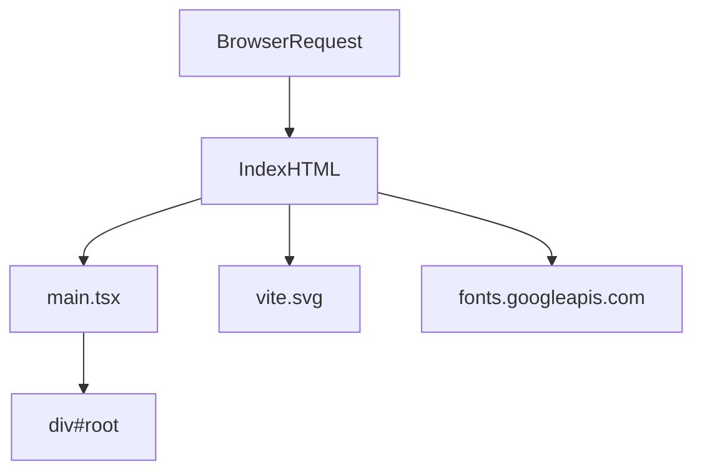

# grms-frontend/index.html

> **Source File:** [grms-frontend/index.html](https://github.com/test-company-prowiz/Easy-Repo/blob/master/grms-frontend/index.html)
> **Repository:** `Easy-Repo`
> **Branch:** `master`

# grms-frontend/index.html

### Overview
This file serves as the primary entry point for the `grms-frontend` single-page application (SPA). It provides the foundational HTML structure, loads essential external resources, and initiates the main JavaScript application.

### Architecture & Role
Architecturally, this file resides at the root of the frontend application's presentation layer. It is the initial document loaded by a web browser, responsible for bootstrapping the entire client-side experience. It functions as the host for the dynamically rendered JavaScript application.

### Key Components
*   **`

`**: This element acts as the mount point where the client-side JavaScript framework will inject and manage the application's user interface components.
*   **``**: This script tag loads the main application bundle, indicating a modern JavaScript module setup. It is the starting point for the frontend application's logic and rendering.
*   **`<link rel="icon" type="image/svg+xml" href="/vite.svg" />`**: Specifies the application's favicon, which is an SVG asset. The path suggests a development environment or build system like Vite.
*   **Google Fonts `<link>` tags**: These tags import custom fonts (Geist, DM Sans, Lato) from Google Fonts, defining the application's typographic styles.

### Execution Flow / Behavior
When a user navigates to the frontend application, the browser first requests and receives `index.html`. The browser then parses this HTML document:
1.  Metadata (charset, viewport, title) is processed.
2.  External resources like the favicon (`/vite.svg`) and custom fonts from Google Fonts are requested and loaded in parallel.
3.  The empty `

` is prepared in the DOM.
4.  Finally, the `/src/main.tsx` script is loaded and executed as an ES module. This script then takes control, typically initializing a JavaScript framework (e.g., React, Vue) and rendering the application's components into the `#root` element.

### Dependencies
*   **Internal**:
    *   `/vite.svg`: Favicon asset.
    *   `/src/main.tsx`: The primary JavaScript/TypeScript application entry point.
*   **External**:
    *   `https://fonts.googleapis.com`: Provides the Geist, DM Sans, and Lato font families.
    *   `https://fonts.gstatic.com`: Used for preconnecting to the Google Fonts server for improved performance.

### Design Notes
This file reflects a standard setup for a modern single-page application (SPA). The use of `type="module"` for the main script and the presence of `/vite.svg` strongly suggest a development workflow leveraging Vite or a similar module bundler. The `#root` div is a common pattern for framework-driven UIs. Preconnecting to Google Fonts is a performance optimization for faster font loading.

### Diagram
