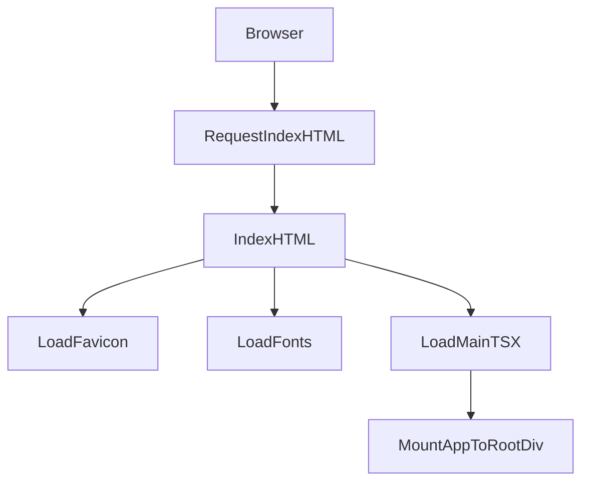

# grms-frontend/index.html

> **Source File:** [grms-frontend/index.html](https://github.com/test-company-prowiz/Easy-Repo/blob/master/grms-frontend/index.html)
> **Repository:** `Easy-Repo`
> **Branch:** `master`

# grms-frontend/index.html

### Overview
This file serves as the primary entry point for the `grms-frontend` web application, providing the foundational HTML structure and bootstrapping the client-side JavaScript application.

### Architecture & Role
Architecturally, this file is the root document served by the web server to the client browser. It resides at the presentation layer, acting as the initial shell that hosts and loads the Single Page Application (SPA) built with client-side frameworks.

### Key Components
*   **`<html>` structure**: Defines the document language and essential meta-information.
*   **`<head>` section**:
    *   `meta` tags: Character set, viewport configuration.
    *   `link` tags: Favicon (`/vite.svg`), preconnect directives, and stylesheet links for external fonts (Geist, DM Sans, Lato from Google Fonts).
    *   `title` tag: Sets the browser tab title to "Easy Repo".
*   **`

`**: This element acts as the mount point where the client-side JavaScript application will render its user interface components.
*   **``**: This is the application's main JavaScript entry point, loaded as an ES module.

### Execution Flow / Behavior
When a browser navigates to the application, it first requests and receives this `index.html` file. The browser then:
1.  Parses the HTML structure.
2.  Fetches external resources referenced in the `<head>`, such as the favicon and Google Fonts stylesheets.
3.  Upon reaching the `<script>` tag, it loads and executes the `/src/main.tsx` module.
4.  The script's execution is responsible for initializing the application framework (e.g., React via Vite) and mounting the root application component into the `

` element, thereby rendering the user interface.

### Dependencies
*   **Internal Dependencies**:
    *   `/vite.svg`: Used as the favicon for the web application.
    *   `/src/main.tsx`: The primary JavaScript/TypeScript entry point that initializes the frontend application.
*   **External Dependencies**:
    *   `https://fonts.googleapis.com`: Provides CSS for web fonts (Geist, DM Sans, Lato).
    *   `https://fonts.gstatic.com`: Preconnect domain for faster font asset loading.

### Design Notes
This `index.html` file reflects a standard setup for a modern Single Page Application (SPA) using a build tool like Vite. It separates the initial HTML shell from the dynamic application logic, which is injected into the `#root` element. The use of `<script type="module">` ensures modern JavaScript module loading and execution.

### Diagram
