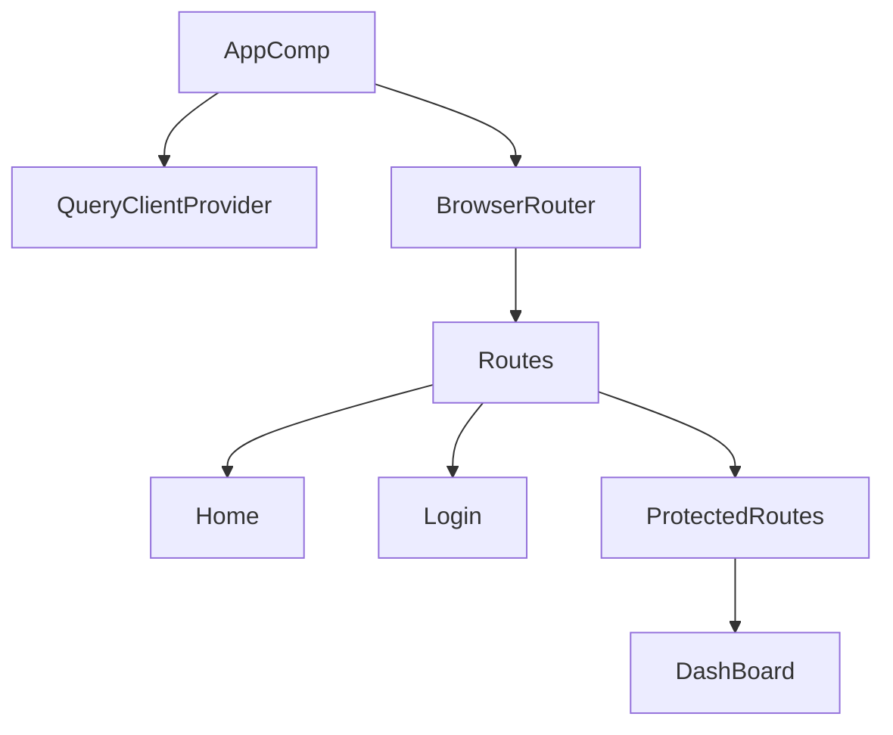

# grms-frontend/src/App.tsx

> **Source File:** [grms-frontend/src/App.tsx](https://github.com/test-company-prowiz/Easy-Repo/blob/master/grms-frontend/src/App.tsx)
> **Repository:** `Easy-Repo`
> **Branch:** `master`

# grms-frontend/src/App.tsx

### Overview
This file defines the root component (`App`) of the React frontend application. Its primary purpose is to establish the global client-side routing configuration and integrate a global state management solution for data fetching and caching.

### Architecture & Role
Architecturally, `App.tsx` serves as the top-level entry point for the user interface layer. It sits at the highest level of the component tree, orchestrating navigation and providing core services like data management to its child components.

### Key Components
*   **`App` function**: The main React functional component that renders the application's structure.
*   **`QueryClient`**: An instance used by `@tanstack/react-query` to manage global cache and data fetching logic.
*   **`QueryClientProvider`**: A React context provider that makes the `QueryClient` instance available throughout the component tree.
*   **`BrowserRouter` (aliased as `Router`)**: The top-level component for client-side routing, synchronizing the UI with the URL.
*   **`Routes`**: A component that wraps individual `Route` definitions, enabling `react-router-dom` to match the current URL against defined paths.
*   **`Route`**: Defines a specific path and the component to render when that path is active.
*   **`Login`**: Component for user authentication.
*   **`Home`**: The application's landing page component.
*   **`DashBoard`**: A component representing a user's dashboard, requiring authentication.
*   **`ProtectedRoutes`**: A custom component designed to wrap routes that require user authentication, enforcing access control.

### Execution Flow / Behavior
1.  Upon application startup, the `App` component is rendered as the root.
2.  A new `QueryClient` instance is created, setting up the global data caching mechanism.
3.  The `QueryClientProvider` wraps the entire application, making the `queryClient` accessible to all components.
4.  The `BrowserRouter` (Router) initializes, enabling client-side navigation.
5.  The `Routes` component evaluates the current URL:
    *   If the path is `/`, the `Home` component is rendered.
    *   If the path is `/login`, the `Login` component is rendered.
    *   If the path is `/dashboard`, the `ProtectedRoutes` component is first rendered. `ProtectedRoutes` is responsible for checking authentication status. If authenticated, it renders the `DashBoard` component; otherwise, it redirects the user (behavior inferred from the name).

### Dependencies
*   **`react-router-dom`**: External library for declarative routing in React applications (`BrowserRouter`, `Routes`, `Route`).
*   **`@tanstack/react-query`**: External library for server-state management, data fetching, caching, and synchronization (`QueryClient`, `QueryClientProvider`).
*   **`./components/AuthComponents/Login`**: Internal component for user login.
*   **`./components/HomeComponents/Home`**: Internal component for the application's home page.
*   **`./components/DashBoard`**: Internal component for the user dashboard.
*   **`./ProtectedRoutes/ProtectedRoutes`**: Internal custom component for handling authenticated routes.

### Design Notes
The application's design separates public routes (`/`, `/login`) from authenticated routes (`/dashboard`) using the `ProtectedRoutes` wrapper. This pattern ensures that authentication logic is centralized and applied consistently to restricted areas of the application. The integration of `@tanstack/react-query` at the root level signifies an application-wide approach to efficient data fetching, caching, and invalidation, reducing boilerplate and improving performance.

### Diagram
