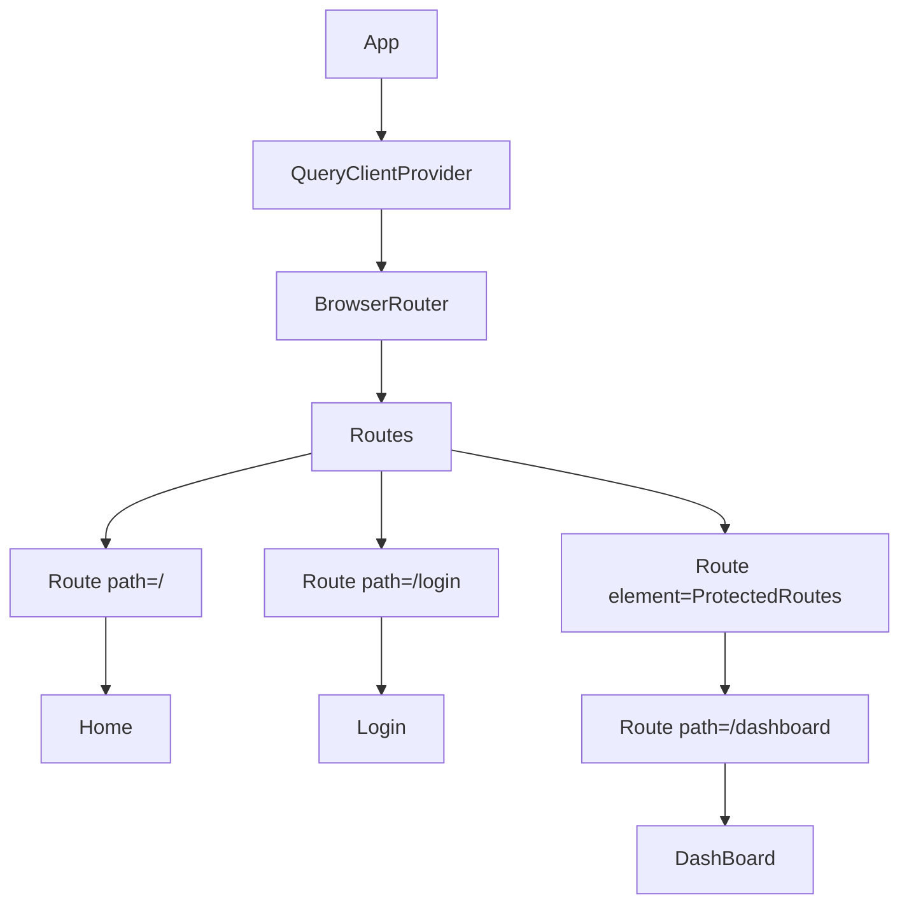

# grms-frontend/src/App.tsx

> **Source File:** [grms-frontend/src/App.tsx](https://github.com/test-company-prowiz/Easy-Repo/blob/master/grms-frontend/src/App.tsx)
> **Repository:** `Easy-Repo`
> **Branch:** `master`

# grms-frontend/src/App.tsx

### Overview
This file defines the root `App` component, which serves as the entry point for the frontend application. Its primary responsibility is to configure global services such as client-side routing and data fetching/caching, and to orchestrate the top-level layout of the application's routes, including protected routes.

### Architecture & Role
Architecturally, `App.tsx` functions as the main application shell and resides at the top of the UI layer. It is the root component rendered by React, responsible for initializing global contexts and defining the application's navigational structure.

### Key Components
*   **`App` function**: The primary React functional component that renders the entire application.
*   **`QueryClient`**: An instance from `@tanstack/react-query` responsible for managing global state related to data fetching, caching, and synchronization.
*   **`QueryClientProvider`**: A context provider that makes the `queryClient` instance available to all descendant components.
*   **`BrowserRouter` (as `Router`)**: The top-level component from `react-router-dom` that enables client-side routing using the browser's history API.
*   **`Routes`**: A component that acts as a container for individual `Route` definitions, matching the current URL to a specific component.
*   **`Route`**: Defines a mapping between a URL path and the React element to render when that path is active.
*   **`ProtectedRoutes`**: An internal component designed to wrap other routes, enforcing authentication or authorization before rendering its children.
*   **`Login`, `Home`, `DashBoard`**: Imported UI components representing different views within the application.

### Execution Flow / Behavior
When the `App` component is rendered, it first instantiates a `QueryClient`. This client is then passed to the `QueryClientProvider`, making it globally accessible. Subsequently, `BrowserRouter` initializes the routing context. The `Routes` component then evaluates the current URL:
*   Requests to `/` are handled by the `Home` component.
*   Requests to `/login` are handled by the `Login` component.
*   Requests to `/dashboard` are nested within `ProtectedRoutes`. If the `ProtectedRoutes` component determines the user is not authorized or authenticated, it will typically redirect them, preventing direct access to `DashBoard`.

### Dependencies
*   **`react-router-dom`**: Provides core routing functionalities like `BrowserRouter`, `Routes`, and `Route`. Essential for client-side navigation.
*   **`@tanstack/react-query`**: Offers capabilities for efficient asynchronous data fetching, caching, and state management.
*   **`./components/AuthComponents/Login`**: Internal component for user authentication.
*   **`./components/HomeComponents/Home`**: Internal component for the application's landing page.
*   **`./components/DashBoard`**: Internal component for the authenticated user dashboard.
*   **`./ProtectedRoutes/ProtectedRoutes`**: Internal component for implementing route-level access control.

### Design Notes
The `App` component consolidates global configuration (routing, data fetching) in a central location, promoting modularity for individual pages and components. The use of nested routes with `ProtectedRoutes` provides a declarative and scalable pattern for securing application areas, separating authorization logic from component rendering. This structure improves maintainability by clearly defining the application's main entry points and their access requirements.

### Diagram
