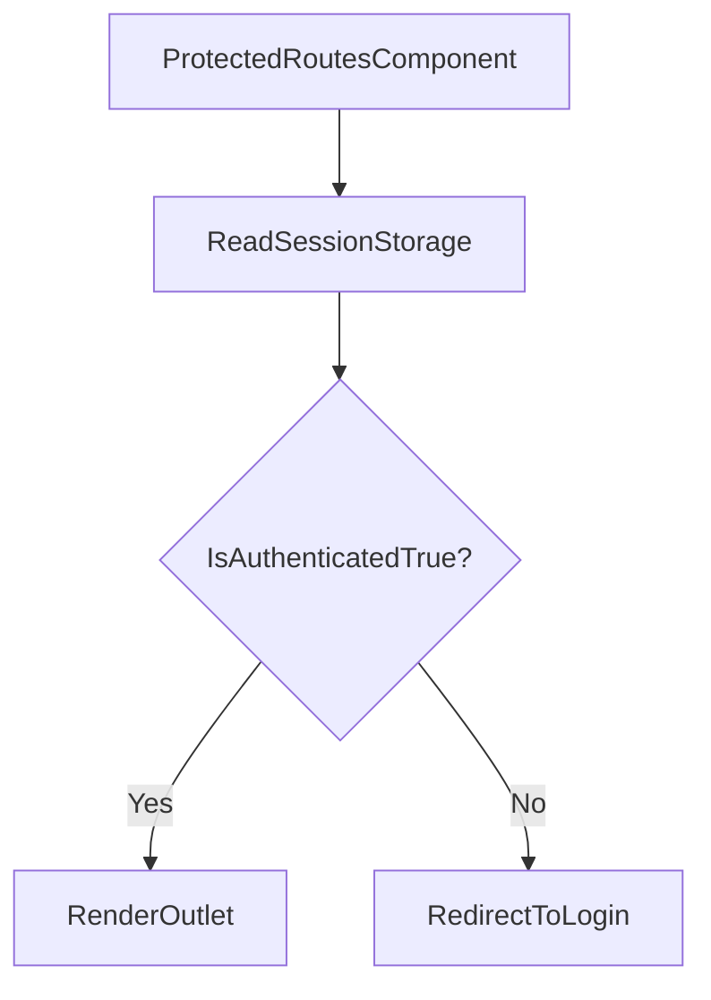

# grms-frontend/src/ProtectedRoutes/ProtectedRoutes.tsx

> **Source File:** [grms-frontend/src/ProtectedRoutes/ProtectedRoutes.tsx](https://github.com/test-company-prowiz/Easy-Repo/blob/master/grms-frontend/src/ProtectedRoutes/ProtectedRoutes.tsx)
> **Repository:** `Easy-Repo`
> **Branch:** `master`

# grms-frontend/src/ProtectedRoutes/ProtectedRoutes.tsx

### Overview
This file defines the `ProtectedRoutes` React component, which serves as a routing guard. Its primary purpose is to control access to specific routes by checking the user's authentication status and conditionally rendering the requested content or redirecting to a login page.

### Architecture & Role
This file resides in the frontend application's routing layer. It acts as a presentational component within the React component tree, specifically a wrapper around routes that require authentication. It enforces client-side route protection by integrating with `react-router-dom`.

### Key Components
- **`ProtectedRoutes` (Functional Component)**: The default export. This component evaluates the user's authentication state and determines whether to render child routes or initiate a redirect.

### Execution Flow / Behavior
When a route wrapped by `ProtectedRoutes` is accessed:
1. The component checks `sessionStorage` for an item with the key `authenticated`.
2. If the value of `authenticated` in `sessionStorage` is exactly the string `'True'`, the internal `authenticated` flag is set to `true`.
3. If the `authenticated` flag is `true`, the component renders an `<Outlet />`, allowing the nested protected routes to be displayed.
4. If the `authenticated` flag is `false` (either `sessionStorage` item is missing, not `'True'`, or any other value), the component renders a `<Navigate to="/login" />`, redirecting the user to the `/login` path.

### Dependencies
- **`react-router-dom`**:
    - `Outlet`: Used to render the child route components when the user is authenticated.
    - `Navigate`: Used to programmatically redirect the user to the login page when not authenticated.
- **`sessionStorage` (Browser API)**: Directly accessed to retrieve the authentication status persisted by the application.

### Design Notes
- The authentication check relies solely on a client-side `sessionStorage` item. This approach provides basic route protection but is not a substitute for robust server-side authentication and authorization.
- The `authenticated` status is determined by a strict string comparison (`'True'`). This design is simple but could be made more robust by storing actual boolean values or more complex tokens.
- This component is a pure wrapper, making it reusable across various parts of the application where authentication is required for route access.

### Diagram
