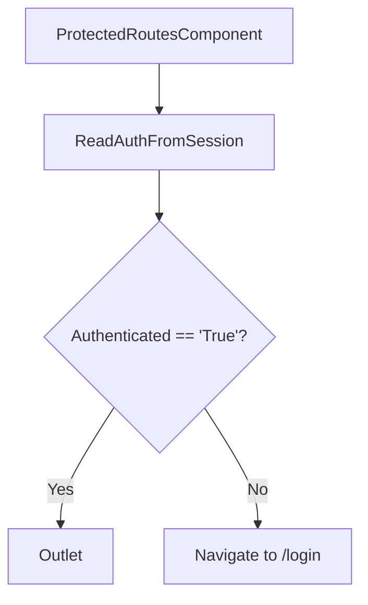

# grms-frontend/src/ProtectedRoutes/ProtectedRoutes.tsx

> **Source File:** [grms-frontend/src/ProtectedRoutes/ProtectedRoutes.tsx](https://github.com/test-company-prowiz/Easy-Repo/blob/master/grms-frontend/src/ProtectedRoutes/ProtectedRoutes.tsx)
> **Repository:** `Easy-Repo`
> **Branch:** `master`

# grms-frontend/src/ProtectedRoutes/ProtectedRoutes.tsx

### Overview
This file defines a React functional component `ProtectedRoutes` responsible for controlling access to specific routes within the application. It acts as a gatekeeper, ensuring that only authenticated users can view protected content.

### Architecture & Role
This component operates at the presentation layer, specifically within the client-side routing infrastructure of the frontend application. It functions as a route guard, wrapping other routes and enforcing an authentication check before allowing access to its children.

### Key Components
- `ProtectedRoutes`: A React functional component that checks authentication status.
- `Outlet`: A component from `react-router-dom` used to render the child routes nested within `ProtectedRoutes`.
- `Navigate`: A component from `react-router-dom` used to redirect the user to a different path (e.g., `/login`) if not authenticated.

### Execution Flow / Behavior
When a route wrapped by `ProtectedRoutes` is accessed:
1. The component checks `sessionStorage` for an item with the key `authenticated`.
2. If the value of `sessionStorage.getItem('authenticated')` is strictly equal to the string `'True'`, the user is considered authenticated.
3. If authenticated, the `Outlet` component is rendered, allowing the nested child routes to display.
4. If not authenticated (i.e., the `authenticated` item is missing or its value is not `'True'`), the `Navigate` component redirects the user to the `/login` path, preventing access to the protected content.

### Dependencies
- `react-router-dom`: Provides `Outlet` for rendering nested routes and `Navigate` for declarative client-side redirection. These are essential for implementing the routing protection logic.

### Design Notes
The current implementation relies on `sessionStorage` for determining authentication status. This approach offers basic client-side route protection but is not a substitute for robust server-side authentication and authorization. Sensitive data should not solely depend on client-side checks. Improvement areas could include integrating with a more secure token-based authentication mechanism that validates tokens with a backend service.

### Diagram
