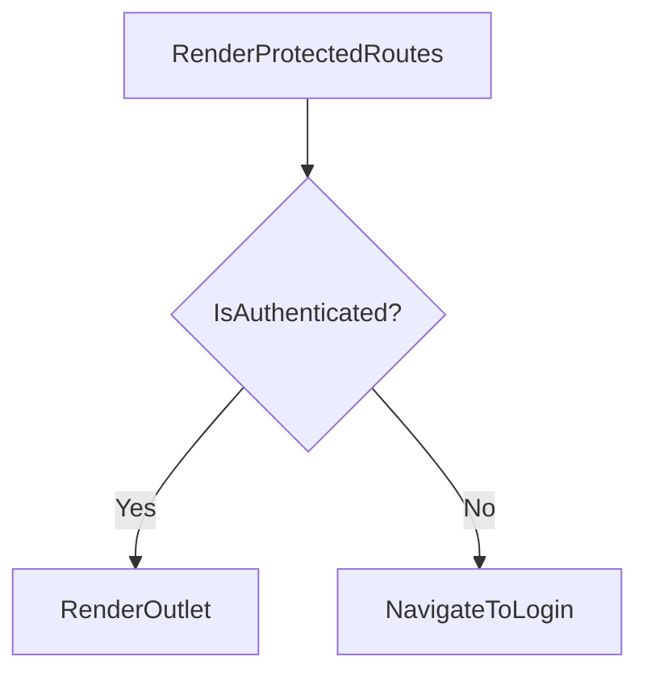

# grms-frontend/src/ProtectedRoutes/ProtectedRoutes.tsx

> **Source File:** [grms-frontend/src/ProtectedRoutes/ProtectedRoutes.tsx](https://github.com/test-company-prowiz/Easy-Repo/blob/master/grms-frontend/src/ProtectedRoutes/ProtectedRoutes.tsx)
> **Repository:** `Easy-Repo`
> **Branch:** `master`

# grms-frontend/src/ProtectedRoutes/ProtectedRoutes.tsx

### Overview
This file defines a React functional component, `ProtectedRoutes`, which serves as a routing guard. Its primary purpose is to control access to specific application routes, ensuring that only authenticated users can proceed to view protected content.

### Architecture & Role
This component operates within the presentation layer of the frontend application. It integrates with `react-router-dom` to enforce authentication checks at the client-side routing level, effectively acting as middleware for routes.

### Key Components
*   `ProtectedRoutes` (functional component): This component encapsulates the logic for checking user authentication status and conditionally rendering either the protected child routes or redirecting to the login page.

### Execution Flow / Behavior
1.  When a route configured to use `ProtectedRoutes` is accessed, the component executes.
2.  It checks the `sessionStorage` for an item with the key 'authenticated' and a value of 'True'.
3.  If the 'authenticated' item is found and its value is 'True', the component renders an `Outlet`, allowing any nested child routes to be displayed.
4.  If the 'authenticated' item is not 'True' (e.g., absent or a different value), the component renders a `Navigate` component, which immediately redirects the user to the `/login` path.

### Dependencies
*   `react-router-dom`:
    *   `Outlet`: Used to render the nested route components that are children of `ProtectedRoutes` when the user is authenticated.
    *   `Navigate`: Utilized for programmatic redirection to the `/login` route when the user is not authenticated.

### Design Notes
*   **Authentication State Management:** The component relies on `sessionStorage` for managing the authentication state. This mechanism is client-side only and means the authentication status is tied to the browser session, expiring when the tab or browser is closed.
*   **Security Considerations:** While effective for client-side UI protection, relying solely on `sessionStorage` for authentication status does not provide server-side security. Robust applications require backend authentication and authorization checks to protect data and sensitive operations.
*   **Loose Coupling:** The component's direct dependency on a specific `sessionStorage` key ('authenticated') makes it tightly coupled to this particular authentication implementation.

### Diagram
