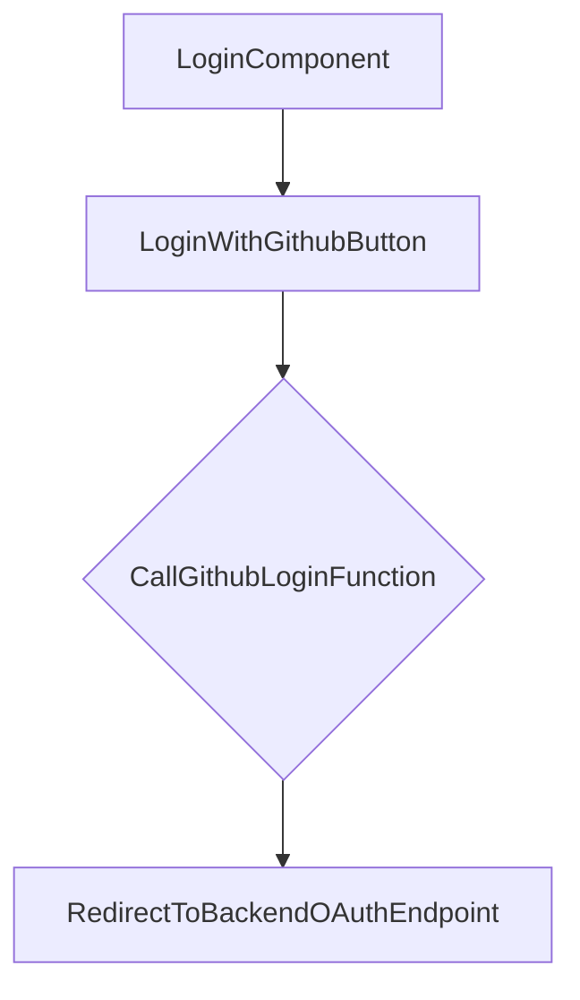

# grms-frontend/src/components/AuthComponents/Login.tsx

> **Source File:** [grms-frontend/src/components/AuthComponents/Login.tsx](https://github.com/test-company-prowiz/Easy-Repo/blob/master/grms-frontend/src/components/AuthComponents/Login.tsx)
> **Repository:** `Easy-Repo`
> **Branch:** `master`

# grms-frontend/src/components/AuthComponents/Login.tsx

### Overview
This file defines the `Login` React component, which provides a user interface for authentication. Its primary function is to facilitate login, specifically integrating with GitHub OAuth for user authentication by redirecting to a backend authorization endpoint.

### Architecture & Role
This file resides within the frontend's `components/AuthComponents` directory, classifying it as a UI component responsible for authentication interactions. It operates at the presentation layer, handling user input and initiating authentication flows with the backend.

### Key Components
*   **`Login` (default export)**: A functional React component that renders the login page, including input fields, a "Join the Codebase" button, and a dedicated "Log in with Github" button.
*   **`githubLogin`**: A local function within the `Login` component responsible for initiating the GitHub OAuth flow by redirecting the browser to the configured backend OAuth authorization URL.

### Execution Flow / Behavior
The `Login` component renders a login form upon client-side execution (indicated by `"use client"`). It displays a text input for "Github Username" and a "Join the Codebase" button, though their `onSubmit` handler is prevented, indicating this form section is not functional as implemented. The core behavior is triggered by the "Log in with Github" button. When pressed, it invokes the `githubLogin` function. This function constructs a redirect URL using the `VITE_BACKEND_URL` environment variable and the `/oauth2/authorization/github` path, then changes `window.location.href`, sending the user to the backend's GitHub OAuth initiation endpoint.

### Dependencies
*   **`@nextui-org/react`**: Provides UI components such as `Button`, `Input`, `Checkbox`, `Link`, and `Divider` for building the login form.
*   **`@iconify/react`**: Used for rendering the GitHub icon within the login button.
*   **`../Navbar/Navbar` (NavbarComponent)**: An internal component responsible for rendering the navigation bar at the top of the page.

### Design Notes
The component explicitly uses client-side rendering (`"use client"`). While a username input and a "Join the Codebase" button are present, their associated form submission is prevented, suggesting this part of the UI may be incomplete or intended for a different, currently unimplemented, login method. The primary implemented authentication path is through GitHub OAuth redirection, leveraging an environment variable for the backend URL.

### Diagram
