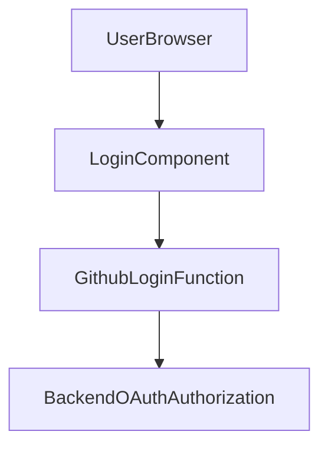

# grms-frontend/src/components/AuthComponents/Login.tsx

> **Source File:** [grms-frontend/src/components/AuthComponents/Login.tsx](https://github.com/test-company-prowiz/Easy-Repo/blob/master/grms-frontend/src/components/AuthComponents/Login.tsx)
> **Repository:** `Easy-Repo`
> **Branch:** `master`

# grms-frontend/src/components/AuthComponents/Login.tsx

### Overview
This file defines the `Login` React component, which provides a user interface for authentication within the GRMS frontend application. Its primary function is to facilitate user login, particularly through GitHub OAuth.

### Architecture & Role
This component operates within the presentation layer of the frontend application. It is a client-side component responsible for rendering the login page and initiating authentication flows. Architecturally, it serves as an entry point for users to access the system, integrating with a backend authentication service.

### Key Components
*   **`Login` (Default Export)**: The main functional React component responsible for rendering the login form and handling user interaction.
*   **`githubLogin`**: An internal function within the `Login` component that redirects the browser to the backend's GitHub OAuth authorization endpoint.
*   **`NavbarComponent`**: An imported component used to display the application's navigation bar on the login page.

### Execution Flow / Behavior
When the `Login` component is rendered, it displays a page with a login form.
1.  The `backendUrl` is retrieved from `import.meta.env.VITE_BACKEND_URL` at runtime.
2.  If a user clicks the "Log in with Github" button, the `githubLogin` function is invoked.
3.  The `githubLogin` function performs a client-side redirect (`window.location.href`) to the constructed GitHub OAuth authorization URL on the backend.
4.  The username input form's `onSubmit` handler is set to `e.preventDefault()`, indicating that the form submission via username/password is not actively handled by this component.

### Dependencies
*   **`@nextui-org/react`**: Provides UI components such as `Button`, `Input`, `Checkbox`, `Link`, and `Divider` for building the login form.
*   **`@iconify/react`**: Used for rendering icons, specifically the GitHub icon on the login button.
*   **`../Navbar/Navbar`**: Imports the `NavbarComponent` for consistent page header rendering.
*   **Environment Variables**: Relies on `import.meta.env.VITE_BACKEND_URL` to determine the base URL for backend API calls, particularly for OAuth redirection.

### Design Notes
The component utilizes NextUI for a modern and consistent user interface. The primary authentication mechanism exposed is GitHub OAuth, with a direct client-side redirect to the backend's authorization endpoint. The presence of a username input form with a non-functional submit action suggests either an incomplete feature or a placeholder for future implementation of traditional username/password login. The `"use client"` directive ensures this component is rendered on the client side, which is necessary for `window` object interactions and interactive UI.

### Diagram
