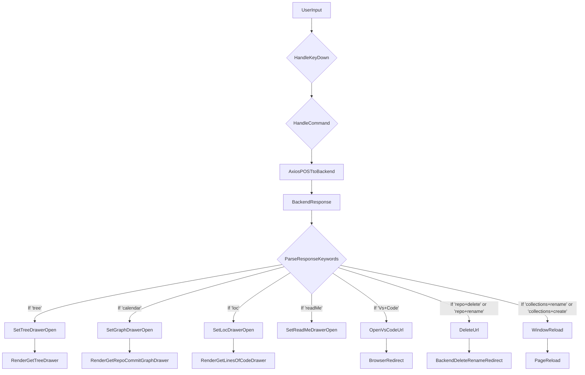

# grms-frontend/src/components/CLI/CLIMain.tsx

> **Source File:** [grms-frontend/src/components/CLI/CLIMain.tsx](https://github.com/test-company-prowiz/Easy-Repo/blob/master/grms-frontend/src/components/CLI/CLIMain.tsx)
> **Repository:** `Easy-Repo`
> **Branch:** `master`

# grms-frontend/src/components/CLI/CLIMain.tsx

### Overview
This file implements the main Command Line Interface (CLI) component, `CLIMain`, for the GRMS frontend. It provides an input field for users to type commands and displays their execution results. The component integrates with a backend API to process commands and dynamically renders various drawers or navigates based on the command output.

### Architecture & Role
`CLIMain.tsx` resides within the frontend's component layer, specifically in the `CLI` directory. It acts as a user interface entry point for interacting with certain backend functionalities via a command-line paradigm. It is responsible for capturing user input, dispatching commands to the backend, and updating the UI state based on the backend's response, often by controlling the visibility of other drawer components.

### Key Components
*   **`CLIMain`**: The primary functional component that renders the CLI input field and response area. It manages local state for input and response, handles command execution, and conditionally renders other components.
*   **`inputValue`**: A `useState` hook managing the current text in the CLI input field.
*   **`response`**: A `useState` hook storing the string response received from the backend after command execution.
*   **`useUserStore`**: A Zustand store hook used to manage global state variables, primarily for controlling the visibility and content of various application drawers (`setTreeDrawerOpen`, `setGraphDrawerOpen`, `setLocDrawerOpen`, `setreadMeDrawerOpen`) and setting associated data (`setTreeRepoId`, `setRepoName`).
*   **`handleKeyDown`**: An event handler that triggers `handleCommand` when the "Enter" key is pressed.
*   **`handleCommand`**: An asynchronous function that sends the `inputValue` to the backend `/easyrepo/cli/execute` endpoint via an `axios` POST request. It then processes the backend's response, updating the `response` state and the `UserStore` state variables to trigger UI changes.
*   **`openVsCodeUrl`**: A utility function that redirects the browser to a given URL, typically for opening content in VS Code.
*   **`deleteUrl`**: An asynchronous function that makes a GET request to a backend endpoint to initiate a repository delete/rename operation, then redirects the browser to the URL returned by the backend.
*   **`GetTreeDrawer`**: A component conditionally rendered to display a repository's file tree.
*   **`GetRepoCommitGraphDrawer`**: A component conditionally rendered to display a repository's commit graph.
*   **`GetLinesOfCodeDrawer`**: A component conditionally rendered to display lines of code statistics for a repository.

### Execution Flow / Behavior
1.  The `CLIMain` component renders an `Input` field and an `Alert` display area.
2.  Users type commands into the `Input` field. The `inputValue` state updates with each change.
3.  Upon pressing the "Enter" key, `handleKeyDown` invokes `handleCommand`.
4.  `handleCommand` sends the `inputValue` as the request body to the backend endpoint `backendUrl + "/easyrepo/cli/execute"` using an `axios` POST request, including authentication cookies and a CSRF token.
5.  The backend processes the command and returns a string `response`.
6.  The `response` string is then stored in the component's `response` state and displayed in the `Alert` component.
7.  The `handleCommand` function checks the `response` string for specific keywords (e.g., `'tree'`, `'calendar'`, `'loc'`, `'readMe'`, `'Vs+Code'`, `'repo+delete'`, `'repo+rename'`, `'collections+rename'`, `'collections+create'`).
8.  Based on detected keywords:
    *   If `'tree'`, `'calendar'`, `'loc'`, or `'readMe'` are present, the corresponding drawer state in `useUserStore` is set to `true`, and relevant IDs or names are extracted from the response string and stored. The respective drawer components (`GetTreeDrawer`, `GetRepoCommitGraphDrawer`, `GetLinesOfCodeDrawer`) are then conditionally rendered.
    *   If `'Vs+Code'` is present, `openVsCodeUrl` is called with the extracted URL to redirect the browser.
    *   If `'repo+delete'` or `'repo+rename'` are present, `deleteUrl` is called with the extracted repository name, which makes another backend call and redirects the browser.
    *   If `'collections+rename'` or `'collections+create'` are present, the browser reloads the page.

### Dependencies
*   **`@nextui-org/react`**: Provides UI components like `Input` and `Alert` for consistent styling and functionality.
*   **`react`**: Core React library, used for `useState` hook to manage component state.
*   **`axios`**: A promise-based HTTP client used for making requests to the backend API.
*   **`../Drawers/GetTreeDrawer`**: Internal component for displaying repository tree structures.
*   **`../../store/UserStore`**: A global state management store (Zustand) used to control drawer visibility and share data across components.
*   **`../Drawers/GetCalendar`**: Internal component for displaying repository commit graphs.
*   **`../Drawers/GetLinesOfCodeDrawer`**: Internal component for displaying lines of code statistics.

### Design Notes
*   The logic for determining UI actions (e.g., opening a specific drawer, redirecting) is strongly coupled to string patterns within the backend's response. This approach could be brittle if backend response formats change without corresponding frontend updates.
*   Direct manipulation of `window.location.href` is used for external redirects and for navigating to backend-provided URLs for actions like repository deletion/renaming.
*   The component relies on a global Zustand store (`useUserStore`) for managing the visibility state of various drawers, allowing them to be controlled from a centralized command handler.
*   CSRF protection is implemented by sending a token from `sessionStorage` in the request headers.
*   The conditional rendering of drawer components within `CLIMain` itself simplifies their lifecycle management, as they are only mounted when relevant.

### Diagram
