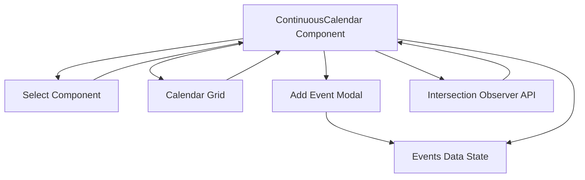

# grms-frontend/src/components/Calendar/Calendar.tsx

> **Source File:** [grms-frontend/src/components/Calendar/Calendar.tsx](https://github.com/test-company-prowiz/Easy-Repo/blob/master/grms-frontend/src/components/Calendar/Calendar.tsx)
> **Repository:** `Easy-Repo`
> **Branch:** `master`

# grms-frontend/src/components/Calendar/Calendar.tsx

### Overview
This file defines a `ContinuousCalendar` React component, which provides a scrollable, year-long calendar interface. It allows users to view days, navigate between years and months, jump to the current day, and add events to specific dates. It also includes a `Select` component for dropdown functionality.

### Architecture & Role
This file resides in the `components` directory, indicating its role as a reusable UI element within the frontend application. It functions as a client-side component, managing its own state for calendar navigation and event data. It is a presentational and interactive component, responsible for rendering a complex date picker and event display.

### Key Components
*   **`ContinuousCalendarProps`**: Defines the props for the `ContinuousCalendar` component, including an optional `onClick` handler for day selection.
*   **`Event`**: Interface representing an event with an `id`, `title`, and `date`.
*   **`ContinuousCalendar`**:
    *   A React functional component that renders the main calendar grid.
    *   Manages state for the displayed `year`, `selectedMonth`, `events`, and the visibility of the `Add Event` modal.
    *   Uses `useRef` (`dayRefs`) to maintain references to individual day elements for scroll synchronization.
    *   Employs `useMemo` (`generateCalendar`) to optimize the generation of calendar days and weeks.
*   **`SelectProps`**: Defines the props for the `Select` component, including `name`, `value`, `label`, `options`, `onChange`, and `className`.
*   **`Select`**: A generic React functional component for rendering a customizable HTML `<select>` dropdown.
*   **`daysOfWeek`**: A constant array of short day names for display.
*   **`monthNames`**: A constant array of full month names for display and selection.

### Execution Flow / Behavior
1.  **Initialization**: The `ContinuousCalendar` component initializes with the current year and month. It generates a full year's worth of days, including padding days from the previous/next year to complete weeks.
2.  **Calendar Rendering**: The `generateCalendar` memoized function creates a grid of day elements. Each day displays its number, optionally the month name (for the first day of a month), and any associated events.
3.  **Navigation**:
    *   Users can change the displayed year using "Prev Year" and "Next Year" buttons.
    *   A `Select` dropdown allows jumping to a specific month within the current year.
    *   The "Today" button resets the calendar to the current date and scrolls to it.
4.  **Day Interaction**:
    *   Clicking a day triggers the `handleDayClick` function, which in turn calls the `onClick` prop if provided, passing the selected day, month, and year.
    *   A "+" button on each day allows opening an "Add Event" modal.
5.  **Event Management**:
    *   The "Add Event" modal allows users to input an event title and date.
    *   Submitting the modal adds a new event to the `events` state, which is then rendered on the corresponding day(s).
6.  **Scroll Synchronization**:
    *   A `useEffect` hook sets up an `IntersectionObserver` to monitor the visibility of the 15th day of each month.
    *   As the user scrolls, the `selectedMonth` state is updated based on which month's 15th day is currently intersecting the viewport, ensuring the `Select` dropdown reflects the visible month.
    *   `scrollToDay` function handles programmatic scrolling to a specific day.

### Dependencies
*   **`react`**: Core React library for components, hooks (`useEffect`, `useMemo`, `useRef`, `useState`), and JSX rendering.
*   **Internal `Select` component**: The `ContinuousCalendar` component utilizes the `Select` component defined within the same file for month navigation.
*   **Browser APIs**: `IntersectionObserver` for scroll position detection and `window.matchMedia` for responsive scrolling offsets.

### Design Notes
*   **Continuous Scroll Experience**: The calendar is designed for a continuous scrolling experience across the entire year, rather than discrete month-by-month views. This requires careful handling of scroll positions and month detection.
*   **Performance Optimization**: `useMemo` is employed for `generateCalendar` to prevent unnecessary re-renders of the entire calendar grid when only state unrelated to day generation changes.
*   **Accessibility**: Basic accessibility attributes like `aria-hidden` are used for SVG icons.
*   **Styling**: Utilizes Tailwind CSS classes for layout and styling, indicated by the extensive `className` strings.
*   **Date Handling**: The calendar logic for generating days handles the start of the year by potentially including days from the previous year to complete the first week, and similarly for the end of the year. This ensures a consistent grid layout but might require careful consideration for date boundaries in external integrations.
*   **Event Storage**: Events are currently stored in local component state. For a production application, this data would typically be managed via a global state manager (e.g., Redux, Zustand) or fetched from a backend API.

### Diagram
