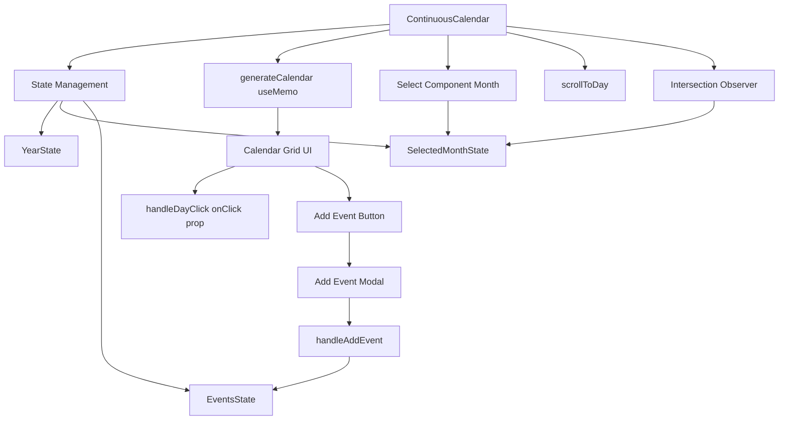

# grms-frontend/src/components/Calendar/Calendar.tsx

> **Source File:** [grms-frontend/src/components/Calendar/Calendar.tsx](https://github.com/test-company-prowiz/Easy-Repo/blob/master/grms-frontend/src/components/Calendar/Calendar.tsx)
> **Repository:** `Easy-Repo`
> **Branch:** `master`

# grms-frontend/src/components/Calendar/Calendar.tsx

### Overview
This file defines the `ContinuousCalendar` React component, which provides a scrollable, year-long calendar view. It allows users to view days, navigate through years, jump to the current day, and add simple events. The calendar also includes a month selector that updates as the user scrolls.

### Architecture & Role
This file resides in the frontend component layer of the `grms-frontend` application. It acts as a presentational and stateful UI component responsible for displaying calendar data and handling user interactions related to date selection and event management. It is a client-side component, indicated by `'use client'`.

### Key Components
*   **`ContinuousCalendarProps`**: Interface defining the props for `ContinuousCalendar`, primarily an optional `onClick` handler for day selections.
*   **`Event`**: Interface describing the structure of an event, including `id`, `title`, and `date`.
*   **`ContinuousCalendar`**: The main functional React component that renders the continuous calendar.
    *   Manages internal state for the current year, selected month, events, and an "add event" modal.
    *   Uses `useRef` to hold references to day elements for scrolling.
    *   Utilizes `useMemo` for optimizing calendar day generation.
    *   Employs `useEffect` to set up an `IntersectionObserver` for tracking the visible month during scrolling.
*   **`SelectProps`**: Interface for the `Select` component's props.
*   **`Select`**: A reusable functional React component for rendering a styled dropdown (`<select>`) element.

### Execution Flow / Behavior
1.  The `ContinuousCalendar` component initializes with the current year and a default selected month.
2.  `generateCalendar` (memoized) computes and structures the days of the entire year into weeks, including padding days from the previous and next year to ensure full weeks.
3.  Each day rendered includes its date, indicates if it's "today," and displays any associated events. A button on each day allows opening an "Add Event" modal.
4.  User interactions:
    *   **Year Navigation**: `handlePrevYear` and `handleNextYear` update the `year` state, triggering a re-render of the calendar.
    *   **Month Selection**: The `Select` component allows users to jump to a specific month. `handleMonthChange` updates `selectedMonth` and calls `scrollToDay` to smoothly scroll to the first day of the chosen month.
    *   **Today Button**: `handleTodayClick` resets the year to the current year and scrolls to today's date.
    *   **Day Click**: `handleDayClick` invokes the `onClick` prop with the selected day, month, and year.
    *   **Add Event**: Clicking the "+" button on a day opens `showAddEventModal`. `handleAddEvent` adds the new event to the `events` state and closes the modal. Events are stored in local component state.
5.  **Scrolling Interaction**: An `IntersectionObserver` monitors the visibility of the 15th day of each month within the `calendar-container`. When the 15th day of a month becomes visible, `selectedMonth` is updated, ensuring the month dropdown accurately reflects the user's current scroll position.
6.  The `scrollToDay` function calculates the appropriate scroll position to bring a specific day into view, considering the container's height and responsive offsets.

### Dependencies
*   **`react`**: Core dependency for React components and hooks (`useState`, `useEffect`, `useMemo`, `useRef`).
*   **`Select` component**: An internal utility component exported from this same file, used by `ContinuousCalendar` for month selection.
*   **Date API**: JavaScript's built-in `Date` object is extensively used for date calculations and formatting.
*   **Tailwind CSS (implicit)**: Styling is heavily reliant on Tailwind CSS utility classes, visible throughout the `className` attributes.
*   **SVG Icons**: External SVG icons are embedded for navigation buttons.

### Design Notes
*   **Client-Side Rendering**: The `'use client'` directive signifies that this component is intended to run on the client, typical for interactive UI elements.
*   **Continuous Scroll**: The calendar provides a continuous scrolling experience across the entire year, which is different from a paginated month-by-month view.
*   **Local State Management**: Event data is managed purely within the component's local state (`events` array) and is not persisted externally. This implies that events will be lost on component unmount or page refresh. For persistence, external state management or API calls would be necessary.
*   **Responsive Design**: The use of `sm:`, `lg:`, `2xl:` utility classes indicates that the component is designed to be responsive across various screen sizes.
*   **Performance Optimization**: `useMemo` is applied to `generateCalendar` to prevent unnecessary re-computation of the entire year's calendar grid unless the `year` or `events` state changes.
*   **Accessibility**: `aria-hidden` attributes are used for SVG icons, and `htmlFor` for labels, contributing to better accessibility.

### Diagram 
