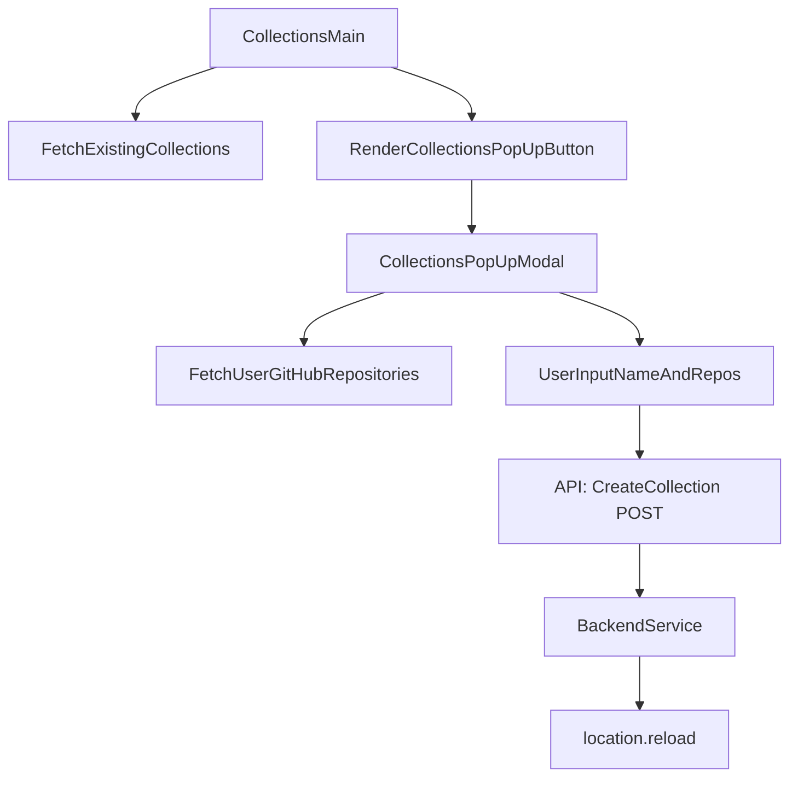

# grms-frontend/src/components/CollectionsComponents/CollectionsMain.tsx

> **Source File:** [grms-frontend/src/components/CollectionsComponents/CollectionsMain.tsx](https://github.com/test-company-prowiz/Easy-Repo/blob/master/grms-frontend/src/components/CollectionsComponents/CollectionsMain.tsx)
> **Repository:** `Easy-Repo`
> **Branch:** `master`

# grms-frontend/src/components/CollectionsComponents/CollectionsMain.tsx

### Overview
This file defines two primary React functional components: `CollectionsMain` and `CollectionsPopUp`. `CollectionsMain` is responsible for fetching and displaying a user's existing collections. `CollectionsPopUp` provides a modal interface for users to create new collections, allowing them to name a collection and associate GitHub repositories with it.

### Architecture & Role
This file resides in the frontend's components layer, specifically within the `CollectionsComponents` directory. Both components serve as user interface elements. `CollectionsMain` acts as a parent container that orchestrates the display of collections and integrates the functionality for creating new collections via `CollectionsPopUp`. `CollectionsPopUp` is a child component that handles user interaction within a modal context for collection creation.

### Key Components
*   **`CollectionsPopUp`**:
    *   A functional component that renders a modal for creating new collections.
    *   Uses `useDisclosure` from `@nextui-org/react` to manage the modal's open/close state.
    *   Fetches the user's available GitHub repositories using a `useAxios` hook when the modal opens.
    *   Manages input for `createCollectionName` and selected repository IDs (`values`).
    *   The `creatingCollect` asynchronous function handles the POST request to the backend to create a new collection.
*   **`CollectionsMain`**:
    *   A functional component responsible for displaying a list of existing collections.
    *   Utilizes `useUserStore` to update the global state with the selected collection's name upon interaction.
    *   The `getAllCollections` asynchronous function fetches all existing collections from the backend upon component mount.
    *   Renders the `CollectionsPopUp` component within an `Alert` component.

### Execution Flow / Behavior
1.  When `CollectionsMain` mounts, `getAllCollections` is invoked, fetching existing collections from the backend.
2.  Fetched collections are then rendered as clickable `Snippet` components. Clicking a snippet updates the `collectionName` in `useUserStore`.
3.  `CollectionsMain` renders the `CollectionsPopUp` component, which initially displays a "+ New Collection" button.
4.  Clicking the "New Collection" button opens the `CollectionsPopUp` modal.
5.  Upon the modal opening, an `useEffect` hook in `CollectionsPopUp` triggers a `fetchData` call to retrieve the user's GitHub repositories.
6.  The user provides a collection name and selects repositories from a dropdown list within the modal.
7.  When the "Create" button is clicked in the modal, the `creatingCollect` function executes:
    *   It parses the selected repository IDs from a comma-separated string into an array of numbers.
    *   It replaces spaces in the collection name with underscores to prevent backend issues.
    *   An `axios.post` request is sent to `/easyrepo/collections/createCollection` with the new collection's details.
    *   Upon successful creation, `location.reload()` is called, refreshing the page to display the newly created collection.

### Dependencies
*   **Internal:**
    *   `../../utility/axiosUtils`: Provides the `useAxios` custom hook for making GET requests (used by `CollectionsPopUp` to fetch GitHub repositories).
    *   `../../store/UserStore`: Supplies the `useUserStore` Zustand hook for global state management, specifically for setting the active collection name.
*   **External:**
    *   `react`: Core React library for components, state (`useState`), and lifecycle (`useEffect`).
    *   `@nextui-org/react`: A UI component library providing elements such as `Select`, `Snippet`, `Alert`, `Modal`, `Button`, `Input`, and `useDisclosure`.
    *   `react-icons/bs`: Used for the `BsBoxSeamFill` icon.
    *   `axios`: An HTTP client used directly by `CollectionsPopUp` for making POST requests to create new collections.

### Design Notes
*   The `creatingCollect` function performs `location.reload()` after a successful collection creation. A more robust user experience might involve updating the `collections` state in `CollectionsMain` directly, avoiding a full page refresh.
*   The collection name sanitization (`replace(/\s+/g, '_')`) addresses a backend constraint or issue, suggesting that collection names with spaces are not directly supported by the API. This indicates a potential area for backend improvement or more robust input validation.
*   Error handling within `creatingCollect` is currently an empty `catch` block; this should be implemented to provide user feedback on failures.
*   There's a mix of using the custom `useAxios` hook for GETs and direct `axios` for POSTs. A consistent approach using the `useAxios` hook for all API interactions could simplify maintainability.

### Diagram
