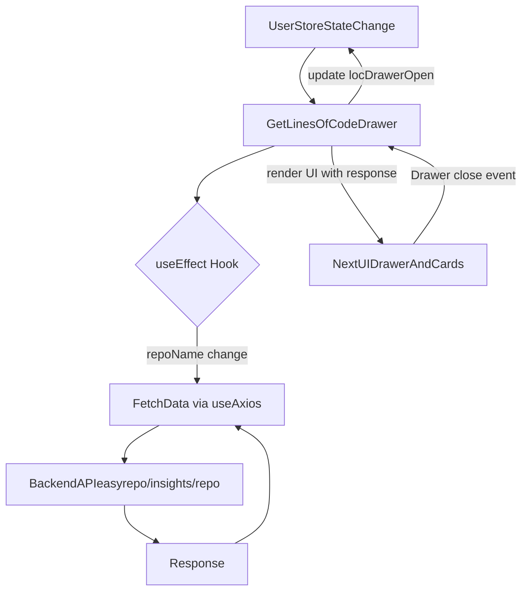

# grms-frontend/src/components/Drawers/GetLinesOfCodeDrawer.tsx

> **Source File:** [grms-frontend/src/components/Drawers/GetLinesOfCodeDrawer.tsx](https://github.com/test-company-prowiz/Easy-Repo/blob/master/grms-frontend/src/components/Drawers/GetLinesOfCodeDrawer.tsx)
> **Repository:** `Easy-Repo`
> **Branch:** `master`

# grms-frontend/src/components/Drawers/GetLinesOfCodeDrawer.tsx

### Overview
This file defines a React functional component, `GetLinesOfCodeDrawer`, which renders a drawer UI element. Its primary purpose is to display lines of code statistics, broken down by programming language, for a specified repository. It fetches this data from a backend API.

### Architecture & Role
This component operates within the frontend presentation layer. It acts as a specialized UI drawer, responsible for data display and interaction. It relies on a global state management store (`UserStore`) to determine its open/closed state and the target repository, and uses a custom Axios hook for data retrieval.

### Key Components
*   **`GetLinesOfCodeDrawer`**: The main React functional component exported by this file. It orchestrates data fetching and renders the drawer UI.
*   **`useUserStore`**: A Zustand hook used to access and modify global state, specifically `locDrawerOpen`, `setLocDrawerOpen`, `repoName`, and `setRepoName`.
*   **`useAxios`**: A custom hook facilitating API requests, providing `response` data and a `fetchData` function.
*   **`Drawer`, `DrawerContent`, `DrawerHeader`, `DrawerBody`, `Card`, `CardHeader`, `CardBody` (from `@nextui-org/react`)**: UI components used to construct the drawer and display individual language statistics.

### Execution Flow / Behavior
1.  The `GetLinesOfCodeDrawer` component renders, retrieving the current `locDrawerOpen` and `repoName` from `useUserStore`.
2.  An `useEffect` hook monitors changes to `repoName`. When `repoName` is updated, it triggers a GET request to `/easyrepo/insights/repo/{repoName}` via `fetchData` from `useAxios`.
3.  The `Drawer` component's `isOpen` prop is directly bound to `locDrawerOpen` from the `UserStore`, controlling its visibility.
4.  The `onOpenChange` callback of the `Drawer` invokes `handleOpenChange`, which updates `locDrawerOpen` in the `UserStore` to `false` when the drawer is closed by the user.
5.  Upon successful API response, the `response.data.languages` and `response.data.keys` arrays are mapped to render a series of `Card` components within the `DrawerBody`, each displaying the language name and its corresponding lines of code count.
6.  While data is being fetched or if the response is empty, a "Loading..." message is displayed.

### Dependencies
*   **`react`**: Core library for building the user interface.
*   **`@nextui-org/react`**: Provides pre-styled UI components like `Drawer` and `Card` for consistent visual presentation.
*   **`../../store/UserStore`**: An internal state management store (Zustand) for global application state, essential for controlling the drawer's visibility and current repository context.
*   **`../../utility/axiosUtils`**: An internal utility hook abstracting Axios-based HTTP requests, used for fetching repository insights.

### Design Notes
The component centralizes repository lines of code display in a dedicated drawer. The use of `useUserStore` for `locDrawerOpen` and `repoName` allows other parts of the application to trigger the drawer and specify the repository without direct prop drilling. The `useAxios` hook effectively separates API concerns from UI logic. The `useDisclosure` hook and `handleOpen` function are declared but not actively used for the drawer's primary open/close state, which is managed directly by `locDrawerOpen` from the `UserStore`.

### Diagram
