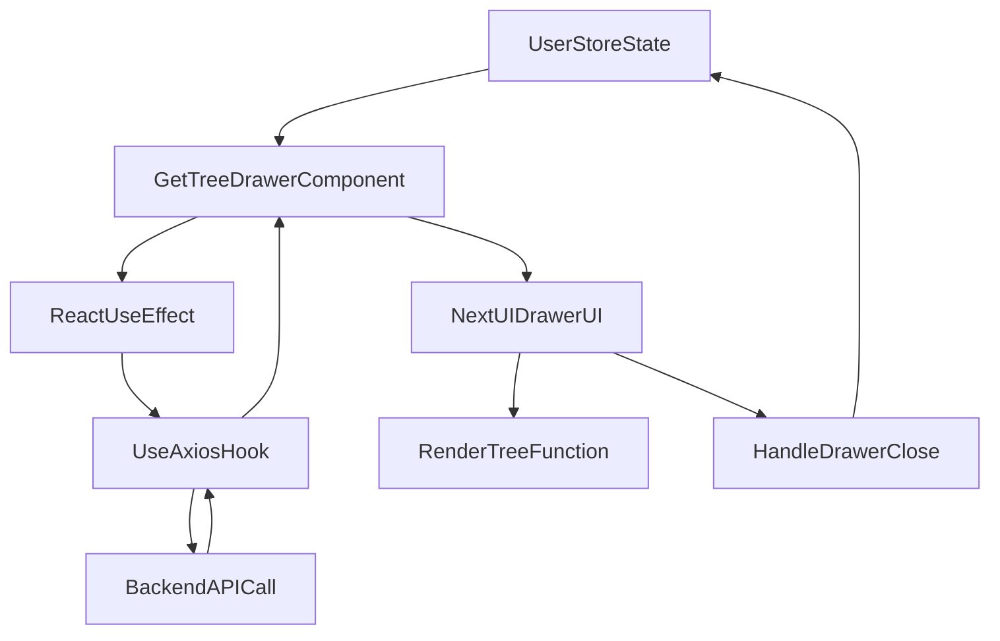

# grms-frontend/src/components/Drawers/GetTreeDrawer.tsx

> **Source File:** [grms-frontend/src/components/Drawers/GetTreeDrawer.tsx](https://github.com/test-company-prowiz/Easy-Repo/blob/master/grms-frontend/src/components/Drawers/GetTreeDrawer.tsx)
> **Repository:** `Easy-Repo`
> **Branch:** `master`

# grms-frontend/src/components/Drawers/GetTreeDrawer.tsx

### Overview
This file defines the `GetTreeDrawer` React component, which displays the file and folder structure (tree) of a specified repository within a retractable drawer UI element. It fetches the tree data from a backend API based on a global state variable.

### Architecture & Role
This component operates within the frontend's presentation layer as a UI component. It is a functional React component that integrates with the application's global state management (`UserStore`) to determine its visibility and the specific repository tree to display. It relies on a custom hook for data fetching and NextUI for its visual presentation as a drawer.

### Key Components
*   **`GetTreeDrawer`**: The primary functional component responsible for rendering the repository tree drawer.
*   **`useAxios`**: A custom hook imported from `../../utility/axiosUtils` used for making HTTP requests to fetch the tree data. It provides `response` and `fetchData`.
*   **`useUserStore`**: A Zustand store used for global state management. It provides `treeDrawerOpen` (to control drawer visibility) and `treeRepoId` (to identify the repository whose tree should be displayed), along with their respective setters.
*   **`Drawer`, `DrawerContent`, `DrawerHeader`, `DrawerBody`**: NextUI components used to construct the drawer UI.
*   **`renderTree`**: A recursive function within the component that takes the tree data and a level, then renders the nested file/folder structure with appropriate indentation and clickable links.

### Execution Flow / Behavior
1.  The `GetTreeDrawer` component renders. Its visibility is controlled by the `treeDrawerOpen` state from `useUserStore`.
2.  An `useEffect` hook monitors changes to `treeRepoId` (also from `useUserStore`). When `treeRepoId` changes or the component mounts, `fetchData` from `useAxios` is called, initiating a GET request to `/getTree/<treeRepoId>`.
3.  Upon receiving a `response` from the `useAxios` hook, the `DrawerBody` conditionally renders the tree structure.
4.  If `response.data` is available, the `renderTree` function is invoked with the tree data. This function recursively iterates through the tree structure, creating a hierarchical view where each item is a clickable link (`<a>`) to its respective URL.
5.  The `onOpenChange` prop of the `Drawer` component is handled by `handleOpenChange`. When the drawer is closed (i.e., `isOpen` becomes `false`), it updates the global state by calling `setTreeDrawerOpen(false)`, ensuring the global state reflects the UI's closed state.

### Dependencies
*   **`react`**: Core React library.
*   **`@nextui-org/react`**: Provides UI components such as `Drawer`, `DrawerContent`, `DrawerHeader`, `DrawerBody`, and the `useDisclosure` hook for managing UI component states.
*   **`../../store/UserStore`**: An internal dependency providing global state management for user-related data, specifically `treeDrawerOpen` and `treeRepoId` which control the drawer's behavior.
*   **`../../utility/axiosUtils`**: An internal utility providing the `useAxios` custom hook for standardized HTTP request handling.

### Design Notes
The component utilizes a centralized state management approach via `useUserStore` to control both the visibility and the content (which repository's tree to display) of the drawer. This allows other parts of the application to trigger the drawer's opening and specify its content without direct prop drilling. The use of a custom `useAxios` hook promotes reusability and consistency in API interactions. The recursive `renderTree` function is an effective pattern for displaying arbitrary-depth hierarchical data. The direct links within the tree provide quick access to resources, enhancing user experience.

### Diagram
