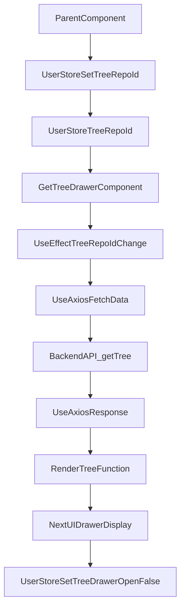

# grms-frontend/src/components/Drawers/GetTreeDrawer.tsx

> **Source File:** [grms-frontend/src/components/Drawers/GetTreeDrawer.tsx](https://github.com/test-company-prowiz/Easy-Repo/blob/master/grms-frontend/src/components/Drawers/GetTreeDrawer.tsx)
> **Repository:** `Easy-Repo`
> **Branch:** `master`

# grms-frontend/src/components/Drawers/GetTreeDrawer.tsx

### Overview
This file defines the `GetTreeDrawer` React component, which renders a drawer displaying the hierarchical file and folder structure of a specified repository. It fetches this tree data from a backend API and presents it as navigable links.

### Architecture & Role
This component operates within the frontend's UI layer. It is a presentational component that consumes application state from the `UserStore` to determine its visibility and the repository ID for which to fetch data. It interacts with the backend through a custom Axios hook to retrieve the tree structure, acting as a client-side view for repository contents.

### Key Components
*   **`GetTreeDrawer`**: The main functional React component that orchestrates the data fetching and rendering of the repository tree within a `NextUI` Drawer.
*   **`useAxios`**: A custom hook for making HTTP requests, used here to fetch the tree structure from the backend. It provides `response` and `fetchData` for managing API calls.
*   **`useUserStore`**: A Zustand store hook that manages global state related to user interactions, specifically controlling the `treeDrawerOpen` state and storing the `treeRepoId` for the currently viewed repository tree.
*   **`useDisclosure`**: A `NextUI` hook used internally by the Drawer component to manage its open/close state.
*   **`renderTree`**: A recursive function responsible for traversing the fetched tree data and rendering each node (file/folder) with appropriate indentation and a clickable link.

### Execution Flow / Behavior
1.  The `GetTreeDrawer` component is rendered. Its visibility is controlled by the `treeDrawerOpen` state from `useUserStore`.
2.  An `useEffect` hook monitors changes to `treeRepoId` from `useUserStore`. When `treeRepoId` is updated, it triggers `fetchData` from `useAxios` to make a GET request to `/getTree/{treeRepoId}`.
3.  Upon receiving a successful response from the backend, the `response.data` (which contains the tree structure) is passed to the `renderTree` function.
4.  The `renderTree` function recursively processes the tree data, generating a nested `div` structure where each `tree.displayName` is displayed. If a `tree.url` is present, it becomes a clickable link to the corresponding file or folder.
5.  The rendered tree structure is displayed within the `DrawerBody` of the `NextUI` Drawer component.
6.  Closing the drawer via its UI controls or `onOpenChange` callback updates `treeDrawerOpen` in `useUserStore` to `false`, effectively hiding the drawer.

### Dependencies
*   **`react`**: Core library for building UI components.
*   **`@nextui-org/react`**: Provides UI components like `Drawer`, `DrawerContent`, `DrawerHeader`, `DrawerBody`, and the `useDisclosure` hook.
*   **`../../store/UserStore`**: An internal Zustand store for managing global application state, specifically `treeDrawerOpen` and `treeRepoId`.
*   **`../../utility/axiosUtils`**: An internal utility hook (`useAxios`) for abstracting Axios HTTP request logic.

### Design Notes
*   The use of Zustand (`useUserStore`) for `treeDrawerOpen` and `treeRepoId` allows external components to trigger the drawer's display and specify the repository without direct prop drilling.
*   The `useAxios` hook centralizes API call logic, promoting reusability and separation of concerns for data fetching.
*   The `renderTree` function provides a clear, recursive approach to displaying hierarchical data, which is well-suited for file system structures.
*   The component directly links to file/folder URLs, providing immediate access to resources without further UI interaction.

### Diagram
